# C++26 Parsing with VlppParser2

## Scope and conclusion

This document evaluates whether the **design of VlppParser2** can support the complete C++26 language syntax. It is not a gap report for the C++ grammar under [`Test/Source/BuiltIn-Cpp`](Test/Source/BuiltIn-Cpp): that grammar is a deliberately useful design specimen, not the proposed C++26 deliverable.

The standards baseline is [N5046, Working Draft, Programming Languages — C++ (2026-05-12)](https://www.open-std.org/jtc1/sc22/wg21/docs/papers/2026/n5046.pdf). [N5047](https://www.open-std.org/jtc1/sc22/wg21/docs/papers/2026/n5047.html) identifies N5046 as the current C++26 working draft and the text from which the Draft International Standard is being prepared. Links to `eel.is/c++draft` below provide a navigable rendering of the current draft.

The short answer is:

> **At the grammar and algorithm level, no nonempty C++26 surface construct has been identified as beyond VlppParser2's ambiguity-preserving PDA after normalization. It is not, by itself, a complete raw-source C++26 front end, and the current runtime still needs full-C++ stress validation before implementation completeness can be claimed.**

No nonempty C++26 core-language production is known to require more recognition power than the generated GLR/PDA can provide after the grammar is normalized. The difficult expression, declarator, template, and declaration/statement cases are exactly the cases for which GLR branching, shared prefixes, and typed local ambiguity nodes are useful.

There are, however, important boundaries:

| Question | Answer |
| --- | --- |
| Can the generated parser model the written form of every nonempty C++26 core-language construct from a suitable token stream? | **No grammar-level blocker is known**, after ordinary grammar refactoring and deliberate AST/instruction shaping. Full implementation coverage remains to be demonstrated. |
| Can it retain `A<B>C;` and similar name-dependent alternatives instead of performing lookup? | **Yes**; this is an existing, tested use of `@ambiguous`. |
| Can the bundled regex lexer turn arbitrary raw C++26 source directly into the exact required tokens? | **No**; a C++-aware scanner is required for several translation-phase rules. |
| Can a parser grammar perform macro expansion, inclusion, conditional compilation, module preprocessing, and `#embed`? | **No**; use a preprocessor before phase-7 parsing. |
| Can it parse a valid empty translation unit through an ordinary generated entry rule? | **No**, because clauses that can consume zero tokens are rejected. A wrapper or sentinel is required. |
| Can it choose the unique interpretation required by lookup, type information, template instantiation, constraints, or reflection evaluation? | **No, intentionally**; preserve candidates and resolve them later. |
| Can the current implementation be claimed proven for every possible full-C++ ambiguity graph and workload? | **Not yet**; there are explicit trace-topology limits, a known ambiguity-boundary comparison defect, and potentially severe candidate growth. |

The intended result is therefore not an underpowered C++ parser. It is a **pre-semantic C++ AST**: a typed tree containing local `ToResolve` nodes wherever tokens alone do not justify selecting one interpretation.

## The correct frontend boundary

C++ is not defined as “run one context-free grammar over the source file.” The [phases of translation](https://eel.is/c++draft/lex.phases) first form preprocessing tokens, execute directives and macro replacement, concatenate string literals, and only then perform syntactic and semantic analysis. C++26 makes the last boundary even more visible: required template instantiations and manifest constant evaluation can affect types and reflection values and thereby affect syntactic analysis.

An appropriate architecture is:

```mermaid
flowchart LR
    Source["Source characters and physical lines"]
    Scanner["C++ scanner<br/>translation characters, comments, pp-tokens"]
    PP["Preprocessor<br/>directives, macros, includes, embed, module handling"]
    Tokens["Prepared parser-token encoding<br/>of the phase-7 stream"]
    GLR["VlppParser2 GLR recognizer"]
    AST["Typed AST with local ToResolve nodes"]
    Resolver["Name/type lookup and ambiguity resolver"]
    Semantic["Constraints, instantiation, constant evaluation, reflection"]

    Source --> Scanner --> PP --> Tokens --> GLR --> AST --> Resolver --> Semantic
    Semantic -. "injected declarations or information affecting later analysis" .-> Resolver
```



This division preserves the main advantage of VlppParser2: the grammar remains declarative and symbol-blind, while C++-specific state is concentrated in a scanner/preprocessor and a later resolver.

The parser already exposes the right seam. Generated parser entry methods provide public overloads that accept a prepared `RegexToken` list; for example, see the generated [`CppParser.h`](Test/Source/BuiltIn-Cpp/Generated/CppParser.h). Those overloads call the protected [`ParserBase::ParseWithTokens`](Source/SyntaxBase.h) helper, whereas the string overload is the convenience path through the bundled lexer. A custom frontend can therefore use the generated AST assembler and GLR runtime without using the generated lexer for every translation phase.

## What “handle C++26 syntax” means

Four capability levels should remain distinct:

1. **Token formation** turns characters into preprocessing tokens and then language tokens. Whitespace, line boundaries, raw strings, header names, token adjacency, Unicode rules, and maximal-munch exceptions matter here.
2. **Preprocessing** selects and transforms the token stream. Includes, macros, token pasting, conditional groups, `#embed`, and module-related preprocessing occur here.
3. **Syntactic recognition** determines every viable tree shape for the resulting tokens. This is the responsibility proposed for VlppParser2.
4. **Standard interpretation and validity** apply lookup, type classification, the standard's disambiguation rules, constraint satisfaction, instantiation, access rules, and other semantic restrictions.

This document calls a construct **supported by the parser** when level 3 can represent it and build the appropriate AST, even if levels 1, 2, or 4 require another component. That definition matches the requested policy of accepting ambiguity and postponing symbol resolution.

It also matches the standard's own presentation. [Annex A](https://eel.is/c++draft/gram) says that its grammar is informative, is not an exact statement of the language, accepts a superset, and relies on later disambiguation and type rules to remove meaningless constructs. An ambiguity-preserving grammar is therefore not a compromise unique to this project; it exposes a separation that the C++ specification itself already makes.

## Why `A<B>C;` is the intended result

Consider:

```cpp
A<B>C;
```

Without knowing what `A` denotes, viable readings include:

```text
expression-statement: (A < B) > C;
declaration-statement: A<B> C;
```

C++ eventually applies rules involving declarations, types, template names, and lookup. VlppParser2 should not invent those facts while recognizing tokens. It should return a `StatementToResolve` with the expression-statement and declaration-statement candidates. A later C++ resolver can then apply the standard's rules or retain a diagnostic if neither candidate becomes valid.

The existing grammar already implements this policy:

- [`Ast/Ast.txt`](Test/Source/BuiltIn-Cpp/Syntax/Ast/Ast.txt) marks `TypeOrExprOrOthers`, `Declaration`, `TypeOrExpr`, and `Statement` as `@ambiguous`.
- [`Syntax/Statements.txt`](Test/Source/BuiltIn-Cpp/Syntax/Syntax/Statements.txt) permits an expression or a declaration in statement position.
- [`TestTraced.cpp`](Test/UnitTest/BuiltInTest_Cpp/TestTraced.cpp) parses `A<B>C;` and expects `CppStatementToResolve`.
- [`TestAmbiguity.cpp`](Test/UnitTest/BuiltInTest_Cpp/TestAmbiguity.cpp) also checks declaration/expression, call/cast, qualified-name/binary-expression, and type/expression alternatives.

The standard contains cases where token-only selection is fundamentally insufficient. [Template names](https://eel.is/c++draft/temp.names) can require lookup to decide whether `<` starts template arguments, and [statement ambiguity](https://eel.is/c++draft/stmt.ambig) and [declarator ambiguity](https://eel.is/c++draft/dcl.ambig.res) prescribe interpretations that can depend on type information or instantiation. Keeping alternatives is the correct parser-layer design.

## Evidence from the current parser design

### Generalized recognition and late AST construction

VlppParser2 lowers EBNF-like rules through NFA and compact PDA representations. The runtime walks token, ending, and left-recursion transitions using persistent return stacks. Multiple surviving paths form a trace graph. AST instructions are not executed speculatively while those paths are still failing or merging; they are replayed after recognition and ambiguity analysis. See [Architecture](doc/Architecture.md), [Automaton Construction](doc/AutomatonConstruction.md), [Runtime Parsing](doc/RuntimeParsing.md), and [Ambiguity and AST Execution](doc/AmbiguityAndAstExecution.md).

That architecture provides the relevant capabilities:

- direct left recursion for expression precedence and recursive qualified names;
- nondeterministic alternatives without committing at the first shared token;
- automatic prefix sharing for long common type/expression/name prefixes;
- priorities for genuinely grammatical choices such as dangling `else`;
- typed local ambiguity wrappers, when branch instruction shapes permit a local common region, rather than necessarily selecting one whole-program AST;
- grammar switches specialized before automaton construction;
- exact-spelling conditional literals on an already recognized token;
- parsing from an externally supplied token sequence.

### The BuiltIn-Cpp grammar demonstrates the hard shape

The local grammar's most important decision is not its list of productions. It is its AST and decomposition strategy:

- [`QualifiedName`](Test/Source/BuiltIn-Cpp/Syntax/Ast/QualifiedName.txt) is itself a `TypeOrExpr`, so the identical name prefix is not duplicated into a false “type candidate” and “expression candidate.”
- [`Types.txt`](Test/Source/BuiltIn-Cpp/Syntax/Syntax/Types.txt) and [`Expressions.txt`](Test/Source/BuiltIn-Cpp/Syntax/Syntax/Expressions.txt) reuse that common representation until the interpretations actually diverge.
- [`DeclaratorComponents.txt`](Test/Source/BuiltIn-Cpp/Syntax/Syntax/DeclaratorComponents.txt) and [`DeclaratorConfigurations.txt`](Test/Source/BuiltIn-Cpp/Syntax/Syntax/DeclaratorConfigurations.txt) divide declarators into prefix operators, a nested core, suffixes, and policies for required/optional/absent names.
- The expression grammar encodes precedence with direct left recursion, which the generator explicitly supports.
- [`Generic.txt`](Test/Source/BuiltIn-Cpp/Syntax/Syntax/Generic.txt) permits both type and expression template arguments.
- [`API.txt`](Test/Source/BuiltIn-Cpp/Syntax/Syntax/API.txt) uses the static `allow_GT` switch to create an expression specialization suitable for a template-argument context.
- [`Lexer.txt`](Test/Source/BuiltIn-Cpp/Syntax/Lexer.txt) represents `<` and `>` individually, allowing the grammar to compose comparisons, shifts, and nested template closers.

Those choices address the difficult topology of C++. New C++26 constructs enlarge the grammar and AST, but they do not invalidate this model.

## Complete syntax-domain audit

The following audit follows every language-syntax domain in [C++26 Annex A](https://eel.is/c++draft/gram). “Parser result” describes grammar-level phase-7 representability, assuming the scanner and preprocessor have already supplied suitable tokens. It does not override the current runtime risks documented later.

| Annex area | Included syntax | Parser result | Principal complication |
| --- | --- | --- | --- |
| Keywords and context-dependent names | Keywords; identifiers that acquire type, namespace, class, enum, or template roles | **Ambiguity-preserving** | A token does not reveal its declared role. |
| Lexical conventions | Unicode identifiers, pp-numbers, literals, raw strings, user-defined literals, operators and punctuators | **External scanner, then supported** | Several token boundaries depend on context or correlated delimiters. |
| Basics | Translation units, module-unit form, splice specifiers and splice specializations | **Supported except empty input** | The ordinary generated entry cannot accept zero tokens; splice meaning is semantic. |
| Expressions | Names, lambdas, folds, requires, splices, pack indexing, calls, casts, operators, allocation, coroutines, reflection | **Supported with ambiguity** | Type/expression/name roles and template delimiters can require lookup. |
| Statements | Labels, blocks, selection, loops, expansion statements, jumps, contract assertions, declarations, try blocks | **Supported with ambiguity** | Declaration versus expression; expansion semantics are not parsing. |
| Declarations | Specifiers, declarators, initialization, functions, structured bindings, enums, namespaces, attributes, annotations, asm, linkage | **Supported with ambiguity** | Recursive declarators and symbol-dependent type classification. |
| Modules | Module units/fragments, module declarations, partitions, exports, imports and header units | **Supported after preprocessing** | `import`/`module` and header-name recognition interact with preprocessing. |
| Classes | Class heads, bases, members, access, bit-fields, virtual/pure specifiers, friends, constructors and conversions | **Supported with ambiguity** | Class/member lookup and validity are semantic. |
| Overloading | Operator function IDs, conversion IDs, literal operator IDs, allocation/deallocation names | **Supported after tokenization** | User-defined literal formation and name legality are outside grammar recognition. |
| Templates | Parameters, template-ids, constraints, requires-clauses, deduction guides, specialization/instantiation, packs | **Supported with ambiguity** | This is the largest source of symbol-dependent branching and candidate growth. |
| Exceptions | Throw expressions, try blocks, function-try-blocks, handlers, exception declarations, `noexcept` | **Supported** | Type matching and exception specifications' meaning are semantic. |
| Preprocessing directives | Conditional groups, include/import, macros, `#embed`, diagnostics, pragmas and preprocessing expressions | **External preprocessor** | It transforms the token stream and is line- and environment-sensitive. |

The remainder of this section expands the audit so that “all syntax” does not hide difficult subcategories behind the table.

### Keywords, identifiers, and contextual words

Ordinary reserved keywords are easy lexer tokens. The hard part is that many grammar categories that look like terminals in the standard—`typedef-name`, `class-name`, `enum-name`, `namespace-name`, `template-name`, and concept/type roles—are actually results of lookup. They should be modeled as identifier-shaped syntax plus unresolved semantic roles, not as facts asserted by the lexer.

The current draft lists `final`, `import`, `module`, `override`, `post`, and `pre` as identifiers with special meaning. A complete frontend should normally lex these spellings as identifiers and use an exact conditional literal or a dedicated normalization step only in their permitted contexts. Tokenizing every contextual spelling as an unconditional keyword would incorrectly reject valid ordinary identifier uses. All six spellings are nevertheless forbidden as macro names by C++26 preprocessing rules. `contract_assert` and `export`, by contrast, are unconditional keywords.

The `_` placeholder/name-independent declaration feature adds no new token shape. Its effect is semantic classification, so the parser simply preserves the identifier spelling.

**Verdict:** all written forms are representable. Name categories and contextual meaning belong to the later resolver.

### Lexical conventions

The lexical domain includes:

- translation characters, universal-character-names, named universal characters, and Unicode XID/NFC restrictions on identifiers;
- comments and whitespace, including the line boundaries needed by preprocessing;
- header names and preprocessing numbers;
- integer, floating, character, string, raw-string, Boolean, pointer, and user-defined literals;
- encoding prefixes, digit separators, escape forms, literal suffixes, and adjacent string-literal handling;
- keywords, alternative tokens, and every operator or punctuator, including C++26 `^^`, `[:`, and `:]`.

Most individual token languages are regular and are suitable for a generated lexer. The complete C++ tokenization procedure is nevertheless not just a static list of independent regular expressions. [Preprocessing-token formation](https://eel.is/c++draft/lex.pptoken) includes longest-match rules and exceptions; a header name is recognized only in particular directive/import contexts; user-defined literals depend on adjacency; and a raw string ends only at a delimiter equal to the delimiter captured at its beginning.

The generated lexer definitions are required to be pure regular expressions by [`LexerSymbolManager::CreateToken`](Source/Lexer/LexerSymbol.cpp). [`RegexProc::extendProc`](Import/VlppRegex.h) is an existing escape hatch and its documentation includes a raw-string matching example. The generated `ParseWithString` path does not install such a callback: a frontend using `RegexProc` must call `Lexer().Parse` itself, validate/filter the resulting tokens, and then call a generated token-list entry overload. A production C++ frontend should go one step further and own the complete scanning policy.

**Verdict:** all tokens can be delivered to VlppParser2, but the bundled declarative lexer alone is not a complete conforming C++26 scanner.

### Basics and translation units

At the grammar level, a translation unit is either an optional declaration sequence or the module-unit form with optional global/private fragments. C++26 also introduces splice specifiers of the form `[: constant-expression :]` and splice-specialization specifiers that append template arguments. Splices are reused by expression, type, scope, namespace, requirement, and specialization grammar.

The delimiters and recursive contents of splices are ordinary grammar material. Evaluating a splice and deciding what entity or declarations it denotes is not.

The one direct recognition exception is the empty translation unit. The standard permits the declaration sequence to be absent, but [`CompileSyntax_ValidateStructure.cpp`](Source/ParserGen/CompileSyntax_ValidateStructure.cpp) reports `ClauseCouldExpandToEmptySequence` when a complete clause has minimum length zero. The runtime's initial configuration also has no general epsilon-only route to a successful root ending.

Practical choices are:

- return an empty `TranslationUnit` AST in a wrapper when the prepared token list is empty;
- inject a private start/end sentinel token that every entry consumes; or
- extend generator/runtime support for a safe nullable root rule.

The wrapper is the smallest solution and does not weaken the progress invariants of ordinary grammar clauses.

**Verdict:** all nonempty written forms are grammar-representable; empty input requires a special case or framework enhancement.

### Expressions

The expression grammar contains all of the following families:

- literals, `this`, parenthesized expressions, unqualified and qualified IDs, operator/conversion/literal/destructor names, and template-ids;
- lambdas with captures, explicit template parameters, specifiers, `noexcept`, attributes, return types, constraints, and contracts;
- fold expressions and requires-expressions with simple, type, compound, and nested requirements;
- C++26 pack-index expressions, reflect expressions using `^^`, and splice expressions using `[: ... :]`;
- postfix calls, subscripts, member access, functional casts, postfix increment/decrement, named casts, and `typeid`;
- unary operators, prefix increment/decrement, `co_await`, `sizeof`, `alignof`, `noexcept`, `new`, `delete`, and reflection;
- C-style casts;
- pointer-to-member, multiplicative, additive, shift, comparison, relational, equality, bitwise, logical, conditional, assignment, yield, throw, and comma expressions;
- parenthesized and braced expression/initializer lists.

Precedence and associativity are naturally represented by the same direct-left-recursive level structure already used in the local expression grammar. Prefix/postfix and delimiter-led constructs are ordinary context-free productions.

Ambiguity appears where an identifier-shaped sequence could be a type, template, or value: `(T)(x)`, `typeid(T)`, functional casts, named template arguments, dependent qualified names, and `A<B>C`. These should converge on shared `TypeOrExpr`/name objects and diverge only when the AST construction differs.

Pack indexing and splice syntax add punctuation conflicts, but not new parsing power. `id-expression ... [constant-expression]` and `typedef-name ... [constant-expression]` can be ordinary alternatives. Reflection evaluation, the validity of a reflected operand, and the entity produced by a splice are semantic operations.

**Verdict:** every expression surface form is grammar-representable. The hard cases deliberately produce ambiguity nodes when the branches satisfy the runtime's ambiguity-shape requirements.

### Statements

The statement domain includes:

- identifier, `case`, and `default` labels;
- expression and compound statements;
- `if`, `if constexpr`, `if consteval`, `switch`, and optional init-statements;
- `while`, `do`, classic `for`, range `for`, and structured bindings in conditions/ranges;
- C++26 expansion statements, `template for (...) { ... }`;
- `break`, `continue`, `return`, `co_return`, and `goto`;
- C++26 `contract_assert` assertion statements;
- declaration statements and try blocks.

Braces and keywords make most alternatives straightforward. The dangling-`else` choice is grammatical and can use priority, as the existing grammar already does. A declaration statement and an expression statement may remain viable over the same tokens; this is the intended `StatementToResolve` case.

An expansion statement's surface syntax is a range-like loop with a mandatory compound body. Whether it is enumerating, iterating, or destructuring, how many instantiations it produces, and whether the initializer is expansion-iterable require constant evaluation, types, and lookup. The parser should build one expansion-statement node and leave those decisions to semantic processing.

Contract predicates are conditional expressions surrounded by fixed punctuation. Their const treatment, evaluation semantic, and validity are not parsing concerns.

**Verdict:** every statement surface form is grammar-representable; declaration/expression alternatives and expansion meaning are deferred.

### Declarations, types, declarators, and initializers

This is the largest grammar-engineering area. It includes:

- name declarations, special declarations, block declarations, empty declarations, and attribute declarations;
- simple and alias declarations, `static_assert`, C++26 `consteval { ... }` block declarations, and opaque enum declarations;
- storage, function, CV, defining-type, placeholder-type, elaborated-type, `decltype`, pack-index, and splice-type specifiers;
- specifier sequences with attributes between specifiers;
- named and abstract declarators, pointer/reference/pointer-to-member operators, arrays, functions, packs, trailing return types, qualifiers, exception specifications, attributes, explicit object parameters, and requires-clauses;
- initializers, braced lists, designated initializers, parenthesized expression lists, and default member initializers;
- function declarations and definitions, defaulted/deleted bodies, C++26 deleted reasons, constructor initializers, function try blocks, and function contract specifiers;
- structured bindings, including C++26 per-binding attributes, binding packs, conditions, and `constexpr` usage;
- enumerations, namespaces, namespace aliases, using declarations/directives/enums, `asm`, linkage specifications, and attributes/annotations.

Recursive C++ declarators are tricky because prefix operators and postfix function/array parts bind around a nested name or abstract core. They are not beyond a PDA. The local grammar's prefix/core/suffix decomposition is a sound basis because it preserves binding structure and allows different entry policies for type-ids, parameters, and named declarations.

The central ambiguity remains whether a token sequence begins a declaration and whether an identifier denotes a type. The AST should accept the syntactic superset and let name/type resolution invalidate or prefer branches later. The standard itself uses semantic rules for this distinction.

C++26 additions in this area are structurally modest:

- a `static_assert` message may be an unevaluated string or a constant expression, with the unevaluated-string interpretation required whenever its syntax matches;
- a deleted function may use `= delete("reason");`;
- a structured-binding element may have an attribute and one element may introduce a pack;
- a structured binding may appear in a condition;
- a friend type declaration can contain a comma-separated and optionally expanded type list;
- a `consteval` block is a declaration containing a compound statement;
- function declarations/definitions place `pre` and `post` contract specifiers after the declarator and any requires-clause; lambda declarators have their own contract slot. Contracts are not generally part of a function type or pointer declarator.

**Verdict:** every declaration surface form is grammar-representable. This requires the most careful AST hierarchy, instruction shaping, and grammar normalization, not a different parsing algorithm.

### Modules

The module grammar contains global and private module fragments, named module declarations and partitions, export declarations, import declarations, module names, partitions, and header-unit imports.

Once normalized tokens reach phase 7, the surface productions are simple. The difficulty lies before that point:

- preprocessing recognizes special `module-keyword`, `import-keyword`, and, in the relevant control-line forms, `export-keyword` tokens; phase-7 `export` is also an unconditional keyword;
- an import can name a module/partition or a header unit;
- header-name recognition is enabled only in specific contexts;
- macros and preprocessing directives have special restrictions around module declarations/imports;
- imports can be represented by preprocessing placeholders before later phases.

The scanner/preprocessor should decide the token contract. The parser should not attempt to infer header-name lexing by reparsing a sequence of `<`, identifiers, punctuation, and `>`.

**Verdict:** module syntax is grammar-representable after the C++ preprocessing/tokenization layer.

### Classes

Class syntax includes class keys and heads, optional names and attributes, base clauses and access/virtual specifiers, member specifications, access labels, member declarators, bit-fields, pure and virtual specifiers, friend types, conversion functions, constructors, destructors, and member templates.

These are combinations of the declaration, qualified-name, type, expression, and template subsystems. Recursion and ambiguity occur in the reused subsystems rather than in a new class-only algorithm. Whether a name denotes a base class, whether an override is valid, access control, injected-class names, member lookup, and special-member-function rules all belong after recognition.

Current N5046 no longer contains the earlier `trivially_relocatable_if_eligible` or `replaceable_if_eligible` class-property syntax; it was removed from C++26 by [P3920R0](https://www.open-std.org/jtc1/sc22/wg21/docs/papers/2025/p3920r0.html). It should not be treated as part of the target grammar.

**Verdict:** every current class surface form is grammar-representable through the declaration/type/template machinery.

### Overloading

The overloading grammar defines operator-function IDs for allocation, deallocation, call, subscript, arithmetic, comparison, assignment, shift, increment/decrement, comma, member access operators, `co_await`, and the other overloadable tokens. It also defines conversion-function IDs and literal-operator IDs.

Multi-token-looking operator names should be assembled from an intentional token contract. Literal operator spellings depend on string/user-defined-literal tokenization. Once tokenized, these are finite alternatives plus a conversion type-id and are straightforward.

Overload resolution, candidate viability, conversion ranking, and legality of a declared operator are semantic and should never be encoded as parser predicates.

**Verdict:** all operator-name surface syntax is grammar-representable after conforming tokenization.

### Templates, constraints, and packs

Template syntax includes:

- class, function, variable, alias, and concept templates;
- type, constant, constrained, and template-template parameters, including packs and defaults;
- C++26 template-template parameters for variable templates and concepts;
- template-ids with type, constant-expression, and template-name arguments;
- explicit instantiations and specializations;
- deduction guides;
- requires-clauses, constraint expressions, and requires-expressions;
- dependent qualified names with optional `template` and `typename` markers;
- fold expressions, pack expansions, C++26 pack indexing, variadic friends, and structured-binding packs.

This is the most ambiguous domain, but ambiguity is not lack of parser power. The main issues are:

1. Lookup can determine whether an identifier is a template-name and therefore whether `<` begins a template argument list.
2. A template argument may be a type-id, constant expression, or template name.
3. The first non-nested `>` closes a template argument list, and `>>` can act as two closing tokens in that context.
4. Dependent names postpone classification until instantiation.
5. Constraint satisfaction and fold-expanded constraint identity are semantic.

The local `allow_GT` specialization demonstrates one grammar-level technique: suppress ordinary greater-than parsing inside a template argument context, while lexing angle brackets separately. A production frontend must additionally preserve whether adjacent angle characters came from one `>>` punctuator or from spaced `>` tokens. For example, it can encode one original `>>` as two generated parser-token-part kinds: template-closer rules accept the appropriate parts, while a shift rule accepts only that genuine paired encoding. `>>=` remains a distinct unsplit punctuator for this purpose.

The current runtime consumes one complete token on each token edge. Its input is one deterministic token list, not a token lattice, and it cannot partially consume one `>>` token as a single `>` before later consuming the remainder. Alternative token boundaries must therefore be resolved or encoded by the external scanner/token-normalization contract before parsing.

The parser should keep type/expression/template alternatives where needed. It should not query a symbol table from a grammar condition: VlppParser2 conditions do not provide that facility, and doing so would couple recognition to declaration order and instantiation state.

**Verdict:** every template/constraint/pack surface form is grammar-representable, but this area is the principal correctness and performance stress case.

### Exception handling

Exception syntax consists of throw expressions, `try`/handler sequences, function-try-blocks, exception declarations (typed or catch-all), and `noexcept` specifications/expressions. These reuse expressions, types, declarators, initializers, and compound statements.

The grammar is straightforward after those reused subsystems exist. Exception matching, type completeness, handler ordering validity, and evaluation of a `noexcept` operand are semantic.

**Verdict:** all exception-handling surface syntax is grammar-representable.

### Attributes, annotations, and balanced tokens

Attributes are cross-cutting: they can occur in many declaration, statement, type, lambda, binding, and contract positions. The grammar includes `[[...]]`, `using` prefixes, scoped attribute tokens, optional argument clauses, pack expansions, `alignas`, and C++26 reflection annotations of the form `[[= constant-expression]]` (including comma-separated/expanded annotation lists).

Attribute arguments and `asm(...)` use recursively balanced parentheses, brackets, braces, and now splice delimiters. Balanced delimiters are context-free and therefore within the parser's power.

One implementation detail needs an explicit design. VlppParser2 rules name concrete token kinds; there is no “any token except this finite delimiter set” terminal. A full grammar can:

- enumerate all ordinary token kinds in a `BalancedLeaf` rule; or
- have the scanner map otherwise irrelevant tokens to a generic balanced-payload token while preserving their text and source metadata.

Ambiguity candidates must be AST objects, not raw token or enum values. If balanced payloads must survive AST construction as structured items, use small AST wrapper objects or preserve a source/token range on the containing node.

**Verdict:** grammar-representable with deliberate token and AST representation; there is no identified intrinsic grammar blocker.

### Preprocessing directives

The preprocessing grammar covers preprocessing files and groups, conditional sections, control lines, text lines, non-directives, macro definitions and invocation, replacement lists, preprocessing expressions, `defined`, `__has_include`, `__has_cpp_attribute`, C++26 `__has_embed`, includes/imports, diagnostics, line control, pragmas, and `#embed` resource parameters.

It is not appropriate to fold this into the phase-7 C++ grammar. Preprocessing:

- is sensitive to physical/logical line boundaries;
- conditionally removes tokens before parsing;
- recursively rescans macro replacement lists;
- uses argument collection, stringization, token pasting, placemarkers, and disabled-macro state;
- performs file/resource lookup for includes and `#embed`;
- changes whether later text even exists in the token stream;
- has module/import-specific interactions.

The local sample lexer discards whitespace and newlines, which is sufficient for its parser tests but cannot preserve the information required for a conforming preprocessor.

**Verdict:** preprocessing syntax and behavior require a dedicated C++ preprocessor. Its phase-7 output is the basis for the deterministic parser-token input.

## C++26-specific surface changes

The complete grammar audit above includes inherited C++ syntax. The following table highlights current C++26 changes that materially affect tokens or productions. Purely semantic and library changes are omitted unless they affect the parser boundary.

| Change | Representative spelling or grammar effect | Parser assessment |
| --- | --- | --- |
| Basic character set additions | `@`, `$`, and grave accent become basic characters | Scanner/source model change; no new ordinary core production. |
| Reflection punctuators | `^^`, `[:`, `:]` | Add real punctuator tokens and maximal-munch exceptions. |
| Static reflection | `^^name`, `^^type-id`, `[:expr:]`, splice types/scopes/specializations | Representable, but reflect-expressions require longest-viable-operand selection; lookup and reflection evaluation are semantic. |
| Reflection annotations | `[[= constant-expression]]` and lists/expansions | Representable as a distinct attribute-specifier alternative. |
| Consteval blocks | `consteval { ... }` as a declaration | Easy surface rule; declaration injection/effects require evaluation. |
| Expansion statements | `template for (auto x : range) { ... }` | Easy surface rule; expansion kind/count are semantic. |
| Contracts | `contract_assert(expr);`, `pre(expr)`, `post(result: expr)` with optional attributes | Fixed statement and post-declarator/lambda slots; contract semantics are later. |
| Pack indexing | `pack...[constant-expression]` in expression and type positions | Representable; preserve type/expression classification where dependent. |
| Computed `static_assert` messages | `static_assert(cond, constant-expression)` | Represent both message forms, but give an unevaluated string the standard-mandated syntactic preference whenever it matches. |
| Deleted-function reason | `= delete("reason");` | Straightforward function-body alternative. |
| Structured-binding extensions | per-binding attributes, one binding pack, use in conditions, `constexpr` legality | Surface grammar representable; pack shape and initialization are semantic. |
| Variadic friends | `friend T..., U;`-shaped type lists | Ordinary list/pack grammar. |
| Comma-less trailing ellipsis | `parameter-declaration-list ...` remains alongside the comma form | Preserve two parses: the parameter's type determines whether `...` belongs to its abstract declarator or is the varargs ellipsis. |
| Expanded template-template parameters | variable-template and concept template parameters | Reuses template parameter grammar; name roles are semantic. |
| Placeholder variable `_` | `_` may introduce a name-independent declaration in specified contexts | No new syntax token; classify later. |
| Preprocessor embedding | `#embed`, `__has_embed(...)`, resource parameters | Dedicated preprocessor responsibility. |
| Unevaluated strings | string literals in language-defined unevaluated contexts | Scanner plus semantic restrictions; the token is ordinary. |

Primary proposal references for these additions include [P2662R3 (pack indexing)](https://wg21.link/P2662R3), [P2741R3 (`static_assert` messages)](https://www.open-std.org/jtc1/sc22/wg21/docs/papers/2023/p2741r3.html), [P2573R2 (deleted reasons)](https://wg21.link/P2573R2), [P1061R10 (structured-binding packs)](https://wg21.link/P1061R10), [P2900R14 (contracts)](https://www.open-std.org/jtc1/sc22/wg21/docs/papers/2025/p2900r14.pdf), [P1967R14 (`#embed`)](https://www.open-std.org/jtc1/sc22/wg21/docs/papers/2025/p1967r14.html), [P2996R13 (reflection)](https://www.open-std.org/jtc1/sc22/wg21/docs/papers/2025/p2996r13.html), [P3394R4 (annotations)](https://wg21.link/P3394R4), and [P1306R5 (expansion statements)](https://www.open-std.org/jtc1/sc22/wg21/docs/papers/2025/p1306r5.html).

## The genuinely tricky syntax

### Template delimiters versus operators

`<` may begin a template argument list or be a relational operator. `>` may close the current argument list or be relational syntax. At preprocessing-token formation, `>>`, `>>=`, `^^`, `[:`, and `:]` are each real single punctuator tokens. During template syntactic analysis, a non-nested `>>` can be replaced by two `>` tokens; `>>=` is not split by that rule. C++26 splice punctuators also interact with bracket/colon maximal-munch rules and attribute balanced tokens.

This is solvable, but responsibility must be explicit:

- the scanner implements the standard's preprocessing-token maximal-munch rules and exceptions;
- the parser-token normalization policy preserves original punctuator identity while encoding the special template treatment of `>>`;
- the GLR grammar retains lookup-dependent template/operator alternatives;
- the resolver uses symbol facts and standard rules to select or diagnose them.

Trying to make the lexer decide whether `A` is a template would put semantic lookup in the wrong layer.

### Declaration versus expression

Statements, conditions, initializers, casts, and template arguments repeatedly cross the type/expression boundary. Examples include:

```cpp
A<B>C;
(T)(x);
T(a);
vector<string> values;
```

The best AST design shares the longest structurally identical name/type/expression prefix and creates a local ambiguity wrapper only around the first genuinely different object. This reduces both false ambiguity and candidate multiplication.

### Recursive declarators

Pointers, references, pointer-to-members, nested parentheses, functions, arrays, packs, qualifiers, attributes, exception specifications, trailing return types, constraints, and explicit-object parameters can compose around one declarator core. Function declarations then have post-declarator positions for requires-clauses and contracts; those positions must not leak into general function-type syntax.

The grammar should preserve binding structure directly rather than flatten a declaration into a list of tokens. A reusable declarator component model also prevents separate, subtly inconsistent grammars for variables, parameters, fields, type-ids, conversion types, and new-expressions.

C++26 retains a specific declarator ambiguity when an ellipsis ends a parameter-declaration-clause without a preceding comma. The ellipsis belongs to the parameter's abstract declarator when that parameter type names an unexpanded template parameter pack or contains `auto`; otherwise it is the function's varargs ellipsis. A symbol-blind parser should retain both object shapes and let the resolver apply that type-dependent rule.

### Contextual identifiers

`final`, `override`, `import`, `module`, `pre`, and `post` are not all unconditional keywords in all positions. The generated grammar's conditional literal feature is useful because it can match an exact spelling of a broader identifier token. It is not a semantic predicate: it cannot ask what declaration an identifier denotes.

### Attributes and arbitrary balanced payloads

Balanced payloads can contain tokens that the C++ grammar otherwise does not care about. The absence of a wildcard terminal means the grammar or scanner must deliberately define the payload token universe. This is repetitive but doable. Preserve token text/ranges so unknown vendor attributes and `asm` payloads round-trip without teaching the AST their semantics.

### Reflection operand boundaries and generated declarations

C++26 imposes a special recognition preference on [reflect-expressions](https://eel.is/c++draft/expr.reflect): `^^` consumes the longest possible token sequence that can syntactically form a reflect-expression. For example:

```cpp
r == ^^int && true;     // ^^ applies to the type-id int&&; the expression is erroneous
r == (^^int) && true;   // parentheses end the reflect-expression
```

A GLR grammar may initially find both the shorter expression operand and the longer type-id operand. It must apply the standard's farthest-span preference through an explicit grammar priority that has been shown to implement this rule, or through a post-recognition syntactic filter; keeping both as equal semantic candidates would be incorrect. A separate semantic rule rejects an unparenthesized reflect-expression that represents a template when it is followed by `<`.

Reflection's phase ordering is harder than its punctuation. A `consteval` block and reflection facilities can compute information and inject declarations that affect later analysis. The [translation phases](https://eel.is/c++draft/lex.phases) explicitly permit required instantiation and manifest constant evaluation to affect syntactic analysis.

No reflection spelling introduces an identified grammar-level blocker for the first GLR pass. A conforming C++ frontend then needs a semantic feedback mechanism that can add synthesized declarations/AST nodes, update scopes, instantiate templates, and revisit unresolved candidates. This is not a reason to perform reflection inside the grammar.

### Splice category rules

Splices have explicit category preferences in addition to semantic lookup:

- a splice specifier or specialization immediately followed by `::` is not a splice-expression and is not a splice-type-specifier; it participates in scope/name syntax;
- preceding it with `typename` excludes the expression interpretation and selects the type form;
- without `typename`, it is interpreted as a splice-type-specifier only in a type-only context; otherwise an expression interpretation can apply.

These rules can prune candidates from token context before general name/type resolution. The entity designated by the splice and whether it is valid in the selected category still require reflection evaluation. See [expression splicing](https://eel.is/c++draft/expr.prim.splice) and [type splicing](https://eel.is/c++draft/dcl.type.splice).

### Ambiguity volume

A symbol-blind full-C++ grammar intentionally recognizes a superset. Every semantically distinct branch that survives explicit grammar priorities remains a candidate. In heavily dependent template code, many branches may survive for a long distance. Packed return stacks, trace sharing, and prefix merging avoid copying entire parser/AST states, but the final typed ambiguity node still materializes candidate objects.

Correctness may therefore be attainable while time or memory is impractical. Performance work should measure:

- maximum concurrent configurations per token;
- trace count and merge density;
- ambiguity nesting and candidate count;
- duplicated AST instruction replay per candidate;
- the effect of safe syntactic priorities and shared AST prefixes.

Semantic information can prune candidates later, but it should not be smuggled into the grammar solely as a performance shortcut.

## What is not doable by the current design alone

### Raw-source-to-token conformance

The default generated lexer path cannot alone implement the whole C++26 character-to-token procedure. In particular, a production frontend needs specialized handling for:

- translation-character processing and Unicode normalization/identifier diagnostics;
- preservation of lines and token-separating whitespace for directives;
- context-sensitive header-name recognition;
- raw-string delimiter correlation;
- maximal-munch exceptions, including new reflection punctuators;
- user-defined literal adjacency and final token categorization;
- source locations across line splicing and transformed input.

This is doable in the overall frontend through a custom scanner, but not solely through ordinary generated token regexes.

### Preprocessing

Macro expansion, conditional inclusion, source inclusion, token pasting, stringization, resource embedding, and preprocessing expressions transform or remove tokens before the C++ grammar sees them. Environment and filesystem state are involved. They are not phase-7 parsing and are not supplied by VlppParser2.

### Token lattices and partial token consumption

The runtime accepts one token list. It cannot receive two competing tokenizations of the same character range, nor can one edge consume only the first half of a token such as `>>`. C++'s context-dependent `>>` replacement must therefore be represented by one deterministic parser-token encoding that preserves original punctuator identity; it cannot be postponed as a token-lattice choice inside the current runtime.

### Empty translation unit

A normal generated rule cannot have a completely empty clause. Consequently, the one valid C++ syntax consisting of no phase-7 tokens is a concrete current limitation. A wrapper returning an empty file node is sufficient; without such a wrapper, sentinel, or framework change, the answer for this case is “not doable.”

### Unique standard parse without semantic state

The parser has no symbol-table predicate, name lookup, constraint solver, template instantiator, module reachability graph, or constant evaluator. It therefore cannot by itself:

- decide whether a name denotes a type, value, namespace, template, or concept;
- apply all declaration/type-id preference rules;
- decide lookup-dependent template delimiter interpretations;
- instantiate templates when the standard requires that for disambiguation;
- satisfy constraints or evaluate requires-expressions;
- apply access, overload, module visibility, or cross-translation-unit rules;
- evaluate C++26 reflection/splices or inject their declarations;
- reject every syntactically representable but semantically ill-formed construct.

This is intentional. The parser's correct output is an unresolved syntactic AST, not the final compiler semantic graph.

### Arbitrary runtime grammar predicates

Grammar switches are specialized into finite grammar variants during generation. Conditional literals test the exact spelling of one existing token. Neither mechanism can query an evolving C++ symbol table at runtime. Adding a production such as “take this branch if `T` is currently a type” is therefore not available—and should not be needed under the ambiguity-preserving policy.

## Current framework constraints and risks

These are framework details a full C++26 implementation must design around or improve.

| Constraint | Consequence for C++26 work | Response |
| --- | --- | --- |
| Complete clauses that expand to zero tokens are rejected. | Empty translation unit cannot use an ordinary entry; nullable-only helper designs also fail validation. | Special-case empty input or add safe nullable-root support. |
| Structural validation also rejects nullable optional/loop bodies, recursive partial rules, reuse inside an optional/loop, incompatible preferred-option placements, and repeated assignment to one scalar field. | Some compact specification-style productions cannot be copied literally. | Refactor into consuming helper rules and distinct construction paths; see [Syntax Validation](doc/SyntaxValidation.md). |
| Indirect leading left recursion is rejected in [`PrefixMergeCrossReference`](Source/Syntax/SyntaxSymbol_NFACompact_PrefixMergeCrossReference.cpp). | The standard's mutually referential presentation cannot always be copied literally. | Refactor cycles so recursion is direct or a token is consumed before the cycle. |
| Direct left recursion is supported. | Expression precedence, qualified names, lists, and declarator continuations remain practical. | Prefer direct LR where it reflects the structure. |
| Ambiguity candidates must be AST objects with an ambiguity-enabled common base. | Raw token/enum alternatives cannot themselves become `ToResolve` candidates. | Use broad semantic bases and token wrapper nodes where necessary. |
| There is no wildcard-token terminal. | Balanced attributes/`asm` need a finite leaf rule or scanner normalization. | Enumerate token kinds or map payload leaves to a generic token. |
| Generated token regexes must be pure regular expressions. | Practical raw-string correlation and genuinely context-sensitive token formation do not belong in the default lexer definition. Contextual spellings can remain one broad identifier token and use grammar conditional literals. | Use `RegexProc` or a dedicated C++ scanner for token formation; use generated token-list entry overloads for parsing. |
| A token carries one linear source range. | Macro expansion and token pasting can have multiple origins. | Maintain a separate provenance/origin table keyed by prepared tokens. |
| [`TraceManager::AddTraceToCollection`](Source/TraceManager/TraceManager.cpp) rejects a general many-to-many predecessor/successor topology. | There is no unconditional implementation-level proof that every highly ambiguous C++ trace graph will survive. | Stress generated C++ grammars; generalize the relation representation if a reproducer reaches this topology. |
| Branches meeting at one ambiguity merge must have compatible symbolic object/create-stack depths and object dependencies, followed by compatible ambiguity boundaries. | A common `@ambiguous` AST base is necessary but not sufficient; incompatible AST instruction shapes fail during trace preparation. | Design alternatives to construct equivalent local object regions and stress nested/overlapping cases. |
| `ComparePrefix`/`ComparePostfix` currently compare both operands through the baseline instruction list, as recorded in [Source Map](doc/SourceMap.md#current-implementation-notes). | Some equal-length but instruction-different ambiguity boundaries may be treated as equal. | Fix before claiming production-grade ambiguity correctness. |
| Every semantically distinct candidate surviving explicit grammar priorities is intentionally retained. | Highly dependent code can cause severe trace and AST candidate growth. | Benchmark, share prefixes aggressively, and prune only through explicit later resolution. |

The trace-topology restriction and boundary-comparison defect are implementation risks, not identified C++26 productions that are theoretically unrepresentable. They do prevent a blanket claim that the current executable has already been validated against every ambiguity pattern a complete C++ grammar can generate.

## Recommended grammar and AST organization

### Token contract

Define one documented contract between the C++ scanner/preprocessor and the generated parser:

- whether alternative operator spellings are canonicalized;
- how the standard's single `>>`, `>>=`, `^^`, `[:`, and `:]` punctuator tokens map to generated parser-token kinds, preserving original-token identity and allowing only `>>` to expose two template closers;
- how contextual words are represented;
- how header names and preprocessing-only tokens disappear or survive;
- how literal spelling, decoded value, suffix, and adjacency are retained;
- how parser coordinates monotonically describe the expansion-token stream while physical spelling, macro definition, invocation, and pasted-token origins are referenced separately;
- what generic token kind, if any, is used inside balanced payloads.

The generated token-list overload bypasses `ParserBase::Tokenize`. The frontend must therefore supply only declared generated token IDs, reject incomplete/unrecognized tokens, remove discarded tokens, and keep every token's `reading` backing buffer alive through recognition and AST replay. A private sentinel or compound-token-part kind must be declared in the generated token table and consumed by the grammar; an arbitrary out-of-range ID is unsafe.

Changing this contract after writing the grammar would multiply special cases across expressions, templates, attributes, and modules.

### AST layers

A scalable AST should distinguish:

1. **Lexical/source objects**: token spelling, normalized kind, source and macro provenance.
2. **Shared name/type/expression prefixes**: identifiers, qualified-name components, template argument syntax, and splice components that should not be cloned before interpretations diverge.
3. **Syntactic category objects**: declarations, statements, expressions, types, declarators, requirements, attributes, module declarations, and preprocessing artifacts if those are exposed.
4. **Local ambiguity objects**: broad `@ambiguous` bases such as `TypeOrExpr`, `Declaration`, `Statement`, and possibly name/template-argument/declarator bases.
5. **Semantic overlays**: resolved entity references, types, scopes, constraints, instantiated nodes, and reflection products stored separately from immutable syntax where practical.

Broad common bases must be intentional. If two viable branches have no ambiguity-enabled common AST base, the runtime cannot construct the requested local `ToResolve` node even though recognition succeeded. Even with a common base, their symbolic AST stack depths, dependencies, and instruction boundaries must be compatible at the merge.

### Grammar layers

Organize the grammar around dependencies rather than standard chapter file size:

- public entries and context switches;
- names and template argument syntax;
- expressions and requirements;
- type specifiers and declarator components;
- initializers;
- statements;
- declarations and functions;
- classes and members;
- modules;
- attributes/balanced payloads;
- C++26 reflection, contracts, and expansion additions at their reused category points.

The standard's grammar is a specification aid, not an implementation grammar. Normalize indirect left recursion, semantic name terminals, nullable roots, and wildcard balanced tokens before translating productions.

### Resolution pipeline

Resolution should be explicit and repeatable:

1. Parse the prepared parser-token encoding of the phase-7 stream and retain every semantically distinct candidate that survives explicit syntax priorities.
2. Apply mandatory token/syntax preferences such as longest reflect-expression, unevaluated-string `static_assert` messages, and token-context splice categories.
3. Build lexical scopes and register declarations that do not require unresolved choices.
4. Classify names as types, templates, namespaces, concepts, or values where lookup permits.
5. Filter local candidates using the standard's declaration, type-id, template, and comma-less-ellipsis rules.
6. Evaluate constraints and instantiate only where required for the current decision.
7. Execute/evaluate C++26 reflection and consteval declaration-producing constructs, update the semantic graph, and revisit affected unresolved nodes.
8. Report zero surviving candidates as an error; collapse one surviving candidate; retain/report multiple candidates according to the frontend's policy.

This keeps ambiguity handling local. It avoids selecting one whole-program parse before enough semantic information exists.

## Final assessment

The answer depends on where “the parser” begins and ends:

- **As a raw-source C++26 compiler frontend:** no. VlppParser2 does not supply the conforming scanner, preprocessor, name lookup, template/constraint engine, reflection evaluator, or final semantic validity checks.
- **As the phase-7 ambiguity-preserving syntactic engine:** architecturally yes—no nonempty C++26 surface construct has been identified as exceeding the normalized generalized pushdown/typed-AST model. Expressions, declarators, templates, constraints, modules, contracts, reflection spellings, splices, annotations, structured-binding extensions, and expansion statements all fit that model. This is a design assessment, not yet an end-to-end proof over every runtime merge shape.
- **As currently implemented without wrappers or further hardening:** the empty translation unit is a real unsupported syntax edge, and trace/ambiguity implementation constraints must be fixed or stress-validated before claiming production completeness.

Most of C++'s notorious “parsing problems” are not failures of context-free recognition. They are questions about which of several syntactically viable interpretations the program's declarations and instantiations authorize. Under the requested policy, VlppParser2 should preserve those interpretations. `A<B>C;` becoming a local ambiguity node is not a deficiency—it is the central design working as intended.

## Standards references

- [N5046 — C++26 working draft](https://www.open-std.org/jtc1/sc22/wg21/docs/papers/2026/n5046.pdf)
- [N5047 — editors' report identifying the current draft](https://www.open-std.org/jtc1/sc22/wg21/docs/papers/2026/n5047.html)
- [Annex A grammar summary](https://eel.is/c++draft/gram)
- [Phases of translation](https://eel.is/c++draft/lex.phases)
- [Preprocessing tokens](https://eel.is/c++draft/lex.pptoken)
- [Template names](https://eel.is/c++draft/temp.names)
- [Statement ambiguity resolution](https://eel.is/c++draft/stmt.ambig)
- [Declarator ambiguity resolution](https://eel.is/c++draft/dcl.ambig.res)
- [Attribute grammar and balanced tokens](https://eel.is/c++draft/dcl.attr.grammar)
- [Preprocessing directives](https://eel.is/c++draft/cpp.pre)
