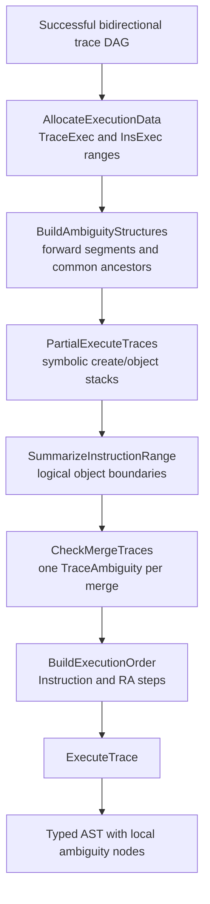
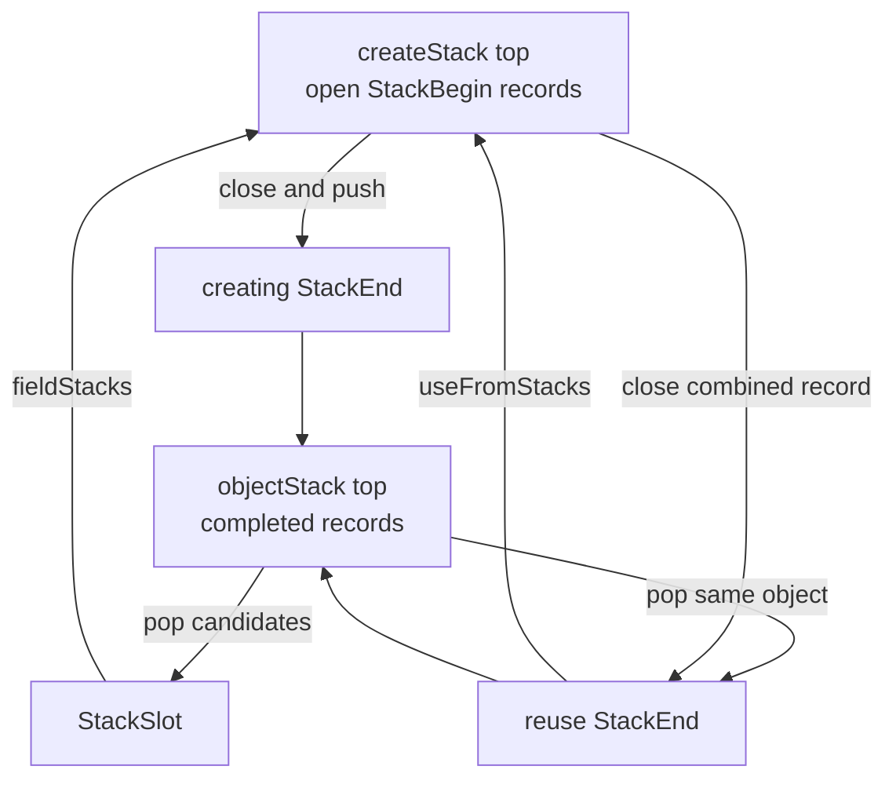
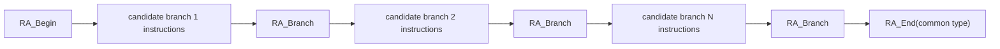
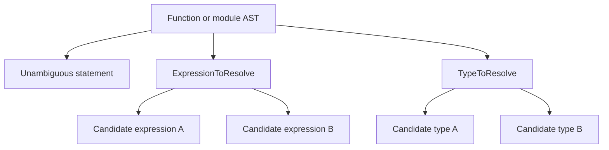

# Ambiguity and AST execution

The recognizer described in [Runtime parsing](RuntimeParsing.md) produces a trace DAG containing every surviving semantic history. This chapter explains how `vl::glr::automaton::TraceManager` turns that DAG into one replay program and how `vl::glr::AstInsReceiverBase` turns the replay into a strongly typed AST.

The crucial distinction is:

> Ambiguity resolution does not normally choose one grammar branch. It discovers the smallest AST object whose construction differs, executes every candidate for that local object, and asks generated code to wrap the candidates in the appropriate `ToResolve` node.

Priority competitions have already removed grammar paths that were declared less desirable. The ambiguity pipeline preserves the remaining, intentional alternatives.

Principal implementation files are:

- [`TmPtr.cpp`](../Source/TraceManager/TmPtr.cpp) and all `TmPtr_*` files for `PrepareTraceRoute`;
- [`TmRa.cpp`](../Source/TraceManager/TmRa.cpp), [`TmRa_CheckMergeTraces.cpp`](../Source/TraceManager/TmRa_CheckMergeTraces.cpp), and [`TmRa_BuildExecutionOrder.cpp`](../Source/TraceManager/TmRa_BuildExecutionOrder.cpp) for `ResolveAmbiguity`;
- [`TraceManager_ExecuteTrace.cpp`](../Source/TraceManager/TraceManager_ExecuteTrace.cpp) for replay;
- [`AstBase.h`](../Source/AstBase.h) and [`AstBase.cpp`](../Source/AstBase.cpp) for the concrete instruction VM.

[Architecture](Architecture.md) explains why recognition and semantic execution are separate. [Automaton construction](AutomatonConstruction.md) explains why the current instruction ordering is independent of left recursion and late class/field choices.

## Why the successful trace still needs analysis

A merge in the recognition graph says that multiple grammar histories reached an equivalent control configuration. It does not directly say:

- which AST object differs;
- whether that object is already complete or still being built;
- how far before the visible branch its construction began;
- how far after an intermediate merge its construction ends;
- which generated class can contain all candidates;
- how nested ambiguity regions overlap.

Normalized `StackBegin` instructions make these questions answerable. Every clause opens a slot frame. A create clause eventually constructs a new object; a reuse clause eventually continues an object produced earlier. Child objects move into slots before fields are applied. The runtime can therefore interpret only stack movement, without allocating an AST, and recover relationships among logical object scopes.

This is more robust than tracking speculative concrete objects. One final AST object can be represented by many `StackBegin` records connected through reuse, and a left-recursive child field can be constructed before the owner's own frame begins. The actual semantic object's begin and end are rarely one syntactically paired `StackBegin` and `StackEnd`.

## Post-processing pipeline

The parser facade calls these phases only when `EndOfInput` found at least one trace with multiple predecessors.



`TraceManager::PrepareTraceRoute` performs the first four stages and changes the manager from `Finished` to `PreparedTraceRoute`. `TraceManager::ResolveAmbiguity` performs the next two and changes it to `ResolvedAmbiguity`.

## Recovering each trace's instruction stream

A trace records the edge that created it and, for a reduction, the return-stack entry that was popped. `TraceManager::ReadInstructionList` in [`TraceManager_Common.cpp`](../Source/TraceManager/TraceManager_Common.cpp) presents their instructions as one virtual array:

1. `EdgeDesc::insAfterInput`;
2. `ReturnDesc::insAfterInput` from `Trace::executedReturnStack`.

The order matters. The callee's ending-edge instructions complete its result before the caller's return instructions store, discard, or reuse that result.

The return descriptors listed on a token or prefix-generated `LeftrecInput` edge are only pushed by that trace. Their `insAfterInput` slices are not appended to the pushing trace's virtual instruction stream. Each return slice appears later, one at a time, after the edge instructions of the `EndingInput` trace that pops that descriptor.

`vl::glr::automaton::TraceInsLists` stores the two slices and their combined counts. `TraceManager::ReadInstruction` translates a virtual index back to the correct `Executable::astInstructions` entry.

No instruction is copied during this operation. All later structures identify an instruction with `vl::glr::automaton::InsRef`, a pair of trace handle and virtual instruction index.

## Allocating execution metadata

`TraceManager::AllocateExecutionData` in [`TmPtr_AllocateExecutionData.cpp`](../Source/TraceManager/TmPtr_AllocateExecutionData.cpp) traverses only the successful DAG.

It allocates:

- one `vl::glr::automaton::TraceExec` per surviving trace;
- one exact-size global `vl::collections::Array<InsExec>` covering every trace instruction;
- linked indexes of all branch traces and merge traces.

`TraceExec::insExecRefs` is a slice into the global `InsExec` array. `TraceExec::traceId` points back to recognition history; `TraceExec::insLists` describes its executable instructions.

`TraceManager::IterateSurvivedTraces` visits a merge once for each incoming predecessor. It invokes merge-specific work on each visit but does not advance through the merge's successors until all incoming paths have arrived. `TraceExec` allocation happens on that final visit, so `Trace::traceExecRef` order is a topological order. Later algorithms use handle comparison as a cheap before/after relation.

## Describing branch topology

`TraceManager::BuildAmbiguityStructures` in [`TmPtr_BuildAmbiguityStructures.cpp`](../Source/TraceManager/TmPtr_BuildAmbiguityStructures.cpp) divides the graph into nonbranching forward segments.

`vl::glr::automaton::TraceBranchData::forwardTrace` identifies the beginning of the current segment. A segment begins at:

- the initial trace;
- every successor of a branch trace;
- every merge trace.

Ordinary traces inherit their predecessor's `forwardTrace`.

For a merge trace, `commonForwardBranch` identifies the latest forward-segment beginning shared by all incoming branches. The algorithm marks one segment-ancestry chain with a new magic counter and walks each other chain until it intersects that marked chain.

`TraceManager::StepForward` walks this compressed ancestry rather than raw trace edges:

- an ordinary trace jumps to its `forwardTrace`;
- a merge jumps through its `commonForwardBranch`;
- a successor segment jumps through the predecessor branch's segment;
- the initial segment terminates the walk.

These relationships are not the final ambiguity boundaries. They are navigation accelerators for nested branch and merge shapes.

## Symbolic partial execution

`TraceManager::PartialExecuteTraces` interprets structural AST instructions but never calls the generated receiver.

### Symbolic data structures

| Structure | Role |
| --- | --- |
| `InsExec` | Records the symbolic context before one instruction and all logical stacks operated on by it. |
| `InsExec_Stack` | Represents one executed `StackBegin`, not one concrete AST allocation. |
| `InsExec_InsRefLink` | Persistent linked set/list of instruction references. |
| `InsExec_StackRefLink` | Persistent linked set/list of logical stack references. |
| `InsExec_StackArrayRefLink` | One persistent stack level; `ids` can contain several alternatives after a trace merge. |
| `InsExec_Context` | Heads of the symbolic `objectStack` and `createStack`. |

`InsExec_StackArrayRefLink::currentDepth` lets merge validation compare stack shapes without counting a linked chain repeatedly. For a create-stack level, `objectStackDepthForCreateStack` remembers the object-stack depth when its `StackBegin` executed.

`InsExec_Stack::previous` links all allocated logical stacks in reverse allocation order. It is an iteration index, not a semantic parent.

### Two symbolic stacks

The partial executor uses the same abstract machine shape as final AST execution:

- `createStack` contains open slot scopes;
- `objectStack` contains completed or reusable results.

Each level contains a set of `InsExec_Stack` records because several incoming branches may hold different logical objects at the same depth.



### Instruction effects

`TraceManager::PartialExecuteOrdinaryTrace` records the pre-instruction context in `InsExec::contextBeforeExecution`, then handles these instructions:

#### `StackBegin`

- Allocate a new `InsExec_Stack`.
- Record its `beginInsRef`.
- Push a create-stack level containing that record.
- Store the current object-stack depth on the new level.
- Link the instruction's `operatingStacks` to the record.

#### `CreateObject`

- Require a nonempty create stack.
- Add the instruction reference to `createObjectInsRefs` of every alternative record at the top level.
- Add those records to the instruction's `operatingStacks`.

No class instance is allocated. The class ID remains available by rereading the original `AstIns` later.

#### `StackEnd`

The phase determines whether the closing scope creates a new object or reuses a prior object.

- If the logical record's most recent `CreateObject` belongs to this trace, append the end reference to `endWithCreateInsRefs`.
- Otherwise append it to `endWithReuseInsRefs`.

One merged `StackEnd` may not be creating for some alternatives and reusing for others. Connected `CreateObject` and `StackEnd` instructions are expected to remain in the same trace.

For a creating end, the closed create-stack records are pushed onto the object stack. For a reuse end:

1. Pop the existing object-stack top.
2. Add those records to each current record's `useFromStacks`.
3. Close the create-stack level.
4. Push the new records onto the object stack.

The relation means both sets of `StackBegin` records describe the same eventual AST object.

#### `StackSlot`

- Pop the object-stack top.
- Add the popped records to every current create-stack record's `fieldStacks`.

Slot number and eventual field ID are unnecessary for ambiguity boundaries. The significant fact is that construction of the owner depends on construction of these child objects.

#### Nonstructural instructions

`Token`, `EnumItem`, `Field`, and `FieldIfUnassigned` do not change object identity or stack shape and are ignored by symbolic execution. A real `ResolveAmbiguity` must never appear in the original trace; it is synthesized only in the final execution order.

### Field and reuse relationships

The two dependency kinds solve different problems:

- `fieldStacks`: a child contributes to the owner's complete subtree range but is a different AST object.
- `useFromStacks`: two normalized scopes contribute fields to the same AST object.

Reuse dependency is transitive. A rule such as `Expr ::= !Term` and another reuse layer above it can produce several logical stack records for one final expression object. A field of any reused record is also a field dependency of the final object.

This is why simply matching a `StackBegin` to its nearest `StackEnd` would calculate the wrong ambiguity range.

## Merging symbolic contexts

At a trace merge, `TraceManager::EnsureInsExecContextCompatible` first validates every incoming context against the first predecessor:

- object stacks are both empty or both nonempty and have equal depth;
- create stacks have equal depth;
- each corresponding open create level has the same `objectStackDepthForCreateStack`.

These are semantic stack-machine invariants. Branches cannot safely reconverge if one leaves an extra object, closes a different number of scopes, or opened corresponding scopes against different object-stack depths.

`TraceManager::MergeInsExecContext` then merges object and create stacks level by level. `TraceManager::MergeStack`:

1. reuses a level immediately if all predecessors already share the same persistent node;
2. otherwise allocates a new level;
3. unions unique `InsExec_Stack` IDs using a magic-counter epoch;
4. continues with each incoming level's `previous` link;
5. reuses a common persistent tail when one is reached.

The resulting context describes all symbolic objects available after the parser merge without multiplying complete context copies.

## Summarizing logical object ranges

`TraceManager::SummarizeInstructionRange` in [`TmPtr_PartialExecuteTraces_SummarizeInstructionRange.cpp`](../Source/TraceManager/TmPtr_PartialExecuteTraces_SummarizeInstructionRange.cpp) runs three dependency passes.

### Earliest local begin and constructors

`SummarizeEarilestLocalInsRefs` follows `useFromStacks` in dependency order.

For every logical stack it computes:

- `earliestLocalInsRef`: earliest `StackBegin` among scopes contributing to the same AST object;
- `indirectCreateObjectInsRefs`: all constructors reachable through those reuse relations.

The constructor set later determines the ambiguity candidate type. A pure reuse scope still obtains the constructor of the object it reuses.

### Earliest complete subtree begin

`SummarizeEarilestStackInsRefs` forms `allDependentStacks` from field and reuse dependencies. It propagates the earliest range through both relations.

`earliestStackInsRef` is therefore the earliest instruction needed to build the complete candidate subtree, not merely the owner's own normalized scope. This matters for left-recursive forms in which the left child was fully constructed before the new owner frame began.

### Matching final ends

`SummarizeEarilestInsRefs` propagates each complete earliest boundary back through the reuse closure and associates it with `bottomInsRefs`, drawn from creating and reuse `StackEnd` references.

The result is deliberately many-to-many:

- one semantic object can have several possible earliest records after branching;
- one earliest logical object can have several ending instructions after branches split;
- begin and end references need not belong to the same normalized scope.

Epoch-marked dependency walks process each record only a small number of times without recursive call depth proportional to the entire parse.

## From parser merges to local AST ambiguities

`TraceManager::CheckMergeTraces` in [`TmRa_CheckMergeTraces.cpp`](../Source/TraceManager/TmRa_CheckMergeTraces.cpp) examines every merge trace. Each must produce one valid `vl::glr::automaton::TraceAmbiguity`; a merge that cannot be explained as alternatives for a local AST object is an internal structural failure.

### Selecting candidate objects

`TraceManager::CheckSingleMergeTrace` uses the location of the merge:

#### Final merge

If the merge has no successor, each complete parse result is at the top of the merged symbolic object stack. Those top alternatives are candidates.

#### Nonfinal merge with synchronized closing objects

The function searches the first predecessor backward for a `StackEnd` and calculates the instruction postfix after it. If every predecessor has a compatible suffix, the objects closed by those aligned `StackEnd` instructions are tested first.

- If `StackEnd` is the predecessor's last instruction, its results are already at the merged object-stack top.
- If instructions follow it, `InsExec::operatingStacks` at the aligned instruction identifies the closed object records directly.

This case handles ambiguity that consists solely of completed object alternatives even though caller instructions occur later in the same traces.

#### Nonfinal merge inside an open object

If no compatible closing suffix yields candidates, alternatives at the top of the merged create stack are tested. The grammar histories differ inside an object that is still being assembled.

### Establishing begin and end boundaries

`TraceManager::CheckAmbiguityResolution` inspects each candidate's summarized range.

`TraceAmbiguity::firstTrace` and `prefix` describe where candidate execution begins. `prefix` is the number of instructions before the first ambiguity instruction.

Candidate begins must be either:

- the same instruction in the same trace; or
- equivalent instruction prefixes in sibling traces sharing one predecessor.

`TraceAmbiguity::lastTrace` and `postfix` describe where candidate execution ends. `postfix` is the number of instructions after the last ambiguity instruction.

Candidate ends must be either:

- the same instruction in the same trace; or
- equivalent instruction suffixes in traces sharing one successor.

An object's `bottomInsRefs` can include an inner field object's end as well as the desired outer candidate's end. The algorithm groups ends twice:

- by the trace containing the end;
- by that trace's unique successor.

It selects the unique largest compatible group. This filters ranges where a candidate from one branch is itself a field of the candidate from another branch.

When equivalent begins live in successors of a branch, `firstTrace/prefix` is adjusted to represent the shared predecessor plus an extra prefix. When equivalent ends live in predecessors of a merge, `lastTrace/postfix` is adjusted to represent the shared merge plus an extra postfix. The execution-order builder understands both forms.

Finally the compressed `forwardTrace` ancestry must prove that the begin and end belong to the same enclosing branch region.

### One ambiguity revealed by several merges

Complex branch graphs can merge in stages. Several merge traces may therefore report the same semantic ambiguity region.

`TraceManager::CheckTraceAmbiguity` associates ambiguity records with their first trace. If a new record has the same final trace as an existing record, their `prefix` and `postfix` must also match. The new record replaces the directly associated one and points to it through `TraceAmbiguity::overridedAmbiguity`.

This retains all candidate-producing merges while presenting one region to execution-order traversal.

### Finding the owning branch

`TraceAmbiguity::mergeTrace` is the parser merge being examined. `branchTrace` must identify the earlier fork whose successors enumerate the semantic candidates.

The nearest candidate is not always the first predecessor's segment ancestor. Uneven nested graphs can merge some branches early and carry another branch farther. `CheckMergeTraces` examines every predecessor's `forwardTrace` or `commonForwardBranch` ancestry and selects the earliest applicable branch trace.

It also builds `nextAmbiguityCriticalTrace` links for:

- every branch trace;
- every predecessor of a merge;
- every ambiguity start inside a forward segment.

These sorted per-segment links let the order builder jump directly between semantic boundaries instead of rescanning every trace.

## Calculating the ambiguity type

The generic runtime sees only integer class IDs. `TraceManager::CreateResolveAmbiguityStep` in [`TmRa_BuildExecutionOrder.cpp`](../Source/TraceManager/TmRa_BuildExecutionOrder.cpp) calculates the generated class that can own the candidates.

For every `TraceAmbiguity::bottomCreateObjectStacks` record it follows `indirectCreateObjectInsRefs`, rereads the corresponding `CreateObject` instructions, and folds their class IDs through:

```cpp
vl::glr::automaton::IExecutor::ITypeCallback::FindCommonBaseClass
```

The generated parser implements this callback with a class-inheritance matrix. Different branches can construct different subclasses; the fold selects their most specific common generated base.

If no common class exists, `vl::glr::automaton::UnableToResolveAmbiguityException` reports both class IDs and the token limits of the ambiguity region. If the callback itself is absent, trace resolution fails before replay.

The common class may still be unsuitable for ambiguity. The generated assembler's `ResolveAmbiguity` implementation enforces the `@ambiguous` contract when the synthetic instruction executes. Thus type compatibility and permission to preserve ambiguity are separate checks.

## Execution steps

`vl::glr::automaton::ExecutionStep` is the replay intermediate representation.

| `ExecutionType` | Payload | Meaning |
| --- | --- | --- |
| `Instruction` | start trace/instruction and end trace/instruction | Execute an inclusive range along a path with unique successors. |
| `RA_Begin` | representative trace | Open a synthetic slot frame for candidates. |
| `RA_Branch` | representative trace | Store one completed candidate in reserved slot `-2`. |
| `RA_End` | common class ID and representative trace | Resolve candidates to one local ambiguity node and close the frame. |

During construction, `ExecutionStep::parent` represents a reverse linked list or a shared tree, while `leafNext` enumerates tree leaves. After construction, `next` is the linear replay link.

### Building one ambiguity

`TraceManager::BuildStepListForAmbiguity` emits this logical shape:



The trace graph can share a prefix among several candidates. Candidate construction cannot share its mutable AST execution, so the builder first represents alternatives as an `ExecutionStepTree`, then `ConvertStepTreeToList` duplicates shared ancestors once per leaf. Each candidate receives an independent execution of every instruction in its semantic range.

`TraceManager::BuildStepLeafsForAmbiguityBranch`:

1. walks one successor of `branchTrace` toward `mergeTrace`;
2. recursively expands any raw fork belonging to the same ambiguity;
3. includes a suffix from the merge to the semantic end when needed;
4. appends `RA_Branch`;
5. records the resulting leaf.

The `prefixExtra` and `postfixExtra` calculations handle ambiguity boundaries located uniformly in branch successors or merge predecessors rather than directly inside the recorded first/last trace.

### Nested ambiguities

An inner ambiguity can begin before the outer ambiguity's visible fork because left recursion moved the inner object's earliest dependency into a shared prefix. Conversely, an outer branch can continue through traces also used while describing the inner ambiguity.

`NestedAmbiguityInfo` records:

- nested `TraceAmbiguity` objects from outermost to innermost;
- their owning branch traces;
- which successor selections connect one nested branch context to another.

`BSL_Guidance` tells an ordinary range walk which branch successor to follow and which ambiguity records to treat as already handled. `BSLA_Guidance` tracks the next nested ambiguity during recursive expansion.

This guidance prevents two errors:

- executing an unrelated outer branch while building an inner candidate;
- expanding the same nested ambiguity once as its own region and again as a raw branch.

### Walking ordinary ranges

`TraceManager::BuildStepListUntilFirstRawBranchTrace` starts at an arbitrary `(trace,instruction)` and seeks an arbitrary end boundary.

- It jumps to the next ambiguity-critical trace in the current forward segment.
- If a `TraceAmbiguity` begins there, it recursively builds that region.
- If the critical trace is a branch with a guidance-selected successor, it follows that successor.
- If the caller is enumerating candidates, an unclaimed raw branch is returned to the caller.
- Otherwise an unclaimed raw branch is an internal error.
- Long stretches without semantic boundaries become one `Instruction` step.

Every `Instruction` step is guaranteed to follow a unique-successor path. This keeps final replay simple and makes encountering a branch inside one step a checked failure.

### Final linearization

`TraceManager::BuildExecutionOrder` asks `BuildStepList` for the complete range from the initial trace to the sole successful final trace. The builder returns a reverse `parent` chain. `BuildExecutionOrder` walks from its last step to its first, writes forward `next` links, and stores `firstStep`.

The semantic scheduler is finished at this point. It has not allocated one concrete AST object.

## Replaying instructions

`TraceManager::ExecuteTrace` in [`TraceManager_ExecuteTrace.cpp`](../Source/TraceManager/TraceManager_ExecuteTrace.cpp) walks the `ExecutionStep::next` list.

### Ordinary instruction ranges

For an `Instruction` step, `TraceManager::ExecuteSingleStep`:

1. obtains the start trace;
2. executes the requested first/last instruction subsection;
3. follows the trace's unique successor;
4. executes complete instruction lists on intermediate traces;
5. stops at the requested end trace and instruction.

`TraceManager::ExecuteSingleTrace` passes each instruction to `vl::glr::IAstInsReceiver::Execute` with the token and token index stored on that trace. Edge and return instructions produced after the same consumed token therefore share that source position.

### Synthetic ambiguity operations

The three ambiguity step kinds are translated into ordinary AST instructions:

- `RA_Begin` executes `StackBegin`.
- `RA_Branch` executes `StackSlot` with `count == vl::glr::ResolveAmbiguitySlotIndex` (`-2`).
- `RA_End` executes `ResolveAmbiguity` with the common class ID, followed by `StackEnd`.

Each candidate branch leaves one current object. `RA_Branch` pops it into the same slot. The slot storage retains the first candidate inline and appends later candidates. `RA_End` replaces them with one generated ambiguity object and leaves that object as the current result for surrounding instructions.

### Empty-frame optimization

`vl::glr::automaton::AstInsOptimizer` wraps the generated receiver. It delays forwarding `StackBegin` until the next instruction is known. If that instruction is immediately `StackEnd`, both are removed as an empty normalized scope. Otherwise the begin is forwarded before the next instruction.

This removes no token, enum, object, or field effect. It avoids making the concrete VM open a frame whose normalized grammar path produced no semantic work.

## The concrete AST instruction VM

`vl::glr::AstInsReceiverBase` in [`AstBase.h`](../Source/AstBase.h) owns the final mutable state:

- `stackFrames`: open slot scopes;
- `creatingObjects`: generated AST nodes currently available for field assignment or movement into a slot;
- `finished` and `corrupted` lifecycle flags.

Generated subclasses implement:

- `CreateAstNode(classId)`;
- object, token, and enum overloads of `SetField`;
- `ResolveAmbiguity(classId, candidates)`.

### Slot values

`vl::glr::astins_slots::SlotValue` is a variant of:

- `TokenSlot`, containing a copied `RegexToken` and token-list index;
- `EnumItemSlot`, containing the generated enum integer;
- `Ptr<ParsingAstBase>`.

`SlotStorage` keeps one value inline and lazily allocates `additionalValues`. A repeated `Token`, `EnumItem`, or `StackSlot` with the same `count` appends rather than overwrites. Repeated object-producing occurrences use this mechanism to populate generated object-list fields; generated setters still enforce the cardinality and value category of the destination field.

### Instruction semantics

#### `StackBegin`

Push an empty frame and initialize its `codeRangeStart` from the current token start.

#### `Token`

Store the current lexer token and token-list index in the requested slot. The lexeme string is copied only when generated code assigns the token to a `ParsingToken` field.

#### `EnumItem`

Store `instruction.param` in the requested slot.

#### `StackSlot`

Require a frame and a current object, pop the object from `creatingObjects`, and append it to the requested slot. If the child's source range begins before the frame's current start, move `codeRangeStart` backward.

#### `CreateObject`

Require an open frame, ask generated code to create class ID `instruction.param`, initialize its range from the current token, correct its start from the frame, and push it on `creatingObjects`.

#### `Field` and `FieldIfUnassigned`

Require a current object and frame. If the requested slot is absent, do nothing; this naturally implements optional syntax.

Otherwise apply the first and all additional values in order to generated field ID `instruction.param`.

- Token values call the generated token setter.
- Enum values call the generated enum setter.
- Object values call the generated object setter.

Weak assignment is accepted only for enum values. It implements syntax assignment `?=` by leaving an already assigned enum unchanged.

#### `StackEnd`

Require a frame and current object. Correct the object's range start from the frame, extend its range end through the current token, and pop the frame. The object remains on `creatingObjects`.

For a reuse clause, no `CreateObject` occurred in this frame, so `Field` and `StackEnd` act on the inherited object already at the top. This is the concrete counterpart of symbolic `useFromStacks`.

#### `ResolveAmbiguity`

Read reserved slot `-2`. It must contain at least two values, and every value must be an AST object. Pass the candidate array and common type ID to generated code, then push the returned ambiguity node as the current object.

Tokens and enum items cannot be ambiguity candidates.

### Generated type and field validation

The helper templates in [`AstBase.h`](../Source/AstBase.h) implement the generated assembler's checked operations:

- `AssemblerSetObjectField` validates the owner class, candidate class, and scalar re-assignment; the list overload appends compatible values.
- `AssemblerSetTokenField` rejects re-assignment and copies token text and range.
- `AssemblerSetEnumField` validates the owner and honors weak assignment.
- `AssemblerResolveAmbiguity<TElement, TAmbiguity>` accepts compatible concrete candidates, flattens an existing `TAmbiguity::candidates` list, and rejects unrelated object types.

Generated switch dispatch calls `AssemblyThrowCannotCreateAbstractType`, `AssemblyThrowFieldNotObject`, `AssemblyThrowFieldNotToken`, `AssemblyThrowFieldNotEnum`, or `AssemblyThrowTypeNotAllowAmbiguity` for invalid IDs or unsupported operations.

`vl::glr::AstInsException` reports a stable `AstInsErrorType` and, where relevant, the offending class or field ID. Once an instruction throws, the receiver becomes corrupted and rejects all later calls.

### Source-range propagation

`vl::glr::ParsingTextRange` uses inclusive start and end positions and carries the lexer `codeIndex`.

The instruction VM derives ranges from semantic dependencies rather than only from the token attached to `CreateObject`:

1. `StackBegin` records the current source start.
2. `StackSlot` can move that start backward to a child constructed earlier.
3. `CreateObject` takes the earlier of its current token and the frame start.
4. `StackEnd` again applies the earliest frame start and extends through its current token.

This is the concrete range equivalent of symbolic field-dependency summarization. It preserves the full left-recursive or prefix-merged subtree range even when object allocation occurs near the clause suffix.

Generated ambiguity wrappers take the first candidate's range. All candidates represent the same recognized source region by the `TraceAmbiguity` boundary invariants.

### Completion

`AstInsReceiverBase::Finished` requires:

- no open stack frames;
- exactly one object in `creatingObjects`.

It removes and returns that root, marks the receiver finished, and rejects all subsequent execution. An unmatched scope or extra/missing object becomes `AstInsErrorType::InstructionNotComplete`.

## Local ambiguity in the returned AST

An AST class declared `@ambiguous` receives a generated ambiguity subtype, conventionally `ClassNameToResolve`, containing `List<Ptr<ClassName>> candidates`.

The final tree therefore remains one ordinary typed tree:



Two independent ambiguous regions do not produce four complete root trees. Each region stores its own candidates. Later semantic analysis can inspect symbols or context and replace or interpret those local wrappers.

## Phase and structural invariants

- `PrepareTraceRoute` requires a finished successful DAG; `ResolveAmbiguity` requires prepared route data; `ExecuteTrace` requires a resolved execution order.
- `TraceExec` handle order is treated as topological order.
- Every trace virtual instruction list is edge instructions followed by at most one popped-return instruction slice.
- A merge may combine symbolic contexts only when their create/object stack shapes agree.
- A single merged `StackEnd` cannot mix create and reuse behavior.
- Every recognition merge must map to a valid local object ambiguity.
- Candidate starts must share one instruction or an equivalent sibling prefix; candidate ends must share one instruction or an equivalent sibling suffix.
- Every candidate logical stack must lead to at least one `CreateObject` through its reuse closure.
- Ambiguity candidates need a common generated base class and a generated ambiguity wrapper for that class.
- One `Instruction` execution step may contain only unique-successor traversal.
- `ResolveAmbiguity` receives at least two object candidates through reserved slot `-2`.
- Final AST execution must end with no frames and exactly one root object.

## Why the algorithms use these structures

The trace DAG and symbolic stack graph solve different sharing problems:

- The trace DAG shares recognition prefixes and futures while preserving branch history.
- Persistent symbolic contexts share unchanged stack tails across ordinary traces.
- A set of logical records at one stack depth represents all branch alternatives without copying the whole stack.
- Field and reuse relations recover semantic object ranges despite normalized, flattened instruction order.
- Magic-counter epochs replace repeated temporary sets in dependency and ancestry traversals.
- Critical-trace links let nested execution-order construction skip ordinary traces.
- Execution-step trees express shared trace structure conveniently, then duplicate semantic instructions exactly where independent candidate objects require it.
- Reserved slot `-2` makes ambiguity collection an ordinary slot-frame operation instead of a special concrete-object stack surgery.

The result is a staged algorithm in which each representation answers one precise question. Recognition never needs generated types, boundary analysis never needs concrete objects, and the concrete VM never needs to understand GLR graph topology.

## Current implementation cautions

This section records verified current-source behavior separately from the intended invariants above.

### Prefix and postfix comparison

In [`TmRa_CheckMergeTraces.cpp`](../Source/TraceManager/TmRa_CheckMergeTraces.cpp), `TraceManager::ComparePrefix` and `TraceManager::ComparePostfix` currently read both compared instructions from `baselineTraceExec->insLists`. The incoming trace is checked for sufficient length, but its instruction contents are not actually read. Consequently the current implementation enforces only the length portion of the intended equal-prefix/equal-postfix invariant.

Documentation and future changes should preserve the intended rule stated above: sibling ambiguity boundaries require equal instruction sequences, not merely equal counts.

### Related runtime cautions

[Runtime parsing](RuntimeParsing.md#current-implementation-cautions) records the verified incomplete-input range issue in `ErrorArgs::ToParsingError` and comments that still mention removed `switchValues` and `insBeforeInput` concepts. Those comments should not be used to infer current ambiguity or replay state.

## Continue reading

- [Runtime parsing](RuntimeParsing.md) explains how the input token stream and packed automaton produce the successful trace DAG consumed here.
- [Automaton construction](AutomatonConstruction.md) explains the generation-time instruction ordering on which symbolic partial execution relies.
- [Grammar compilation](GrammarCompilation.md) explains `@ambiguous`, reuse clauses, partial clauses, fields, and enum assignments before lowering.
- [Code generation](CodeGeneration.md) explains the generated receiver and common-base-class callbacks used during final replay.
- [Source map](SourceMap.md) maps the post-processing implementation files by phase.
