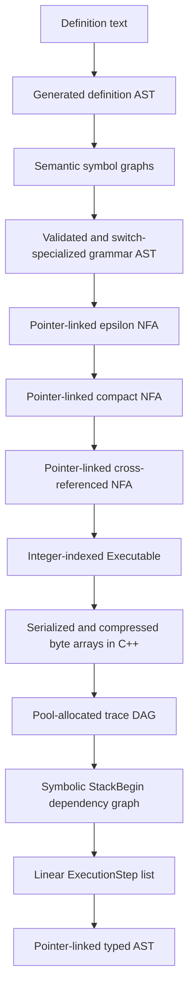
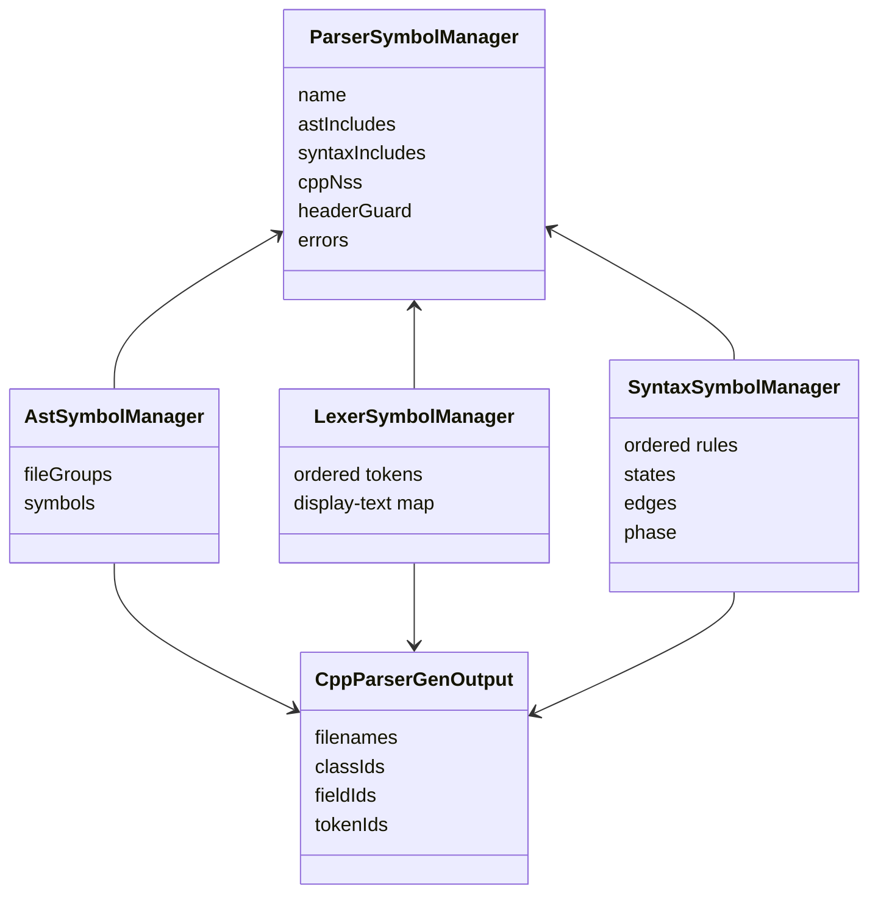

# Architecture

VlppParser2 is best understood as two pipelines with a narrow generated-code boundary:

- The generator pipeline accepts declarative parser definitions, resolves them into semantic models, transforms grammar graphs, and emits C++ plus serialized tables.
- The runtime pipeline loads those tables, recognizes tokens with a generic GLR executor, derives an ambiguity-aware instruction order, and calls a generated type adapter to build a strongly typed AST.

The architecture deliberately moves work to generation time whenever it would otherwise enlarge every runtime configuration. Static switches, partial-rule expansion, type checking, prefix discovery, deterministic indexing, and rule cross-references all disappear into the generated automaton. Runtime state is limited to what depends on the actual token stream: the automaton state, persistent return stack, priority competitions, and trace history.

## Layered view

| Layer | Principal code | Owns | Produces for the next layer |
| --- | --- | --- | --- |
| Definition model | [`ParserGen_Generated`](../Source/ParserGen_Generated) | Generated AST types and parsers for AST/syntax definition languages | `GlrAstFile` and `GlrSyntaxFile` trees |
| Shared generator context | [`ParserGen_Global`](../Source/ParserGen_Global) | Global configuration, errors, output names, stable ID maps | Common policy and diagnostics |
| AST semantics | [`Ast`](../Source/Ast) | AST file groups, files, enums, classes, properties, inheritance | Validated AST symbols and generated C++ types |
| Lexer semantics | [`Lexer`](../Source/Lexer) | Ordered token symbols, regexes, display literals, discard flags | Serialized `RegexLexer` and token metadata |
| Syntax semantics | [`ParserGen`](../Source/ParserGen) | Definition-AST validation, type inference, switch rewriting | A validated switch-free grammar |
| Automaton IR | [`Syntax`](../Source/Syntax) | Rules, states, edges, competitions, AST instruction lists | Epsilon, compact, then cross-referenced NFA |
| Runtime image | [`Executable.h`](../Source/Executable.h) | Dense tables and range descriptors addressed by 32-bit indices | Serializable PDA data |
| Generated parser facade | [`SyntaxBase.h`](../Source/SyntaxBase.h) and generated parser files | Lexer/executable loading, tokenization, typed parse entry points, events | Token list and configured executor |
| Recognition runtime | [`TraceManager`](../Source/TraceManager) | Active configurations, persistent returns, competitions, trace DAG | Successful trace graph |
| Semantic scheduling | [`TraceManager`](../Source/TraceManager) | Symbolic instruction contexts, ambiguity ranges, execution steps | Linear replay schedule |
| AST assembly | [`AstBase.h`](../Source/AstBase.h) and generated assembler | Slot frames, concrete objects, typed field operations | One typed AST with local ambiguity nodes |
| Handwritten integrations | [`Json`](../Source/Json), [`Xml`](../Source/Xml) | Domain-specific normalization, queries, printing | Stable built-in APIs |

No layer reaches backward across this table through a generated concrete type. The semantic scheduler knows integer class IDs and asks an `ITypeCallback` for class relationships. The AST instruction VM knows integer class/field IDs and calls virtual functions implemented by generated code. This inversion is what makes one runtime usable for every generated grammar.

## Principal data transformations

Each representation is chosen for the work performed on it:

- Definition ASTs retain source ranges and declarative structure for diagnostics and rewriting.
- Symbol graphs provide name lookup, stable source order, inheritance, and resolved pointers.
- Pointer-linked automata make graph surgery straightforward.
- `vl::glr::automaton::Executable` replaces pointers and small collections with dense arrays and `{start,count}` slices.
- Trace-processing pools provide stable handles while appending many short-lived graph nodes.
- The final AST returns to ordinary `Ptr<T>` relationships because it is the client-facing semantic model.

Trying to use one representation for every phase would either make generation algorithms index-heavy or make runtime loading allocation-heavy. The explicit conversion boundaries keep both halves simple in their own terms.

## Generator-side ownership

### One shared policy and error sink

`vl::glr::parsergen::ParserSymbolManager` in [`ParserSymbol.h`](../Source/ParserGen_Global/ParserSymbol.h) stores parser-wide naming configuration and every semantic error. AST, lexer, and syntax managers hold a reference to it and report structured errors with a definition kind and source range.

The manager does not own every subsystem object. Instead, each subsystem owns its own graph while sharing error policy:

`MappedOwning<T>` gives named generator objects three simultaneous properties:

- `Ptr<T>` ownership;
- dictionary lookup by name;
- a separate stable insertion order.

The explicit order is not bookkeeping noise. It defines deterministic output, enum values, token priority, and rule ordering. Code that resolves by dictionary but emits by map iteration would silently change generated IDs and serialized automata.

### Output metadata is also a cross-stage contract

`vl::glr::parsergen::CppParserGenOutput` looks like a filename manifest, but its `classIds` and `fieldIds` dictionaries are populated while the AST assembler header is generated. Syntax lowering then embeds those IDs in `CreateObject` and `Field` instructions. Consequently AST file generation must precede syntax compilation. The production generator in [`Tools/GlrParserGen/GlrParserGen/Main.cpp`](../Tools/GlrParserGen/GlrParserGen/Main.cpp) enforces that order.

This coupling is intentional but narrow: syntax generation depends on numeric identities, not generated class declarations or C++ layout.

## Runtime image organization

`vl::glr::automaton::Executable` in [`Executable.h`](../Source/Executable.h) is a structure of arrays. Every variable-length relationship is stored as a range into another flat array:

- `transitions[state * inputCount + input]` gives an `EdgeArray`.
- `EdgeDesc::competitions`, `insAfterInput`, and `returnIndices` are slices.
- Each return index addresses a `ReturnDesc`, which has its own competition and instruction slices.
- Conditional literal text is a slice into one `WString` buffer.

There are only three input categories in the final automaton:

- `EndingInput` (`0`) reduces the current rule and may pop a continuation.
- `LeftrecInput` (`1`) enters a zero-token continuation introduced by direct left recursion or prefix factoring.
- `TokenBegin + tokenId` consumes a lexer token.

Rule calls are absent from the dispatch table. Cross-referencing attaches ordinary leading-call continuations to the first consuming token edge as return descriptors; prefix-merge injection can also attach return descriptors to `LeftrecInput` edges. Runtime dispatch is therefore a direct array lookup while still retaining pushdown behavior.

Metadata such as rule names and state labels is kept beside, rather than inside, the hot transition descriptors. Generated parsers expose it for diagnostics without making every edge larger.

## Runtime transient ownership

The recognizer can create many tiny nodes. `vl::glr::automaton::AllocateOnly<T>` in [`TraceManager.h`](../Source/TraceManager/TraceManager.h) allocates fixed-size arrays and addresses an element with a 32-bit `Ref<T>` handle. The last block is append-only; earlier addresses never move.

Separate pools exist for:

- persistent `ReturnStack` nodes;
- `Trace` nodes;
- priority `Competition` and attendance nodes;
- per-trace execution metadata;
- symbolic stack/dependency records;
- ambiguity records;
- final execution steps.

This arrangement was selected over individually allocated smart-pointer nodes because parser configurations and trace records are small, numerous, and mostly accessed near allocation order. It also makes clearing an executor for a new parse a pool reset rather than a graph destruction walk.

`Ref<T>` is deliberately typed. Although all handles are 32-bit integers, a return-stack handle cannot be accidentally assigned to a trace handle without an explicit conversion.

## The semantic-action boundary

### Why ASTs are not built during recognition

A merged GLR automaton can branch after an object logically begins, merge before a nested object logically ends, and combine paths that took different left-recursive continuations. Executing object mutations during that walk would require speculative object copies and would still struggle to determine the exact local ambiguity boundary.

VlppParser2 instead records one `Trace` per transition. A trace remembers enough configuration to continue recognition:

- automaton state;
- persistent return-stack head;
- transition and input that created it;
- any popped return record;
- token index;
- active priority-competition routing;
- predecessor links.

Only successful endings are used to build successor links, so failed work remains allocated but is outside the surviving DAG. If the DAG is a chain, instructions can be replayed directly. If it branches and merges, a second pipeline derives ambiguity ranges and a safe replay order.

### Why the AST VM uses slots

The AST instruction stream is grammar-independent:

| Instruction | Architectural role |
| --- | --- |
| `Token` | Save the consumed token in a numbered slot. |
| `EnumItem` | Save a compile-time enum value in a slot. |
| `StackBegin` | Open a slot scope and begin tracking a result range. |
| `StackSlot` | Move the most recently completed object into a slot. |
| `CreateObject` | Ask generated code to allocate one class ID. |
| `Field` | Assign all values in a slot to one field ID. |
| `FieldIfUnassigned` | Perform the weak enum assignment used by `?=`. |
| `StackEnd` | Close the scope while leaving its result available. |
| `ResolveAmbiguity` | Replace candidates in the reserved slot with a generated ambiguity wrapper. |

Tokens and child results are collected before a concrete object is required. This produces two important invariants:

1. The instructions attached to a shared prefix normally depend only on that prefix, not on a later class or field choice.
2. A reuse clause can assign fields before or after its `!Rule` syntactically because both are resolved through the same completed slot frame.

Those invariants are prerequisites for the automaton transformations described in [Automaton construction](AutomatonConstruction.md), not merely conveniences of the AST builder.

## Ambiguity is local and typed

GLR branching alone does not say where an AST ambiguity starts or which object type should own the candidates. The post-processing pipeline symbolically executes the slot instructions without creating objects. It records field relationships and reuse relationships among `StackBegin` scopes, then summarizes the earliest begin and latest relevant ends of each logical object.

At a trace merge, the runtime can then answer:

- Which completed objects arrive from the branches?
- What instruction range must be repeated once per candidate?
- Which prefix and postfix are genuinely shared?
- What is the candidates' most specific common generated class?
- Does that class have an `@ambiguous` wrapper?

The generated parser implements `ITypeCallback::FindCommonBaseClass`; the generated assembler implements creation of the corresponding `ToResolve` object. The generic runtime inserts synthetic operations that place each branch result into slot `vl::glr::ResolveAmbiguitySlotIndex`, resolve the candidates, and continue with one object. Nested ambiguities are recursively flattened into one execution-step list.

This representation avoids the whole-tree Cartesian product. Two ambiguous statements in one function remain two local candidate lists inside one function AST.

## Compile-time versus runtime decisions

| Concern | Resolved when | Reason |
| --- | --- | --- |
| AST names, inheritance, and field types | Generation | Errors should refer to definitions; runtime uses numeric IDs. |
| Lexer regex combination | Generation | A serialized combined lexer is faster and deployable without definitions. |
| Grammar switches | Generation | They describe grammar families, not input-dependent state. |
| Partial rules | Generation | They are macros with no runtime result object. |
| Direct left recursion | Generation | It becomes explicit continuation topology. |
| Common-prefix discovery | Generation | Sharing requires whole-grammar start-set knowledge. |
| Conditional literal spelling | Runtime token edge | The token class is static, but the actual lexeme is input-dependent. |
| Preferred optional winner | Runtime | A preferred path can fail later; the input determines which paths survive. |
| GLR ambiguity | Runtime | It depends on the token sequence and surviving configurations. |
| Concrete AST allocation | Final replay | It must follow the already selected ambiguity-aware semantic order. |

## Phase contracts and invariants

The code relies on explicit phase boundaries more than on defensive recovery between arbitrary calls.

### Generator contracts

- All declarations in an AST compilation batch are created before bases and fields are filled, enabling forward references.
- Semantic passes stop after any accumulated error; later passes assume their inputs are valid.
- Switch-bearing syntax is specialized to a switch-free AST before automaton lowering.
- Partial rules are validated as non-recursive and are inlined; their bodies have no packed runtime states and their rule-start indices are not usable parse entries.
- Empty clauses and empty loop/optional bodies are rejected, preventing epsilon-only recognition cycles.
- `vl::glr::parsergen::SyntaxSymbolManager` advances strictly from `EpsilonNFA` to `CompactNFA` to `CrossReferencedNFA`.
- Indirect leading-rule recursion is rejected before recursive start-set expansion and rule cross-referencing.
- Stable rule, state, edge, class, field, and token order must be preserved across serialization and generated adapters.

### Runtime contracts

- `Initialize`, `Input`, `EndOfInput`, `PrepareTraceRoute`, `ResolveAmbiguity`, and `ExecuteTrace` are called in order. `ParserBase` owns this sequence.
- A live parser configuration is identified by state, return-stack identity, and priority routing; semantic history is retained in traces rather than in the merge key.
- Trace sibling links can express a split or a merge collection but not a general many-to-many relation. The input layer copies a trace in the one supported collision case.
- An ending transition is the only transition that pops a return record; the popped node is retained on the new trace so its return-time instructions can be replayed.
- `AstInsReceiverBase::Finished` requires no open frames and exactly one completed object.
- A local ambiguity requires at least two object candidates and a generated ambiguity-enabled common type.

Violations representing an invalid user grammar are accumulated as `ParserError`. Violations of these internal contracts use `CHECK_ERROR`, `CHECK_FAIL`, `TraceException`, or `AstInsException` because continuing would corrupt the generated/runtime representation.

## Performance design

The major performance choices reinforce one another:

- A combined DFA-style lexer recognizes all token definitions in one pass.
- Exact local edge merging avoids duplicating work when input and semantic actions already agree.
- Same-rule factoring shares a subrule even when callers have different continuation actions.
- Automatic cross-rule prefix merging shares expensive indirect prefixes and prevents duplicate equivalent AST candidates.
- Rule cross-referencing makes token dispatch a dense table lookup.
- Persistent return stacks share call prefixes among GLR configurations.
- Equivalent reductions merge trace configurations without losing predecessor histories.
- Append-only pools replace large numbers of scattered heap allocations.
- Recognition defers all concrete AST allocations until one successful replay.
- Serialized tables are compressed before being embedded in generated C++.

The history of the project is important here: prefix sharing is not a cosmetic optimization. Large non-LL grammars can otherwise retain many equivalent configurations across long qualified names or declaration/expression prefixes. The current instruction design was chosen specifically so sharing remains semantically safe.

## Extensibility boundaries

### Adding a grammar feature

A feature that changes accepted syntax normally touches:

1. the generated definition AST or its bootstrap factory;
2. the self-hosted syntax parser/bootstrap syntax;
3. name/type/structure validation;
4. `CompileSyntaxVisitor` lowering;
5. automaton transformations if it introduces a new edge semantic;
6. packed serialization and runtime walking if a new final edge kind survives;
7. definition printers and bootstrap regeneration.

Prefer compiling a feature into existing token, ending, left-recursion, competition, and instruction concepts. A new runtime edge or AST instruction expands the serialization format and every downstream invariant.

### Adding an AST field kind

The current generated assembler recognizes three value families: token, enum, and AST object (scalar or array for objects). A new field kind requires coordinated changes in AST validation, C++ type printing, class generation, slot value representation, generated setter dispatch, copy/traverse/JSON utilities, and TypeScript output.

### Adding a new output utility

AST utilities are independent generator pairs coordinated by `WriteAstFiles`. A new utility should use the AST symbol graph rather than parse generated headers, receive its filename through `CppAstGenOutput`, and be optionally suppressible in the production generator in the same manner as existing blocked utilities.

### Replacing a generated built-in parser

Handwritten JSON and XML wrappers depend on generated AST and parser surfaces but deliberately own normalization that is not generic parser behavior. Regenerating their parsers should preserve those wrapper assumptions or update the wrappers and [Code generation](CodeGeneration.md) documentation together.

## Where to continue

- The exact front-end semantics and current source caveats are in [Grammar compilation](GrammarCompilation.md) and [Syntax validation and rewriting](SyntaxValidation.md).
- The graph transformations behind `EpsilonNFA`, `CompactNFA`, and `CrossReferencedNFA` are in [Automaton construction](AutomatonConstruction.md).
- The recognition state machine and trace merge rules are in [Runtime parsing](RuntimeParsing.md).
- Symbolic semantic execution and the concrete instruction VM are in [Ambiguity and AST execution](AmbiguityAndAstExecution.md).
- The generated C++ surface and bootstrap order are in [Code generation](CodeGeneration.md) and [Bootstrapping and verification](Bootstrapping.md).
