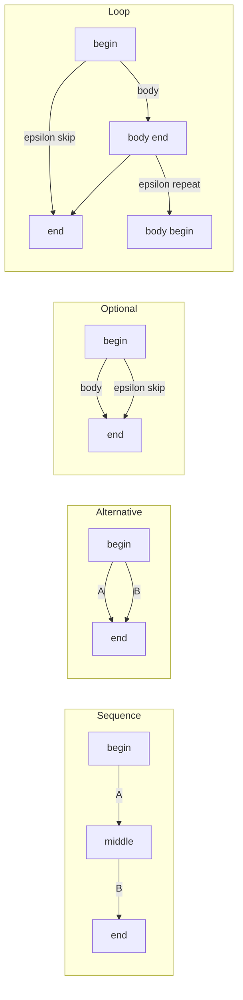
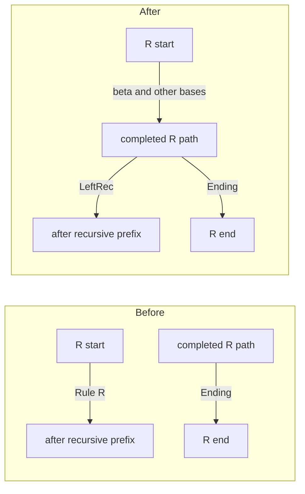
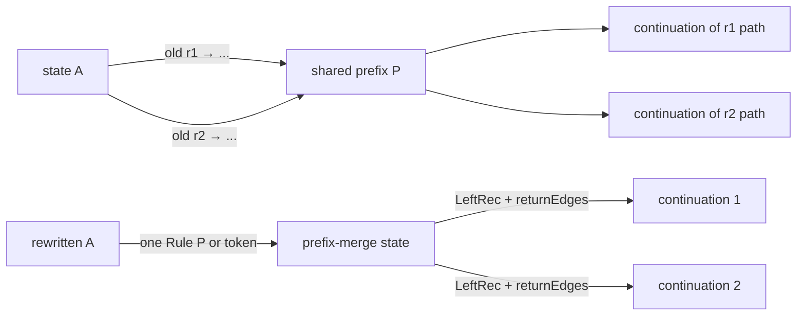

# Automaton construction

Automaton construction turns a validated syntax definition into the packed pushdown automaton consumed by the generic GLR runtime. The transformation deliberately begins with an easy-to-edit graph and ends with dense integer-indexed arrays:

> grammar AST → per-clause epsilon NFA → compact NFA → prefix-merged NFA → cross-referenced PDA → `automaton::Executable`

For context, see the [documentation index](Index.md), [architecture](Architecture.md), and [grammar compilation](GrammarCompilation.md). The semantic preconditions are established by [syntax validation and rewriting](SyntaxValidation.md). The generated tables are consumed as described in [runtime parsing](RuntimeParsing.md), while the AST instructions attached to transitions are interpreted through the pipeline in [ambiguity and AST execution](AmbiguityAndAstExecution.md).

## Why there are several automata

No single representation is ideal for all stages.

- EBNF lowering is simplest when sequence, alternative, optional, and loop can add epsilon edges freely.
- Left recursion and shared prefixes are easiest to transform while rules, states, edges, and instructions are pointer-linked objects.
- Runtime parsing should not chase generator objects or recursively inspect called rules. It needs direct token-indexed transitions and explicit return descriptors.
- Serialization and generated C++ benefit from flat arrays, 32-bit indices, and range descriptors.

The full transformation is:

```mermaid
flowchart LR
    Ast["Validated GlrSyntaxFile"] --> Builder["CompileSyntaxVisitor + AutomatonBuilder"]
    Builder --> ENfa["Epsilon NFA\nper-clause starts"]
    ENfa --> Eps["Eliminate epsilon edges\none start per rule"]
    Eps --> Lr["Eliminate direct left recursion"]
    Lr --> Exact["Merge identical input edges"]
    Exact --> SameRule["Factor calls to the same rule"]
    SameRule --> Prefix["Automatic prefix merge"]
    Prefix --> Compact["Compact NFA"]
    Compact --> Cross["Cross-reference leading rule calls"]
    Cross --> Packed["Packed automaton::Executable"]
```



`vl::glr::parsergen::SyntaxSymbolManager` owns the graph throughout these mutable stages. Its `SyntaxPhase` is a hard contract:

| Phase | Active transition kinds | Meaning |
| --- | --- | --- |
| `EpsilonNFA` | `Epsilon`, `Token`, `Rule`, plus ending-state markers | Direct lowering of clause syntax. |
| `CompactNFA` | `Token`, `Rule`, `Ending`, `LeftRec` | Epsilon closure is compressed; direct recursion and shared prefixes have been transformed. |
| `CrossReferencedNFA` | `Token`, `Ending`, `LeftRec` | Active rule calls have been folded into token edges with explicit return paths. |

`PrefixMergeRule`, `PrefixMergeDiscardedRule`, and `CrossReferencedToken` are temporary/internal edge kinds. Rule and discarded edges may remain owned after their active role ends, but final table construction ignores them.

## Mutable graph model

The graph types are declared in [`SyntaxSymbol.h`](../Source/Syntax/SyntaxSymbol.h) and implemented in [`SyntaxSymbol.cpp`](../Source/Syntax/SyntaxSymbol.cpp).

### `vl::glr::parsergen::RuleSymbol`

A rule stores its stable name, source-file index, resolved AST class, attributes, and start states.

- Before compaction, every compiled ordinary or reuse clause contributes a start state.
- After epsilon elimination, every rule has one compact start state.
- Partial rules are compile-time macros. Their clauses are embedded at references and do not provide a usable runtime entry.

### `vl::glr::parsergen::StateSymbol`

A state belongs to one rule and contains incoming and outgoing raw `EdgeSymbol*` lists. The manager owns the actual `Ptr<StateSymbol>` objects, so graph algorithms can reconnect raw pointers without transferring ownership.

`StateSymbol::label` is not parser semantics. It is a deterministic, human-readable position used for diagnostics, metadata, and stable ordering. Synthetic states append tags such as `[pm-lr]`, `[pm-dup]`, or `[pm-cr-rule: ...]`.

### `vl::glr::parsergen::EdgeSymbol`

An edge has four independent responsibilities:

- `input`: what recognition event enables the edge;
- `competitions`: optional-priority decisions carried by this path;
- `insAfterInput`: AST instructions ordered after the logical edge input; on a rule edge they are delayed until that called rule reduces;
- `returnEdges`: logical rule calls that must be pushed when a cross-referenced edge is taken.

`EdgeInput` holds either a token ID and optional lexeme condition, or a called `RuleSymbol` and `automaton::ReturnRuleType`.

The return kind records how the caller uses a completed subrule:

| Kind | Lowering behavior |
| --- | --- |
| `Field` | Store the returned object in a numbered slot and later bind that slot to a field. |
| `Discard` | Remove/store the returned object without binding it to a field. |
| `Reuse` | Leave the returned object as the object edited by the reuse clause. |
| `Partial` | Reserved in the executable model; current partial references are inlined and do not emit rule edges. |

### Ownership during transformations

Compaction algorithms often need the old graph to stay readable while a replacement is constructed. `SyntaxSymbolManager::IncrementalChange` separates:

- created states and edges;
- operation states and edges to keep or remove;
- the policy deciding whether the operation set or its complement is reused.

`ApplyIncrementalChange` reconnects ownership only after the algorithm has finished. Prefix merge goes further: it applies all solutions against an intact graph, then marks superseded rule edges as ignored. This avoids one solution destroying paths that another still needs to inspect.

## The StackBegin instruction model

The AST instruction set is declared in [`AstBase.h`](../Source/AstBase.h). Automaton construction emits these relevant instructions:

- `Token(slot)` stores the current token in a frame slot.
- `EnumItem(value, slot)` stores a constant enum value.
- `StackBegin` opens a slot frame.
- `StackSlot(slot)` stores the just-completed child object in the frame and clears the current object.
- `CreateObject(type)` creates the clause result object.
- `Field(field, slot)` assigns a slot to the current object, ignoring an empty slot.
- `FieldIfUnassigned(field, slot)` performs a weak enum assignment.
- `StackEnd` closes the frame while leaving the completed object available.

The decisive design property is that the eventual AST class and field names occur near clause completion, not at the beginning of a shared parse prefix.

Consider two clauses that begin with the same subrule but assign it to different fields or create different result classes. The prefix instructions still have the same shape:

```text
... parse Prefix ...
StackBegin
StackSlot(0)
... parse the remaining syntax ...
CreateObject(the selected class)
Field(the selected field, 0)
StackEnd
```

The graph builder initially places `StackBegin` on an epsilon edge before the body. Epsilon elimination attaches it to the first consuming edge's `insAfterInput`, so it executes only after that first token or subrule has completed. This is why left-recursive and prefix-merged paths can move the first input outside the frame without changing the AST result.

Numbered slots also make alternatives compositional. Both branches can contribute deferred `Field` instructions at clause end; a field instruction for the branch not taken sees an empty slot and has no effect. Structural validation has already proved that no non-array field is assigned twice on one actual path.

This model is the bridge between generation and the symbolic execution described in [ambiguity and AST execution](AmbiguityAndAstExecution.md). Recognition may share or reorder prefixes, but the slot-frame program still describes the same final object.

## Lowering syntax to an epsilon NFA

[`CompileSyntax_CompileSyntax.cpp`](../Source/ParserGen/CompileSyntax_CompileSyntax.cpp) contains `vl::glr::parsergen::CompileSyntaxVisitor`. It translates definition-AST nodes into calls on `vl::glr::parsergen::AutomatonBuilder`, declared in [`SyntaxSymbolWriter.h`](../Source/Syntax/SyntaxSymbolWriter.h) and implemented in [`SyntaxSymbolWriter.cpp`](../Source/Syntax/SyntaxSymbolWriter.cpp).

### Atomic inputs

`AutomatonBuilder::BuildTokenSyntax` creates two states and one token edge. The edge stores the token in a fresh slot. If the source syntax names a field, a deferred `Field` instruction is recorded for clause completion.

`BuildRuleSyntaxInternal` creates a rule edge and selects its return behavior:

- field reference: `StackSlot` plus deferred `Field`;
- discard reference: `StackSlot` without a field;
- `!Rule`: no `StackSlot`, leaving the returned object active for the reuse clause.

Double-quoted and conditional literals have already been mapped to token IDs by semantic validation. A conditional literal additionally fills `EdgeInput::condition` with the required lexeme.

When an identifier names a partial rule, `CompileSyntaxVisitor` does not create a rule edge. It recursively compiles all partial clauses as an alternative at the reference site and appends their enum assignments. This is literal macro expansion in the automaton IR.

### EBNF topology

Each builder operation returns `AutomatonBuilder::StatePair { begin, end }`.



The actual body begin/end states are separate; the diagram emphasizes connectivity. A separated loop routes repetition through the delimiter before returning to the body.

Nested sequence and alternative AST nodes are flattened into builder lists. This avoids unnecessary layers of synthetic epsilon states caused only by left- or right-associated definition-AST shape.

### Priority optionals

`BuildOptionalSyntax` creates take and skip epsilon edges. For `+[]` or `-[]`, it allocates one manager-wide competition ID and attaches an `EdgeCompetition` to both branches:

- the preferred branch has `highPriority = true`;
- the other branch has `highPriority = false`.

Epsilon elimination carries the competition forward to the consuming or ending edge where the choice becomes observable. Runtime handling is documented in [runtime parsing](RuntimeParsing.md).

### Clause envelopes

`BuildCreateClause` wraps the compiled body with:

1. `StackBegin`;
2. body instructions;
3. `CreateObject(classId)`;
4. every deferred field instruction;
5. `StackEnd`.

`BuildReuseClause` uses the same frame and deferred fields but omits `CreateObject`; the single `!Rule` result is the object receiving those fields.

Additional enum assignments extend the body with an epsilon edge containing `EnumItem`, while their `Field` or `FieldIfUnassigned` instruction remains deferred to the clause end.

`BuildClause` resets slot numbering, records the clause start in `RuleSymbol::startStates`, marks the end state, and renders positional state labels by inserting `@` into the clause display text.

## Compact-NFA pass order

`vl::glr::parsergen::SyntaxSymbolManager::BuildCompactNFAInternal` is in [`SyntaxSymbol_NFACompact.cpp`](../Source/Syntax/SyntaxSymbol_NFACompact.cpp). For each rule it performs local transformations in this exact order:

1. `EliminateEpsilonEdges`
2. `EliminateLeftRecursion`
3. `MergeEdgesWithSameInput`
4. `MergeEdgesWithSameRuleUsingLeftrec`

Only after every rule is locally compact does it calculate global start sets and apply automatic prefix merge.

The order prevents later algorithms from solving problems an earlier, cheaper transformation can normalize:

- epsilon removal exposes the real first inputs and ordered instruction prefixes;
- direct-left-recursion removal breaks self-leading cycles;
- exact merging removes branches that are already identical;
- same-rule factoring ensures one state no longer has duplicate calls to one rule;
- prefix merge can then reason about distinct leading-rule paths globally.

## Epsilon elimination

[`SyntaxSymbol_NFACompact_EliminateEpsilonEdges.cpp`](../Source/Syntax/SyntaxSymbol_NFACompact_EliminateEpsilonEdges.cpp) implements `EliminateEpsilonEdges` and the private `CompactSyntaxBuilder`.

### Joining clauses

Every clause initially has its own start and marked ending state. Epsilon elimination first creates:

- one pseudo start with an epsilon edge to every clause start;
- one dedicated compact ending state for the rule.

The pseudo start is mirrored as the final compact start. Thus all rule alternatives become one connected epsilon NFA before closure is computed.

### Compressing an epsilon path

For each mirrored compact state, `BuildEpsilonEliminatedEdgesInternal` recursively follows old epsilon edges. When it reaches a token or rule edge, it creates one direct compact edge and concatenates, in traversal order:

- competitions from every traversed edge;
- `insAfterInput` from every traversed edge, including the final input edge.

When the epsilon closure reaches a marked clause ending, it creates an explicit `Ending` edge to the compact ending state.

```text
Before:

                 -- epsilon e2 --> C -- input y --> E
                /
A -- epsilon e1
                \
                 -- epsilon e3 --> D -- input y --> E

After:

A -- input y / instructions(e1,e2,y) --> E'
A -- input y / instructions(e1,e3,y) --> E'
```

The two edges remain separate because their semantic histories may differ. Exact merging decides later whether they can safely share a target.

`oldToNew` and `newToOld` maps guarantee one mirrored compact state for each reachable old input-boundary state. A work list expands newly discovered compact targets.

Empty loop and optional bodies were rejected by [syntax validation](SyntaxValidation.md#path-structure-validation), so the epsilon-only subgraph cannot contain a repetition cycle that makes this recursive closure infinite.

## Direct left recursion

[`SyntaxSymbol_NFACompact_EliminateLeftRecursion.cpp`](../Source/Syntax/SyntaxSymbol_NFACompact_EliminateLeftRecursion.cpp) handles a rule whose compact start calls itself.

For a grammar shape `R ::= R alpha | beta`, choosing the recursive branch at the beginning would require predicting how many `alpha` repetitions the future input contains. The pass instead starts with a completed non-recursive result and loops afterward.



`EliminateLeftRecursion` finds every start-state `Rule` edge that calls the current rule. For each such edge and each edge entering the dedicated end state, it creates a `LeftRec` edge from the completed-path predecessor to the recursive edge's target.

`BuildLeftRecEdge` concatenates:

1. competitions and instructions that finish the current result;
2. competitions and instructions that followed the original recursive prefix.

The original self-call is disconnected. The resulting zero-token `LeftRec` transition turns recursion into iteration while preserving the order needed to build a left-associated AST. Because the StackBegin model leaves the completed left operand available before the next frame begins, no special AST register or grammar annotation is required.

This pass handles only direct recursion. Leading calls among multiple rules are checked for cycles during prefix-merge start-set construction.

## Exact merge by input

[`SyntaxSymbol_NFACompact_MergeEdgesWithSameInput.cpp`](../Source/Syntax/SyntaxSymbol_NFACompact_MergeEdgesWithSameInput.cpp) merges only edges that are equivalent at the current point.

The grouping key contains:

- complete `EdgeInput`;
- the exact ordered `AstIns` sequence;
- the exact competition set.

`returnEdges` are still empty at this stage and therefore need not participate.

If several outgoing edges share a key, their target states become a `StateSymbolSet`. A synthetic state represents that set, and its outgoing behavior is the union of the constituent states' outgoing behavior. The mapping from target sets to synthetic states is memoized, making the algorithm a selective powerset construction.

```text
Before:                         After:

        -- r/same --> U -- b --> X              -- b --> {X,Y}
       /                                         /
A ----+--- r/same --> V -- b --> Y      A -- r --> {U,V,W}
       \                                         \
        -- r/same --> W -- c --> Z              -- c --> Z
```

An original state can remain because another incoming edge may still reference it. The transformation only removes graph objects not selected as reachable operation objects when `ApplyIncrementalChange` installs the result.

This pass exists for performance, not acceptance. GLR could parse all duplicate branches and later discover that they are equivalent, but doing the same expensive subparse repeatedly creates avoidable traces.

## Factoring calls to the same rule

[`SyntaxSymbol_NFACompact_MergeEdgesWithSameRuleUsingLeftrec.cpp`](../Source/Syntax/SyntaxSymbol_NFACompact_MergeEdgesWithSameRuleUsingLeftrec.cpp) handles the next broader case: several edges call the same rule but differ in post-return instructions or competitions.

The common subrule should still be parsed once. The pass creates:

- one action-free rule edge to a synthetic `[pm-lr]` state;
- one zero-token continuation for each original caller behavior.

```text
Before:                              After:

        -- Rule r / action 1 --> U                 -- LeftRec / action 1 --> U
       /                                           /
A ----+--- Rule r / action 2 --> V      A -- Rule r --> B -- LeftRec / action 2 --> V
       \                                           \
        -- Rule r / action 3 --> W                 -- LeftRec / action 3 --> W
```

`LeftRec` here is the runtime's generic “continue after a completed prefix without consuming another token” transition. It is used both for source-level direct left recursion and for compiler-created post-return branching. The edge itself is not a rule input, but a prefix-merge-created `LeftRec` edge can carry `returnEdges`; the packed runtime pushes those descriptors when it follows the continuation.

Targets need careful handling:

- If all following edges consume input, the original edge can be reconnected from the synthetic state and changed to `LeftRec`.
- If following `Ending` or `LeftRec` edges exist, two consecutive zero-input transitions would violate compact form. The pass folds original and following instructions/competitions into one edge.
- If consuming and zero-input behavior coexist and the target may be shared, a `[pm-dup]` target is created and only the necessary consuming edges are copied.

This normalization also establishes an invariant used by prefix solving: two outgoing active rule edges from one state never consume the same rule.

## Automatic prefix merge

[`SyntaxSymbol_NFACompact_PrefixMergeCrossReference.cpp`](../Source/Syntax/SyntaxSymbol_NFACompact_PrefixMergeCrossReference.cpp) performs global sharing of indirectly common prefixes.

### The problem

Distinct rules often begin through different wrapper paths but eventually parse the same deep construct. A type and an expression may both begin with a qualified identifier, for example. Without prefix merge, GLR does all of the following:

- follows both wrapper paths;
- parses the same long identifier more than once;
- retains duplicate traces until much later input distinguishes the wrappers;
- may report two structurally identical results as ambiguity merely because they arrived through different rule paths.

Historical versions required grammar annotations such as `left_recursion_inject` and `!prefix_merge`. The current instruction ordering makes those annotations unnecessary. Equal parse prefixes expose equal early instructions, so the compiler can discover and factor them from any PDA state.

### Start-set representation

`PrefixMergeCache` assigns every rule a dense `pmRuleIndex` and stores bit sets:

- `directStartSetTokens`: token edges directly leaving the rule start;
- `startSetTokens`: transitive token starts through leading rule calls;
- `directStartSetRules`: rules directly called at the start;
- `startSetRules`: transitive leading-rule closure;
- `reverseStartSetRules`: rules whose closure contains a given rule.

`CreatePrefixMergeCache` builds the leading-rule dependency graph and orders it with `PartialOrderingProcessor`. A multi-rule strongly connected component is reported as `RuleIsIndirectlyLeftRecursive`.

Direct self recursion is absent because the preceding pass converted it to `LeftRec`. Therefore any remaining leading-rule cycle is genuinely indirect and would make both start-set closure and later rule cross-reference recurse forever.

Token and rule closures are then accumulated in dependency order. Bit sets are used because grammar rule counts are modest while solution code performs many union, intersection, and subtraction operations.

### Finding states that need a solution

`PrefixMergeCrossReference_Solve` operates in two rounds:

1. solve every rule start state in callee-before-caller order;
2. traverse and solve every other reachable state.

The first round lets a caller reuse prefix rules already selected for a called rule. The second is what removes the old “only at a rule prefix” limitation.

At one state, outgoing rule edges are related when both of these intersect:

- their transitive token start sets;
- their transitive rule start sets, including the called rule itself.

The token intersection says the paths can compete for the same input. The rule intersection says there is an actual shared rule prefix the algorithm can factor. Connected components of this relationship become candidate applications.

A non-start state needs a solution only for a multi-edge component. A rule start can also propagate the already-known solution of a single called rule upward; this is how common prefixes remain visible through wrapper rules.

### Selecting prefix rules

For one multi-edge component, `PrefixMergeCrossReference_SolveInState` begins with each edge's remaining transitive rule set. It scans candidate rules in dependency order.

Let `R` be a candidate rule closure and `E[i]` an edge's remaining closure. `R` is selectable only when every edge satisfies one of:

- `E[i]` completely contains `R`; or
- `E[i]` is disjoint from `R`.

At least one edge must contain it. A partial intersection would cut through a dependency subgraph and cannot be represented by one injected prefix rule.

When a candidate is selected, the solver removes:

- the candidate and its descendants;
- every reverse-dependent ancestor containing that candidate.

Removing both directions prevents a later selection from overlapping the already factored region. The process repeats until the remaining sets are empty. Previously inherited prefix solutions are removed from the working sets before new candidates are chosen.

The result is represented by:

- `PrefixMergeSolutionValue`, the union of selected prefix rules and its applications;
- `PrefixMergeSolutionApplication`, the original outgoing edges and prefix rules for one intersecting component.

The goal is not merely pairwise intersection. It is a set of high-level, non-overlapping prefixes that covers the relevant start-set leaves with minimal duplicated work.

### Applying a solution

`PrefixMergeCrossReference_Apply` marks selected rules in `PrefixMergeApplicationItems::coveredRules`, then walks each original outgoing rule path recursively.

- Reaching a covered rule records the complete accumulated edge path under that rule.
- Reaching a token records the path under `(tokenId, condition)`.
- Following another leading rule continues recursively; indirect-left-recursion validation guarantees termination.

For each group, `PrefixMergeCrossReference_AccumulatedEdges` creates one new edge from the state being optimized and reconstructs the continuations that the original paths would have produced.



The reconstructed edges preserve:

- each path's ordered return edges;
- competitions;
- AST instructions;
- token conditions;
- ending and left-recursive behavior following the prefix.

Continuation states are created when several path lengths or following edge shapes must be represented. Equivalent created continuations are deduplicated by from/to state, input, competitions, instructions, and return-edge sequence.

The implementation recognizes a trailing pure reuse edge as an identity wrapper when all of these hold:

- it is a `Reuse` rule edge;
- it carries no competition;
- its only instructions are the permitted `StackBegin` placement;
- its target has exactly one ending edge completing the matching `StackBegin`/`StackEnd` frame.

Such tails can be shortened while reconstructing continuations because they do not create or replace the object. This special case is much smaller than the historical prefix-merge machinery precisely because the StackBegin instruction set has already normalized all other AST differences.

New rule-prefix edges are temporarily tagged `PrefixMergeRule`; new token-prefix edges are ordinary token edges. Original participating rule edges are marked `PrefixMergeDiscardedRule` after all applications have been built. New rule edges are then normalized to `Rule`. Discarded edges stay owned but are ignored by cross-reference and final packing.

## Cross-referencing rule calls

The compact NFA still contains active `Rule` edges. Runtime token dispatch would be expensive if it had to recursively enter rule starts to discover which tokens are possible. [`SyntaxSymbol_NFACrossReferenced.cpp`](../Source/Syntax/SyntaxSymbol_NFACrossReferenced.cpp) removes that runtime search.

`SyntaxSymbolManager::BuildCrossReferencedNFAInternal` first records all existing outgoing edges in stable order. For every active rule edge, `FixCrossReferencedRuleEdge` recursively follows leading rule edges until it reaches a token edge.

It then creates a direct token edge from the original caller state to the deepest token target. For each traversed rule edge, it appends:

1. any return edges already attached by prefix merge;
2. the traversed rule edge itself.

```text
Compact calls:

Caller -- Rule A --> A-start -- Rule B --> B-start -- token t --> X

Cross-referenced edge:

Caller -- token t / returns [A-call, B-call] --> X
```

When this edge is executed, return descriptors are pushed in listed order, leaving the innermost call on top. `Ending` transitions reduce the current rule and resume through that stack. A `LeftRec` transition consumes no token, but it can also carry and push return descriptors introduced by prefix merging.

Token instructions and competitions are copied to the new edge. A traversed rule edge becomes a `ReturnDesc`: its competitions are attended when that descriptor is pushed, while its `insAfterInput` instructions are delayed until the descriptor is popped by a later `Ending` transition.

The ordering in the recognizer is therefore precise:

1. For each return descriptor on the chosen edge, attend its competitions against the current return-stack head, then push the descriptor.
2. Attend competitions stored directly on the chosen edge after all of its return descriptors have been pushed.
3. If the chosen input is `Ending`, require that it introduces no new return descriptors, pop at most one existing descriptor, and save that popped node on the new trace.

AST instructions are still deferred until final replay. The virtual instruction list of an `Ending` trace executes the ending edge's instruction slice first and the popped `ReturnDesc::insAfterInput` slice second. This completes the callee before applying the caller's field, discard, or reuse action.

New edges are temporarily marked `CrossReferencedToken` so they cannot be mistaken for an original token while construction is in progress. They are normalized to `Token` afterward. Original `Rule` edges remain available as return descriptors but are not emitted as active transition-table entries.

This cross-referenced graph is already the executable PDA in pointer-linked form: every input-consuming choice is token-indexed, and call/return behavior is explicit data rather than recursive graph search.

## Stable graph ordering

Determinism matters for generated files, serialized data, diagnostics, and reproducible review.

`SyntaxSymbolManager::GetStatesInStableOrder`:

1. discovers reachable states from rule starts;
2. groups them by owning rule;
3. follows stable rule insertion order;
4. excludes every state owned by a partial rule (including its compact placeholder start and end states);
5. sorts each rule's states by their diagnostic label.

`StateSymbol::GetOutEdgesInStableOrder` orders edges by input kind and value, target state, competitions, instructions, and return path. Cross-reference uses this stable snapshot when creating new edges.

Synthetic labels include their constituent original labels, so state-set and prefix transformations remain inspectable in generated `StateLabel` metadata.

## Packing `automaton::Executable`

[`SyntaxSymbol_Automaton.cpp`](../Source/Syntax/SyntaxSymbol_Automaton.cpp) implements `SyntaxSymbolManager::BuildAutomaton`. The destination structures are declared in [`Executable.h`](../Source/Executable.h).

The method requires `CrossReferencedNFA` and an empty error list.

### Input numbering and transition matrix

Runtime transition inputs are fixed:

- `Executable::EndingInput == 0`
- `Executable::LeftrecInput == 1`
- `Executable::TokenBegin + tokenId` for tokens

`EndOfInputInput == -1` is a reserved constant, not a transition-matrix column. The runtime validates end of input explicitly after token processing.

`Executable::transitions` is a dense array indexed by:

```text
state * (Executable::TokenBegin + tokenCount) + input
```

Each cell is an `EdgeArray { start, count }` slice into the flat `Executable::edges` array. Only active `Ending`, `LeftRec`, and matching `Token` edges enter this matrix.

### Packed arrays

| Array | Contents |
| --- | --- |
| `ruleStartStates` | `statesInOrder.IndexOf(rule->startStates[0])` for every rule ID. Ordinary rules receive a stable state index; partial rules are already inlined, their compact placeholder states are excluded from stable state order, and their entry is therefore `-1`. |
| `states` | Owning rule index and ending-state flag. |
| `edges` | From/to indices plus slices for condition, competitions, AST instructions, and returns. |
| `returns` | Consumed rule, return state, return kind, call-time competitions, and post-reduction instructions. |
| `returnIndices` | Per-edge references into the shared `returns` array. |
| `competitions` | Flat `CompetitionDesc` storage used by edge and return slices. |
| `astInstructions` | Flat `AstIns` storage used by edge and return slices. |
| `stringLiteralBuffer` | Concatenated conditional-token lexemes referenced by start/count ranges. |

Empty slices use `start = -1`. Nonempty values are appended in stable edge order.

Each distinct `EdgeSymbol*` appearing in any edge's `returnEdges` is assigned one `ReturnDesc`; repeated references to that same edge pointer share the descriptor. Structurally equivalent but distinct rule-edge objects are not deduplicated here.

The field, discard, and reuse effects are encoded in `ReturnDesc::insAfterInput`. The recognizer's direct use of `ReturnRuleType` is narrower: `PushReturnStack` may share an identical return-stack node for non-reuse calls, while a `Reuse` descriptor deliberately receives a distinct node. `ReturnDesc::competitions` are call-time annotations processed immediately before that node is pushed, not instructions delayed until return.

Conditions are not stored as separate strings. `BuildAutomaton` concatenates them into one `WString` and records a `StringLiteral` range on each edge, reducing allocation and serialization overhead.

### Metadata versus executable data

`automaton::Metadata` contains stable rule names and global state labels. It is used by generated diagnostic helpers. Recognition only needs the numeric `Executable` arrays.

[`SyntaxCppGen.cpp`](../Source/Syntax/SyntaxCppGen.cpp) serializes the executable into generated parser data and emits:

- the rule-start state enum;
- rule-name and state-label lookup functions;
- the generated parser class and `@parser` entry methods;
- type-name and common-base callbacks needed by ambiguity processing.

The serialization and generated-parser boundary is described further in [code generation](CodeGeneration.md); runtime loading and use are covered in [runtime parsing](RuntimeParsing.md).

## Invariants and failure handling

Public phase methods in [`SyntaxSymbol.cpp`](../Source/Syntax/SyntaxSymbol.cpp) enforce:

- `BuildCompactNFA` requires no semantic errors and `EpsilonNFA` phase;
- `BuildCrossReferencedNFA` requires no errors and `CompactNFA` phase;
- `BuildAutomaton` requires no errors and `CrossReferencedNFA` phase;
- public `CreateState` and `CreateEdge` are available only while initially building the epsilon NFA;
- no new rules may be created after graph construction has begun.

Later graph passes use friend access and direct `StateSymbol`/`EdgeSymbol` constructors because phase-checked public construction is intentionally closed.

User grammar failures discovered here are limited mainly to indirect left recursion and are reported through `SyntaxSymbolManager::AddError`. Impossible compiler states use `CHECK_ERROR` or `CHECK_FAIL`, including:

- an unexpected edge kind in a phase;
- two same-rule outgoing edges surviving the same-rule merge pass;
- recursive cross-reference after indirect cycles were supposedly rejected;
- a prefix rule whose bit-set relationships cannot be decomposed without a partial overlap;
- building or packing in the wrong phase.

These checks document pass contracts. Adding a fallback for one of them would hide a broken transformation and could serialize an automaton whose return or instruction semantics are corrupt.

## Design consequences for runtime parsing

The packed result gives the runtime several strong guarantees:

- Token input dispatch is a direct state/token table lookup.
- Entering nested rules does not require recursively searching their start states; return descriptors are already attached to token edges.
- Reductions and compiler-created continuations use the dedicated ending and left-recursion columns.
- Priority competitions and AST instructions are immutable slices.
- AST classes and fields do not participate in recognition decisions.
- Equivalent grammar prefixes have already been shared as far as the generator can prove safe.

The runtime can therefore focus on persistent return stacks, trace merging, competition tracking, and successful-path discovery. Continue with [runtime parsing](RuntimeParsing.md) for recognition and [ambiguity and AST execution](AmbiguityAndAstExecution.md) for the later replay of `StackBegin`, slot, object, and field instructions.

## Source guide

- [`CompileSyntax_CompileSyntax.cpp`](../Source/ParserGen/CompileSyntax_CompileSyntax.cpp): definition-AST visitor that selects builder operations and inlines partial rules.
- [`SyntaxSymbol.h`](../Source/Syntax/SyntaxSymbol.h): rule/state/edge IR, phases, prefix-solution records, and manager API.
- [`SyntaxSymbol.cpp`](../Source/Syntax/SyntaxSymbol.cpp): ownership, phase checks, stable state/edge ordering.
- [`SyntaxSymbolWriter.h`](../Source/Syntax/SyntaxSymbolWriter.h): `AutomatonBuilder` API and the typed bootstrap grammar DSL.
- [`SyntaxSymbolWriter.cpp`](../Source/Syntax/SyntaxSymbolWriter.cpp): epsilon-NFA topology, slot instructions, clause envelopes, and competitions.
- [`SyntaxSymbol_NFACompact.cpp`](../Source/Syntax/SyntaxSymbol_NFACompact.cpp): compact-pass orchestration and incremental graph application.
- [`SyntaxSymbol_NFACompact_EliminateEpsilonEdges.cpp`](../Source/Syntax/SyntaxSymbol_NFACompact_EliminateEpsilonEdges.cpp): epsilon closure and explicit ending edges.
- [`SyntaxSymbol_NFACompact_EliminateLeftRecursion.cpp`](../Source/Syntax/SyntaxSymbol_NFACompact_EliminateLeftRecursion.cpp): direct recursion to `LeftRec` loops.
- [`SyntaxSymbol_NFACompact_MergeEdgesWithSameInput.cpp`](../Source/Syntax/SyntaxSymbol_NFACompact_MergeEdgesWithSameInput.cpp): exact behavior merge and state-set construction.
- [`SyntaxSymbol_NFACompact_MergeEdgesWithSameRuleUsingLeftrec.cpp`](../Source/Syntax/SyntaxSymbol_NFACompact_MergeEdgesWithSameRuleUsingLeftrec.cpp): one-call/multiple-continuation factoring.
- [`SyntaxSymbol_NFACompact_PrefixMergeCrossReference.cpp`](../Source/Syntax/SyntaxSymbol_NFACompact_PrefixMergeCrossReference.cpp): start-set closure, indirect-recursion validation, prefix solving, and solution application.
- [`SyntaxSymbol_NFACrossReferenced.cpp`](../Source/Syntax/SyntaxSymbol_NFACrossReferenced.cpp): direct token edges with logical return paths.
- [`SyntaxSymbol_Automaton.cpp`](../Source/Syntax/SyntaxSymbol_Automaton.cpp): deterministic packing into `automaton::Executable` and metadata.
- [`Executable.h`](../Source/Executable.h): serialized/runtime table schema.
