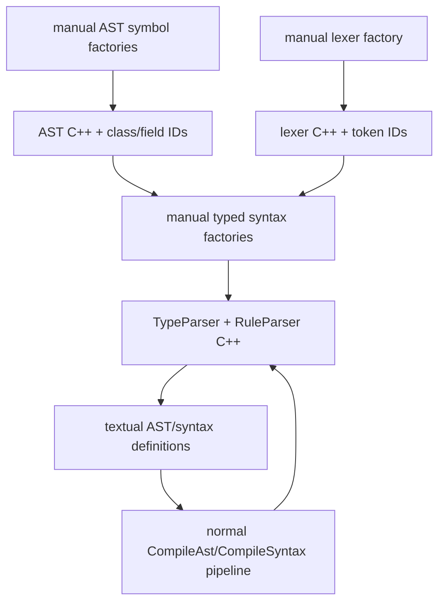

# Bootstrapping and verification

VlppParser2 generates parsers from AST and syntax definition files, but the parsers for those definition files are themselves generated by VlppParser2. The project resolves this circular dependency with a small manual semantic model, a typed automaton-building DSL, checked-in generated artifacts, and a strictly ordered regeneration chain.

This chapter documents the dependency structure and project order. It intentionally does not document test source code. The authoritative project list and platform commands remain in [`Project.md`](../Project.md).

For the underlying front end and emitters, read [Grammar compilation](GrammarCompilation.md) and [Code generation](CodeGeneration.md). For the automata produced at each stage, read [Automaton construction](AutomatonConstruction.md).

## What is self-hosted?

Two definition languages use generated parsers:

- AST definitions are parsed by `vl::glr::parsergen::TypeParser` into `GlrAstFile`.
- Syntax definitions are parsed by `vl::glr::parsergen::RuleParser` into `GlrSyntaxFile`.

Lexer definitions are the deliberate exception. `CompileLexer` is a handwritten line reader because token declarations and textual fragments do not need a recursive grammar. Keeping this bottom layer manual makes the bootstrap finite and easy to inspect.

The checked-in generated implementation is in [`Source/ParserGen_Generated`](../Source/ParserGen_Generated). It contains:

- AST classes for both definition languages;
- one shared definition lexer;
- one shared AST instruction receiver;
- `TypeParser` and `RuleParser`;
- generated builder, visitor, JSON, and TypeScript utilities.

These files are both outputs of the generator and compiled inputs to the normal production generator.

## Manual bootstrap factories

The bootstrap source creates the same semantic managers that textual definitions would create.

| Factory | File | Responsibility |
| --- | --- | --- |
| `InitializeParserSymbolManager` | [`ParserSymbol.cpp`](../Source/ParserGen_Global/ParserSymbol.cpp) | Names the bootstrap parser `ParserGen` and supplies includes, namespace, and guard. |
| `CreateParserGenTypeAst` | [`AstSymbol_CreateParserGenTypeAst.cpp`](../Source/Ast/AstSymbol_CreateParserGenTypeAst.cpp) | Defines the AST-definition AST: enums, classes, properties, and file root. |
| `CreateParserGenRuleAst` | [`AstSymbol_CreateParserGenRuleAst.cpp`](../Source/Ast/AstSymbol_CreateParserGenRuleAst.cpp) | Defines conditions, switch nodes, EBNF syntax nodes, clauses, assignments, rules, and syntax-file root. |
| `CreateParserGenLexer` | [`LexerSymbol_CreateParserGenLexer.cpp`](../Source/Lexer/LexerSymbol_CreateParserGenLexer.cpp) | Defines attributes, keywords, punctuation, identifiers, literals, whitespace, and comments for both definition parsers. |
| `CreateParserGenTypeSyntax` | [`SyntaxSymbol_CreateParserGenTypeSyntax.cpp`](../Source/Syntax/SyntaxSymbol_CreateParserGenTypeSyntax.cpp) | Builds rules for AST definition files and exposes `File` as the typed parser entry. |
| `CreateParserGenRuleSyntax` | [`SyntaxSymbol_CreateParserGenRuleSyntax.cpp`](../Source/Syntax/SyntaxSymbol_CreateParserGenRuleSyntax.cpp) | Builds precedence rules for conditions and EBNF, then clause/rule/file syntax; exposes `File`. |

The two AST factories use normal `AstSymbolManager` APIs. They are not a second AST implementation: they construct the same resolved symbols that `CompileAst` produces.

Likewise, the syntax factories construct ordinary `RuleSymbol`, `StateSymbol`, `EdgeSymbol`, and `AstIns` data through the same builder used after textual syntax validation. Automaton compaction and runtime behavior therefore do not have a special bootstrap path.

## The typed syntax-writer DSL

[`SyntaxSymbolWriter.h`](../Source/Syntax/SyntaxSymbolWriter.h) provides `vl::glr::parsergen::syntax_writer`. Its value types model grammar pieces:

- `Token`, `Rule`, and `Use`;
- `Loop` and `LoopSep`;
- `Opt`;
- `Seq` and `Alt`;
- `With` for enum assignment;
- `Create` and `Reuse` for clause object semantics.

Helpers and operators make the C++ structure resemble syntax-definition text:

```cpp
tok(T::ID, F::EnumItem_name) + tok(T::COMMA)
rule(otherRule, F::Some_field)
use(otherRule)
loop(body)
loop(body, delimiter)
opt(body)
left | right
body && with(field, enumItem)
create(body, classId)
reuse(body)
```

`syntax_writer::Clause` owns an `AutomatonBuilder`. Assigning a `Create`, `Reuse`, or ordinary grammar value to it calls the same `BuildTokenSyntax`, `BuildRuleSyntaxInternal`, `BuildLoopSyntax`, `BuildOptionalSyntax`, `BuildClause`, and object-instruction methods used by `CompileSyntaxVisitor`.

The DSL is intentionally typed by generated enums:

- `ParserGenTokens`;
- `ParserGenClasses`;
- `ParserGenFields`.

This catches mismatched bootstrap IDs at C++ compile time. It also explains why regeneration is staged: those enums must exist before the manual syntax factories can be recompiled.

[`SyntaxSymbol_CreateParserGenUtility.cpp`](../Source/Syntax/SyntaxSymbol_CreateParserGenUtility.cpp) provides `tok` overloads that add a readable token name or fixed display text to state labels while preserving the generated numeric ID.

## The bootstrap loop



The final arrow is the self-hosting check: once `TypeParser` and `RuleParser` exist, textual definitions can reproduce the same semantic model and generated parser. The project's GLR refactoring history explains the rationale: the manual form first made the runtime independently testable, and exact state-machine comparison then separated parser-generator bugs from parser-runtime bugs.

The manual factories remain valuable even after self-hosting. They are a small trusted seed and a direct specification of the parser-definition object model.

## Generated-code boundary

The following directories are generated and must not be hand-edited:

- [`Source/ParserGen_Generated`](../Source/ParserGen_Generated);
- [`Source/Json/Generated`](../Source/Json/Generated);
- [`Source/Xml/Generated`](../Source/Xml/Generated).

If generated output is wrong, fix:

- the semantic factories;
- a compiler/validation pass;
- automaton construction;
- a C++ generator;
- or the textual AST/lexer/syntax source.

Then run the ordered chain below. Editing the output would make the current checkout work only until the next regeneration and would hide the actual defect.

## Production `GlrParserGen` pipeline

[`Tools/GlrParserGen/GlrParserGen/Main.cpp`](../Tools/GlrParserGen/GlrParserGen/Main.cpp) is the non-test production entry point. It accepts one configuration XML path and performs the following exact order.

### 1. Read configuration

The built-in XML `Parser` parses the configuration. The driver fills:

- `ParserSymbolManager::name`;
- global includes, C++ namespace, and header guard;
- output directory;
- each AST group's generated C++ namespace, reflection namespace, and class prefix;
- AST, lexer, and syntax input filenames;
- optional blocked AST utilities.

`GenerateParserFileNames` creates the shared output manifest.

### 2. Parse and compile AST definitions

For every AST group:

1. `TypeParser::ParseFile` creates a `GlrAstFile` for each input.
2. The driver creates matching `AstDefFile` objects.
3. `CompileAst` declares all types, then fills bases and fields.

After all AST groups succeed:

4. `GenerateAstFileNames` assigns artifact names.
5. `WriteAstFiles` generates every AST group and the parser-wide assembler.

This emission also fills `CppParserGenOutput::classIds` and `fieldIds`. Syntax lowering later requires those maps, so AST output is not safely postponable.

### 3. Compile and generate the lexer

1. The driver reads the lexer file as text.
2. `CompileLexer` expands fragments and fills `LexerSymbolManager`.
3. `WriteLexerFiles` emits token APIs and serialized compressed lexer data.

### 4. Parse and compile syntax definitions

1. `RuleParser::ParseFile` creates one `GlrSyntaxFile` per input.
2. `CompileSyntax` merges files, resolves names and types, specializes switches, validates structure, and builds the epsilon NFA.

Every phase checks `ParserSymbolManager::Errors` before continuing.

### 5. Transform and pack the automaton

The driver calls, in order:

1. `SyntaxSymbolManager::BuildCompactNFA`;
2. `SyntaxSymbolManager::BuildCrossReferencedNFA`;
3. `SyntaxSymbolManager::BuildAutomaton`.

The first two calls perform the graph algorithms in [Automaton construction](AutomatonConstruction.md). The third replaces pointer-linked states and edges with an `automaton::Executable` plus diagnostic metadata.

### 6. Generate the parser

1. `GenerateSyntaxFileNames` adds the parser artifact names.
2. `WriteSyntaxFiles` emits state enums, typed parse methods, metadata, and compressed executable data.

### 7. Filter and write files

For each AST group, `BlockedUtilities` can remove:

- `Empty`;
- `Copy`;
- `Traverse`;
- `Json`, including its `.d.ts`;
- `Builder`.

The driver creates the output directory, compares every generated string with the existing file, and writes UTF-8 only when content changed. Avoiding timestamp-only changes keeps staged rebuilds and source-control diffs manageable.

## Configuration shape

The production driver expects the following conceptual structure:

```xml
<Parser name="...">
  <Includes>include1;include2</Includes>
  <CppNamespace>ns1::ns2</CppNamespace>
  <HeaderGuard>...</HeaderGuard>
  <OutputDir>...</OutputDir>
  <Asts>
    <Ast name="...">
      <CppNamespace>...</CppNamespace>
      <ReflectionNamespace>...</ReflectionNamespace>
      <ClassPrefix>...</ClassPrefix>
      <File file="..."/>
      <BlockedUtilities>
        <Copy/>
      </BlockedUtilities>
    </Ast>
  </Asts>
  <Lexer file="..."/>
  <Syntax name="...">
    <File file="..."/>
  </Syntax>
</Parser>
```

Includes are semicolon-separated; namespaces are `::`-separated. The exact parser is implemented by the `READ_*` helpers in `Main.cpp` rather than by a separate reflected configuration type.

## Ordered verification and regeneration chain

The projects in [`Project.md`](../Project.md) must execute in this order because generated files become compilation inputs for later projects. “Rebuild” below means rebuild the solution after that project completes, before starting the next project that consumes its output.

### 1. `ParserTest_AstGen`

Generates Calculator AST C++ from manual definitions and generates the parser-definition AST C++ from manual definitions.

**Rebuild after execution.** The new AST headers, visitors, and parser-generator class/field IDs are needed by the next stage.

### 2. `ParserTest_AstParserGen`

Runs the Calculator lexer from manual definitions, exercises assembly into AST objects, and generates Calculator and parser-definition lexer C++ from manual definitions.

**Rebuild after execution.** The generated token enums and lexer-data functions are needed by the manual syntax factories.

### 3. `ParserTest_LexerAndParser`

Generates Calculator parser C++ and parser-definition parser C++ from manual definitions.

**Rebuild after execution.** This makes the newly generated `TypeParser` and `RuleParser` available as compiled code.

### 4. `ParserTest_LexerAndParser_Generated`

Runs the generated Calculator lexer types and the Calculator parser built from manual definitions. This checks the first handoff from generated tables to the generic runtime.

### 5. `ParserTest_ParserGen`

Exercises parser-generator error detection. This stage validates that malformed definitions stop at the intended semantic phase instead of reaching automaton generation.

### 6. `ParserTest_ParserGen_Compiler`

Runs the generated Calculator parser, runs the generated parser-definition parsers, and builds multiple parsers from external textual definitions.

**Rebuild after execution.** The generated external parser sources are inputs to the next stage.

### 7. `ParserTest_ParserGen_Generated`

Runs the multiple parsers generated by the preceding compiler stage. This is the normal text-definition-to-generated-parser path after self-hosting.

### 8. `BuiltInTest_Compiler`

Builds the real-world built-in parsers.

**Rebuild after execution.** The JSON, XML, Workflow, and C++ parser consumers compile the newly generated outputs.

### 9. `BuiltInTest_Json`

Runs the generated JSON parser and its handwritten integration against real-world inputs.

### 10. `BuiltInTest_Xml`

Runs the generated XML parser and its handwritten text-recovery/integration layer against real-world inputs.

### 11. `BuiltInTest_Workflow`

Runs the generated Workflow parser against examples in the sibling Workflow repository.

### 12. `BuiltInTest_Cpp`

Runs the generated C++ parser against real-world inputs.

### 13. TypeScript declarations

After all C++ projects complete, run `Test/TypeScript/prepare.ps1` followed by `npm run build` for the JSON TypeScript package as described in [`Project.md`](../Project.md). This copies generated `.d.ts` files and matching JSON AST examples, then verifies that the generated declarations describe valid consumable TypeScript shapes.

## Why rebuilds occur at specific boundaries

There are three different moments:

1. **A generator writes C++ source.**
2. **The solution compiles that source into types and functions.**
3. **A later generator or consumer links and uses them.**

Running the next executable without the required rebuild would use the previously compiled generated code, even though files on disk had changed. The explicit rebuild barriers make each bootstrap level consume exactly the output just produced.

This is also why “all generated text matches” is not enough. The chain verifies both directions:

- semantic managers and automata can produce compilable generated APIs;
- those compiled APIs can tokenize, parse, assemble ASTs, and generate the next parser level.

## Platform coverage

`Project.md` lists the supported Windows solution as the complete ordered chain. The Linux configurations cover a smaller subset centered on running generated parsers and the parser compiler; they do not currently reproduce every bootstrap-producing project.

That limitation is about available project wiring, not a separate parser design. Generated lexer/executable data and the runtime are intended to remain cross-platform, which is why [Code generation](CodeGeneration.md) embeds data through stream serialization and ordinary C++ rather than platform APIs.

## Maintenance checklist for bootstrap changes

When changing a parser-definition AST, token, field, or rule:

1. Change the authoritative factory or compiler/generator source, not `ParserGen_Generated`.
2. Check whether a generated class, field, or token enum will change.
3. Preserve the AST → lexer → parser staging order.
4. Rebuild at every boundary required by `Project.md`.
5. Complete the generated-parser and built-in consumer stages.
6. Verify generated TypeScript declarations.
7. Review generated diffs for deterministic renumbering and renamed APIs.

When changing only the generic automaton or runtime, the same chain is still valuable: it proves that both the bootstrap parsers and production generated parsers agree with the updated [Automaton construction](AutomatonConstruction.md) and [Runtime parsing](RuntimeParsing.md) contracts.
