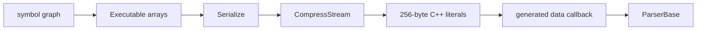

# Code generation

Code generation is the boundary between pointer-linked compiler data and a deployable parser. It emits strongly typed C++ adapters around two serialized data sets:

- a compiled `vl::regex::RegexLexer`;
- a packed `vl::glr::automaton::Executable`.

The generated code does not reimplement GLR recognition. [Runtime parsing](RuntimeParsing.md) remains generic; generated files supply tables, numeric IDs, concrete AST types, and a small instruction receiver that translates generic AST operations into typed C++ member access.

For the transformations before emission, read [Grammar compilation](GrammarCompilation.md), [Syntax validation and rewriting](SyntaxValidation.md), and [Automaton construction](AutomatonConstruction.md).

## Output manifest and artifact families

[`ParserCppGen.h`](../Source/ParserGen_Global/ParserCppGen.h) defines three output records.

### `vl::glr::parsergen::CppAstGenOutput`

One record belongs to each `AstDefFileGroup` and names:

- the AST header and implementation;
- builder header and implementation;
- empty-visitor header and implementation;
- copy-visitor header and implementation;
- traversal-visitor header and implementation;
- JSON-visitor header and implementation;
- TypeScript declaration file.

`GenerateAstFileNames` in [`AstCppGen.cpp`](../Source/Ast/AstCppGen.cpp) uses:

```text
{GlobalName}{AstGroup}.h/.cpp
{GlobalName}{AstGroup}_Builder.h/.cpp
{GlobalName}{AstGroup}_Empty.h/.cpp
{GlobalName}{AstGroup}_Copy.h/.cpp
{GlobalName}{AstGroup}_Traverse.h/.cpp
{GlobalName}{AstGroup}_Json.h/.cpp
{GlobalName}{AstGroup}_Json.d.ts
```

### `vl::glr::parsergen::CppSyntaxGenOutput`

One record belongs to each `SyntaxSymbolManager`. `GenerateSyntaxFileNames` in [`SyntaxCppGen.cpp`](../Source/Syntax/SyntaxCppGen.cpp) emits:

```text
{GlobalName}{SyntaxManagerName}.h/.cpp
```

The library supports multiple syntax managers sharing one lexer and assembler. The parser-generator bootstrap uses this for `TypeParser` and `RuleParser`. The production XML driver currently exposes one syntax-manager block.

### `vl::glr::parsergen::CppParserGenOutput`

This parser-wide record contains:

- assembler and lexer filenames;
- AST and syntax output maps;
- class, field, and token ID maps.

`GenerateParserFileNames` in [`ParserCppGen.cpp`](../Source/ParserGen_Global/ParserCppGen.cpp) names the shared files `{GlobalName}_Assembler.h/.cpp` and `{GlobalName}_Lexer.h/.cpp`.

It is more than a filename manifest. It is the shared registry that makes generated numeric instructions agree with generated C++ switch statements.

## Required generation order

The order is a correctness contract:

1. `GenerateParserFileNames` creates the parser-wide manifest.
2. `GenerateAstFileNames` creates AST manifests.
3. `WriteAstFiles` emits ASTs and the assembler.
4. `CompileLexer` and `WriteLexerFiles` emit token APIs and lexer data.
5. `CompileSyntax` lowers clauses using the class and field IDs already assigned by AST emission.
6. Automaton construction packs the graph.
7. `GenerateSyntaxFileNames` and `WriteSyntaxFiles` emit parser APIs and executable data.

`WriteAstAssemblerHeaderFile` fills `CppParserGenOutput::classIds` and `fieldIds`. [`CompileSyntax_CompileSyntax.cpp`](../Source/ParserGen/CompileSyntax_CompileSyntax.cpp) consumes those maps when it emits `CreateObject`, `Field`, and enum-assignment instructions. Calling syntax compilation before AST generation leaves that contract incomplete.

`tokenIds` is filled while the lexer enum is emitted. Current source otherwise uses `LexerSymbolManager::TokenOrder` directly, so this map is presently a symmetric output record rather than a later compiler dependency.

The complete driver order and regeneration chain are documented in [Bootstrapping and verification](Bootstrapping.md).

## Generated AST classes

[`AstCppGen_Classes.cpp`](../Source/Ast/AstCppGen_Classes.cpp) writes the core type API.

### C++ representation

The generator maps definition types as follows:

| Definition | Generated C++ |
| --- | --- |
| enum | `enum class` with `UNDEFINED_ENUM_ITEM_VALUE = -1` |
| token field | `vl::glr::ParsingToken` |
| enum field | enum value |
| class field | `vl::Ptr<T>` |
| class array | `vl::collections::List<vl::Ptr<T>>` |
| root class | derives from `vl::glr::ParsingAstBase` |
| derived class | derives from its AST base |

Every class also derives from `vl::reflection::Description<T>`, but parsing does not require reflection.

### Visitor shape

A class with derived classes is emitted as abstract and owns a nested `IVisitor`. It declares one `Visit(Derived*)` per direct child and a virtual `Accept`. Each child implements the base's `Accept` by calling the correct visitor overload.

Putting visitor interfaces at inheritance branch points supports multi-level trees without a central generated type tag. Generated utility visitors implement all required interfaces in one class and forward through intermediate abstract nodes until they reach a concrete leaf.

### Optional reflection

The generator emits:

- `DECL_TYPE_INFO` and implementation macros;
- enum and class metadata;
- visitor interface proxies;
- a group-specific type loader and `LoadTypes` function.

These sections are guarded by `VCZH_DEBUG_NO_REFLECTION` and `VCZH_DESCRIPTABLEOBJECT_WITH_METADATA`. The generated assembler uses direct C++ operations, so a no-reflection build retains the parser and typed AST. This is an important portability boundary: reflection is an optional consumer API, not the mechanism used to construct parse results.

## Generated AST utilities

`WriteAstFiles` in [`AstCppGen.cpp`](../Source/Ast/AstCppGen.cpp) invokes a separate generator for each utility. They are split into files so a configuration can omit unused surfaces.

### Fluent builders

[`AstCppGen_Builder.cpp`](../Source/Ast/AstCppGen_Builder.cpp) emits a `builder::MakeType` class derived from `vl::glr::ParsingAstBuilder<T>` for each class that declares at least one property. Once emitted, it includes setters for inherited properties as well. A property-less class does not receive a builder wrapper in the current generator. A setter:

- copies a string into a token's `value`;
- assigns an enum or object pointer;
- appends one object pointer to an array;
- returns `*this` for chaining.

`ParsingAstBuilder<T>` converts to a compatible `vl::Ptr<TExpected>`, so a nested AST can be assembled declaratively while remaining strongly typed.

### Empty visitors

[`AstCppGen_EmptyVisitor.cpp`](../Source/Ast/AstCppGen_EmptyVisitor.cpp) implements every abstract visitor member with no work. When a direct child is itself abstract, the generated method calls a virtual `Dispatch` hook. A client that cares about only a few leaves can inherit the empty visitor instead of implementing an entire hierarchy.

### Deep-copy visitors

[`AstCppGen_CopyVisitor.cpp`](../Source/Ast/AstCppGen_CopyVisitor.cpp) emits:

- one `CopyFields` overload per class;
- visitor dispatch for every inheritance branch;
- typed `CopyNode` overloads.

Tokens and enums are copied directly. Object fields and array elements are recursively copied. Public `CopyNode` entry points preserve the source node's `codeRange`. The visitor therefore provides a true independent tree, which the switch rewriter and other definition-AST transformations can safely modify.

### Traversal visitors

[`AstCppGen_TraverseVisitor.cpp`](../Source/Ast/AstCppGen_TraverseVisitor.cpp) emits `InspectInto` entry points and two hook families:

- `Traverse` before children;
- `Finishing` after children.

For a concrete object, pre-hooks run from `ParsingAstBase` through base classes to the concrete class. Fields are then visited recursively. Finishing hooks run from the concrete class back to `ParsingAstBase`. Token fields have their own `Traverse(ParsingToken&)` hook.

This gives algorithms such as JSON/XML post-processing a predictable enter/children/leave protocol without reimplementing inheritance dispatch.

### JSON and TypeScript

[`AstCppGen_JsonVisitor.cpp`](../Source/Ast/AstCppGen_JsonVisitor.cpp) emits a visitor derived from `vl::glr::JsonVisitorBase`. It serializes:

- the actual leaf type;
- optional AST and token code ranges;
- token values;
- enum item names;
- nested objects and arrays;
- null object pointers.

`JsonVisitorBase` exposes `printTokenCodeRange`, `printAstCodeRange`, and `printAstType`. Its `$ast` field is either a type string or an object containing type and range, depending on these switches.

The matching `.d.ts` generator uses:

- string unions for enums;
- unions of leaf interfaces for abstract AST classes;
- `_Common` interfaces for property-bearing abstract ancestors;
- a literal `$ast` discriminant on concrete leaves;
- nullable object references and nullable array elements.

The TypeScript output describes the compact JSON shape used when range-heavy output is disabled. It provides a cross-language schema without making the C++ parser runtime depend on a JavaScript toolchain.

## Numeric class and field IDs

[`AstCppGen_Assembler.cpp`](../Source/Ast/AstCppGen_Assembler.cpp) is the adapter generator.

### Stable IDs

It emits parser-wide enums:

- `{Parser}Classes : vint32_t`;
- `{Parser}Fields : vint32_t`.

It simultaneously stores the assigned values in `CppParserGenOutput::classIds` and `fieldIds`. Syntax lowering writes those IDs into `AstIns`. At runtime, the generated receiver switches on the same enums.

Type IDs include abstract and generated ambiguity types because instructions and diagnostics must use one complete type space. Field IDs identify the class that declares the field; inherited assignment works because the generated setter dynamically accepts derived objects.

Lookup functions expose both source-like and fully qualified C++ names:

- `{Parser}TypeName` and `{Parser}CppTypeName`;
- `{Parser}FieldName` and `{Parser}CppFieldName`.

These names turn a compact integer failure into a useful diagnostic without storing C++ type information in the generic automaton.

### `AstInsReceiverBase` subclass

The generated `{Parser}AstInsReceiver` overrides:

- `CreateAstNode`;
- object-valued `SetField`;
- token-valued `SetField`;
- enum-valued `SetField`;
- `ResolveAmbiguity`.

`CreateAstNode` constructs only concrete classes. Attempting to instantiate an abstract ID raises a typed assembly error.

The field switches call templates in [`AstBase.h`](../Source/AstBase.h):

- `AssemblerSetObjectField` validates the declaring object and child type, appending for arrays and rejecting scalar reassignment.
- `AssemblerSetTokenField` captures token range, token-list index, token ID, and source text.
- `AssemblerSetEnumField` implements strong assignment and `FieldIfUnassigned` weak assignment.

This direct pointer-to-member adapter keeps construction strongly typed without reflection and keeps the runtime virtual interface small.

### Ambiguity resolution

For every class below an `@ambiguous` ancestor, the generated receiver maps the concrete type ID to:

```cpp
AssemblerResolveAmbiguity<ElementType, AmbiguousBaseToResolve>(...)
```

The helper creates one `ToResolve` node, copies compatible candidates, and flattens an already wrapped ambiguity. The generated parser also supplies a class-ID common-base matrix to the runtime type callback. See [Ambiguity and AST execution](AmbiguityAndAstExecution.md) for when a trace region asks for this wrapper.

## Generated lexer artifacts

[`LexerCppGen.cpp`](../Source/Lexer/LexerCppGen.cpp) emits:

- `{Parser}Tokens` in lexer-definition order;
- `{Parser}TokenCount`;
- `{Parser}TokenDeleter` for discarded tokens;
- `{Parser}TokenId`;
- `{Parser}TokenDisplayText`;
- `{Parser}TokenRegex`;
- `{Parser}LexerData(IStream&)`.

The metadata functions support diagnostics, generated syntax labels, and tools. The parser itself loads the serialized combined lexer instead of recompiling all token regexes at application startup.

## Generated parser artifacts

[`SyntaxCppGen.cpp`](../Source/Syntax/SyntaxCppGen.cpp) emits one parser class per syntax manager.

### State and metadata APIs

The header contains:

- `{Syntax}States`, mirroring generated rule metadata and executable start-state indices;
- `{Syntax}RuleName`;
- `{Syntax}StateLabel`;
- `{Global}{Syntax}Data(IStream&)`.

State labels come from the generation-time clause text with an `@` cursor inserted at the state's location. They make a packed state index understandable in logs without retaining the mutable symbol graph.

### Parser class

The generated class derives from:

```cpp
vl::glr::ParserBase<TokenEnum, StateEnum, AstInsReceiver>
```

and implements `vl::glr::automaton::IExecutor::ITypeCallback`. Its constructor passes three callbacks to `ParserBase`:

- the discarded-token predicate;
- the lexer-data loader;
- the executable-data loader.

For each rule marked `@parser`, it emits two typed methods:

```cpp
vl::Ptr<Result> ParseRule(const vl::WString& input, vl::vint codeIndex = -1) const;
vl::Ptr<Result> ParseRule(vl::collections::List<vl::regex::RegexToken>& tokens, vl::vint codeIndex = -1) const;
```

Rules represented in the executable without `@parser` have no public typed wrapper. Partial rules are macro-like compilation inputs that are inlined at reference sites and are not valid runtime parser entry points. A generated method delegates to `ParseWithString` or `ParseWithTokens` in the generic runtime.

`GetClassName` serves diagnostics. `FindCommonBaseClass` uses a generated matrix when any AST class enables ambiguity; parsers without ambiguity return `-1` and avoid the table.

Partial-rule packing makes this distinction explicit. `EliminateEpsilonEdges` gives every rule symbol a compact placeholder start, even when a partial rule had no top-level clause states. `GetStatesInStableOrder` then excludes partial-rule states, so `BuildAutomaton` records `statesInOrder.IndexOf(rule->startStates[0]) == -1` for that rule. Its name can remain in metadata, but the `-1` start value means that it has no runtime parser entry.

## Serialization and compression

### Data production

`WriteLexerCppFile` constructs a `RegexLexer` from token regexes and calls `Serialize`.

After the syntax manager reaches its cross-referenced phase, `SyntaxSymbolManager::BuildAutomaton` fills an `automaton::Executable` and metadata. `WriteSyntaxCppFile` calls `Executable::Serialize`.

### C++ embedding

`WriteLoadDataFunctionCpp` in [`ParserCppGen.cpp`](../Source/ParserGen_Global/ParserCppGen.cpp):

1. compresses the serialized stream;
2. divides it into 256-byte rows;
3. emits each byte as `\xHH` in a static string literal;
4. records row and length constants;
5. generates a loader that calls `vl::glr::DecompressSerializedData`.

`DecompressSerializedData` in [`AstBase.cpp`](../Source/AstBase.cpp) concatenates rows and, when requested, passes the result through `DecompressStream`.



The generated source is portable ordinary C++ and contains no grammar compiler. Deployment needs the parser runtime and generated files, not `GlrParserGen`, AST/lexer/syntax input files, or runtime regex compilation. Treating the large PDA as compressed data also keeps generated control code small and stable as the automaton grows.

## Shared text-generation helpers

[`ParserCppGen.cpp`](../Source/ParserGen_Global/ParserCppGen.cpp) also provides:

- `WriteFileComment`;
- `WriteNssName`, `WriteNssBegin`, and `WriteNssEnd`;
- `WriteCppStringBody`;
- data-loader declaration and implementation writers.

AST utility generators use `WriteAstUtilityHeaderFile`/`WriteAstUtilityCppFile`. Parser-wide utilities use `WriteParserUtilityHeaderFile`/`WriteParserUtilityCppFile`. Centralizing guards, namespaces, includes, and escaping prevents subtle differences among artifact families.

The command-line driver first accumulates every output in a `Dictionary<WString, WString>`. It can remove a group's `Builder`, `Empty`, `Copy`, `Traverse`, or `Json` family through `BlockedUtilities` before touching the filesystem, then rewrites only changed files.

## Definition-AST printers

[`AstToCode.h`](../Source/ParserGen_Printer/AstToCode.h) exposes three utilities.

### `TypeSymbolToAst`

[`TypeSymbolToAst.cpp`](../Source/ParserGen_Printer/TypeSymbolToAst.cpp) reconstructs a `GlrAstFile` from `AstSymbolManager`.

With generated types included, it exposes the semantic `Common` and `ToResolve` classes. With them excluded, it reverses the `@ambiguous` lowering:

- generated helper classes disappear;
- fields from `Common` return to the declared class;
- a subclass base of `Common` is printed as the original source base;
- `@ambiguous` is restored.

This makes the semantic model inspectable without leaking implementation-only classes.

### `TypeAstToCode` and `SyntaxAstToCode`

[`TypeAstToCode.cpp`](../Source/ParserGen_Printer/TypeAstToCode.cpp) prints enums, classes, attributes, bases, and fields in canonical AST-definition syntax.

[`SyntaxAstToCode.cpp`](../Source/ParserGen_Printer/SyntaxAstToCode.cpp) is precedence-aware for:

- condition negation, conjunction, and disjunction;
- syntax sequence and alternative;
- loops and delimited loops;
- equal, prefer-take, and prefer-skip optionals;
- switch push/test forms;
- create, partial, and reuse clauses;
- strong and weak enum assignments.

The syntax printer is particularly useful for viewing the specialized AST returned by switch rewriting.

## `AstPrint` and generated-location recording

[`AstPrint.h`](../Source/AstPrint.h) and [`AstPrint.cpp`](../Source/AstPrint.cpp) define `vl::glr::ParsingWriter`, a `TextWriter` wrapper that tracks index, row, and column while nested nodes are printed.

Callers pair `BeforePrint(node)` and `AfterPrint(node)`. The writer records the inclusive range from the saved start to the last emitted character and associates the configured `codeIndex`.

Recorder implementations are composable:

- `ParsingEmptyPrintNodeRecorder` ignores ranges.
- `ParsingMultiplePrintNodeRecorder` fans out to several recorders.
- `ParsingOriginalLocationRecorder` forwards the node's original range but substitutes the current code index.
- `ParsingGeneratedLocationRecorder` stores node-to-generated-range mappings.
- `ParsingUpdateLocationRecorder` replaces `node->codeRange`.

The current parser-generator printers accept a generic `TextWriter` and do not call `BeforePrint`/`AfterPrint` themselves. `AstPrint` is reusable infrastructure for printers that explicitly bracket nodes, not an automatic source map for `TypeAstToCode` or `SyntaxAstToCode`.

## The checked-in generated API shape

[`Source/ParserGen_Generated`](../Source/ParserGen_Generated) is the concrete example of every generator family:

- `ParserGenTypeAst.*` and `ParserGenRuleAst.*` define the definition ASTs.
- `*_Builder`, `*_Empty`, `*_Copy`, `*_Traverse`, and `*_Json` demonstrate optional utilities.
- `ParserGen_Lexer.*` embeds the shared definition lexer.
- `ParserGen_Assembler.*` connects definition-AST IDs to `Glr*` C++ types.
- `ParserGenTypeParser.*` and `ParserGenRuleParser.*` are two parsers sharing that lexer and assembler.

These files are outputs and a bootstrap input. Do not repair them manually; repair the generator or manual bootstrap model and run the ordered regeneration chain in [Bootstrapping and verification](Bootstrapping.md).

## Built-in JSON integration

The source definitions are:

- [`Json/Syntax/Ast.txt`](../Source/Json/Syntax/Ast.txt);
- [`Json/Syntax/Lexer.txt`](../Source/Json/Syntax/Lexer.txt);
- [`Json/Syntax/Syntax.txt`](../Source/Json/Syntax/Syntax.txt).

They generate literals, strings, numbers, arrays, object fields, and objects. `JValue` reuses those node classes. The public `JRoot` rule currently accepts an object or array root.

[`GlrJson.cpp`](../Source/Json/GlrJson.cpp) supplies semantics that should not be hard-coded into the generic generator:

- `JsonUnescapeVisitor` removes string delimiters and calls `JsonUnescapeString` for string values and object member names.
- `JsonParse` calls the generated `Parser::ParseJRoot` and post-processes the tree.
- `JsonPrintVisitor` escapes strings and supports spaces after colons/commas, CRLF formatting, indentation, and optional compact formatting for flat containers.
- `JsonPrint` and `JsonToString` expose serialization.
- `JsonNodeListSerializer` wraps a list in a `JsonArray` for channel-style serialization.

Generated code owns recognition and the typed tree shape. The handwritten wrapper owns JSON value normalization and presentation policy.

## Built-in XML integration

The source definitions are:

- [`Xml/Syntax/Ast.txt`](../Source/Xml/Syntax/Ast.txt);
- [`Xml/Syntax/Lexer.txt`](../Source/Xml/Syntax/Lexer.txt);
- [`Xml/Syntax/Syntax.txt`](../Source/Xml/Syntax/Syntax.txt).

The generated parser exposes `ParseXElement` and `ParseXDocument`. Public callers should normally use `XmlParseElement` and `XmlParseDocument` in [`GlrXml.cpp`](../Source/Xml/GlrXml.cpp).

### Why XML needs post-processing

The XML lexer discards whitespace, but whitespace inside element content is data. `XmlUnescapeVisitor` receives the original `RegexToken` list and:

- strips quotes and unescapes attribute values;
- strips CDATA and comment delimiters;
- finds consecutive `XmlText` nodes;
- uses token `reading` and `length` pointers to recover the exact source span, including discarded gaps;
- replaces the run with one unescaped `XmlText`.

That is why the wrapper tokenizes explicitly and calls the token-list parser overload. The generated grammar stays small, while the public XML API preserves text that generic discarded-token handling would lose.

### XML utilities

`GlrXml.cpp` also supplies:

- escaping and unescaping for the five named entities;
- CDATA and comment wrapping/unwrapping;
- `XmlPrint`, `XmlPrintContent`, and `XmlToString`;
- attribute and child-element lookup;
- immediate text/CDATA `XmlGetValue`;
- `XmlElementListSerializer` using an `<Array>` wrapper;
- fluent `XmlElementWriter` construction.

Current behavior to keep in mind:

- numeric character references are not decoded by `XmlUnescapeValue`;
- the AST stores `XmlElement::closingName`, but this wrapper does not compare it with `name`;
- `XmlPrintVisitor` emits the opening name for both tags and uses `/>` for an element with no children;
- `XmlGetValue` collects immediate text and CDATA children, not recursive descendant text.

As with JSON, the generated directory is disposable, while `GlrXml.h/.cpp` is the stable domain-facing integration layer.

## Why this boundary solves code-generation and portability problems

The generated/parser-runtime split has several deliberate consequences:

- **No generated GLR algorithm:** fixes and optimizations stay in one runtime.
- **No runtime grammar compiler:** applications load embedded tables.
- **No mandatory reflection:** direct switch adapters create and populate ASTs.
- **Stable typed entry points:** clients receive `Ptr<ResultType>` rather than a generic parse tree.
- **Compact deployment data:** large lexer and PDA structures are compressed byte arrays.
- **Useful diagnostics:** generated metadata maps dense IDs back to grammar and C++ names.
- **Disposable generated files:** the source definitions and generators are authoritative.
- **Optional utility surface:** builders, visitors, JSON, and TypeScript can be omitted when unused.

The generic runtime can therefore focus on recognition, trace graphs, ambiguity, and instruction scheduling, while generated code focuses on static type knowledge. The only shared language is stable IDs plus `AstIns`—a narrow boundary that is practical to serialize, inspect, and regenerate.
