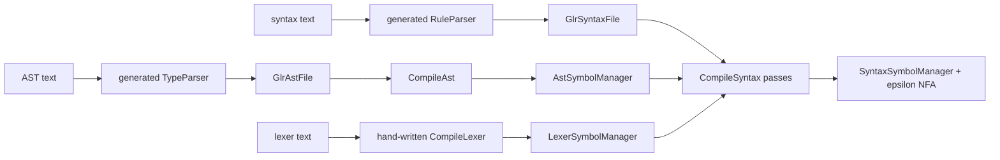

# Grammar compilation

Grammar compilation is the front half of VlppParser2. It turns three definition languages—AST, lexer, and syntax—into resolved symbol managers. The syntax manager then owns the mutable automaton graph described in [Automaton construction](AutomatonConstruction.md). This chapter concentrates on definition inputs, ownership, name resolution, and the AST and lexer compilers; the rule-analysis passes are covered in [Syntax validation and rewriting](SyntaxValidation.md).

The main source directories are:

- [`Source/Ast`](../Source/Ast) for the AST semantic model and AST C++ generators.
- [`Source/Lexer`](../Source/Lexer) for lexer symbols, definition parsing, and lexer generation.
- [`Source/ParserGen`](../Source/ParserGen) for definition-AST-to-symbol compilation and syntax validation.
- [`Source/ParserGen_Global`](../Source/ParserGen_Global) for shared configuration, errors, generated filenames, and data-emission helpers.
- [`Source/ParserGen_Generated`](../Source/ParserGen_Generated) for the checked-in generated parsers of AST and syntax definition files.

## The three input languages

A production parser is described by:

1. One or more AST definition files.
2. One lexer definition file.
3. One or more syntax definition files.

The quick language references are [AST definitions](../.github/KnowledgeBase/manual/vlppparser2/ast.md), [lexer definitions](../.github/KnowledgeBase/manual/vlppparser2/lexer.md), and [syntax definitions](../.github/KnowledgeBase/manual/vlppparser2/syntax.md). This design guide follows the current source where an older reference differs.



AST and syntax definitions have generated parsers because their structures are recursive and benefit from the same typed AST machinery as client grammars. Lexer definitions deliberately retain a small line-oriented reader: their format is simple enough that using the generated parser to define its own lexer would add a bootstrap level without adding useful expressive power. See [Bootstrapping and verification](Bootstrapping.md).

## Shared configuration and diagnostics

### `vl::glr::parsergen::ParserSymbolManager`

[`ParserSymbol.h`](../Source/ParserGen_Global/ParserSymbol.h) defines the global object shared by every manager. It stores:

- the parser name;
- AST and syntax include lists;
- the generated C++ namespace;
- the header guard;
- a structured list of `ParserError` values.

Every compiler reports into this one error list. `ParserErrorLocation` identifies an AST group, AST file, lexer, or syntax file and carries a `ParsingTextRange`. `GLR_PARSER_ERROR_LIST` is the common inventory used to declare `ParserErrorType` and by the command-line driver to print named arguments. Keeping errors structured avoids coupling validation code to console wording and lets every pass stop before later code assumes a valid model.

`InitializeParserSymbolManager` in [`ParserSymbol.cpp`](../Source/ParserGen_Global/ParserSymbol.cpp) fills the namespace, include, name, and guard used while bootstrapping the `ParserGen` parser itself. The production command-line tool instead fills these settings from its configuration XML.

### Owned maps with stable order

`MappedOwning<T>` combines:

- a private `List<Ptr<T>>` that owns objects;
- a name-to-pointer dictionary for lookup;
- an explicit name list for insertion order.

The distinction matters. Resolution wants maps, while generation and lexer priority need stable order. A duplicate is reported instead of silently replacing the first declaration. All later compilation stages are gated on an empty global error list, so partially created duplicate objects do not leak into generated tables.

## AST symbol organization

[`AstSymbol.h`](../Source/Ast/AstSymbol.h) organizes AST declarations in four levels:

```text
AstSymbolManager
  AstDefFileGroup
    AstDefFile
      AstEnumSymbol
        AstEnumItemSymbol
      AstClassSymbol
        AstClassPropSymbol
```

### File groups

An `AstDefFileGroup` is one generated AST artifact family. It has:

- `cppNss`: the C++ namespace of generated types;
- `refNss`: their reflection name namespace;
- `classPrefix`: a prefix such as `Glr`, `Json`, or `Xml`;
- an ordered set of definition files;
- one symbol map shared by those files.

`AstDefFile::CreateSymbol` checks both duplicates in the current file and duplicates elsewhere in the same group. `AstSymbolManager::Symbols` is a grouped global name index. Syntax type lookup uses that index and reports `TypeNotUniqueInRule` when the same short name resolves to multiple AST groups.

`isPublic` controls references across AST definition files. `AstClassSymbol::SetBaseClass` and `AstClassPropSymbol::SetPropType` allow private symbols within their owning file but reject a private target from another file.

### Types and fields

`AstPropType` has three storage categories:

- `Token` becomes `vl::glr::ParsingToken`.
- `Type` becomes an enum value or `vl::Ptr<Class>`.
- `Array` becomes `vl::collections::List<vl::Ptr<Class>>` and therefore requires a class element type.

`AstClassSymbol` stores one base pointer, an ordered derived-class list, and declared fields. `FindPropSymbol` walks bases so syntax validation and generated field setters use the declaring field even when a clause creates a subclass. `FindCommonBaseClass` aligns two inheritance chains by depth and then walks them together; rule type inference uses it to compute the most specific type common to all clauses.

## AST compilation

The input tree types `GlrAstFile`, `GlrEnum`, `GlrClass`, and their children are generated in [`ParserGenTypeAst.h`](../Source/ParserGen_Generated/ParserGenTypeAst.h). [`CompileAst.cpp`](../Source/ParserGen/CompileAst.cpp) deliberately compiles them in two passes.

### Pass 1: declare every type

`CreateAstSymbolVisitor` creates all enum and class symbols across all supplied files. This makes forward references independent of file order. It also expands `@ambiguous` declarations before any base or field is resolved.

### Pass 2: fill relationships and members

Only if pass 1 produced no errors, `FillAstSymbolVisitor`:

- creates enum items;
- resolves class bases;
- creates fields and resolves their types.

`AstClassSymbol::SetBaseClass` validates existence, class-ness, public visibility, and cycles. `AstClassPropSymbol::SetPropType` performs the corresponding field checks. Separating declaration from filling prevents a failed or later declaration from being mistaken for a missing type.

### How `@ambiguous` changes the class tree

`AstClassSymbol::CreateDerivedClass_ToResolve` creates `NameToResolve` with:

```text
candidates : Name[]
```

If the declared ambiguous class owns fields, `CreateDerivedClass_Common` also creates `NameCommon`. The fields are placed on `NameCommon`, and subclasses that name `Name` as their base are redirected to `NameCommon`:

```text
DeclaredBase
  +-- DeclaredBaseToResolve
  +-- DeclaredBaseCommon
        +-- OrdinaryDerivedA
        +-- OrdinaryDerivedB
```

Without this split, the ambiguity wrapper would either need ordinary fields it cannot meaningfully populate, or ordinary subclasses would lose the fields declared on their source-level base. The original class remains the common semantic root, `ToResolve` stores local alternatives, and `Common` carries fields shared only by ordinary objects.

`AstClassType` records whether a class is source-defined, generated for ambiguity resolution, or generated as the common field-bearing base. [`TypeSymbolToAst`](../Source/ParserGen_Printer/TypeSymbolToAst.cpp) can reverse this transformation for readable definition output.

## Lexer compilation

### The line-oriented definition reader

`CompileLexer` in [`CompileLexer.cpp`](../Source/ParserGen/CompileLexer.cpp) reads one line at a time. A definition is one of:

```text
TOKEN_NAME:REGEX
discard TOKEN_NAME:REGEX
$FRAGMENT_NAME:REGEX
```

`{$FRAGMENT_NAME}` references are replaced while a token is read. Expansion is textual, so a fragment does not gain grouping parentheses automatically. Fragments must have appeared earlier in the file; forward and recursive fragments are not supported. A fragment cannot be marked `discard`.

The colon is the last piece of lexer-definition syntax: everything after it belongs to the regular expression. Consequently the reader does not support trailing comments. Full-line comments are recognized separately when `//` is the first two characters; a whitespace-indented comment is not accepted by the current reader. This choice avoids accidentally treating the regex library's slash syntax as definition-file comments.

Each line receives a source range anchored at that line. Malformed lines, duplicate fragments, and unknown fragments are reported through `LexerSymbolManager::AddError`.

### `LexerSymbolManager` and `TokenSymbol`

[`LexerSymbol.cpp`](../Source/Lexer/LexerSymbol.cpp) preserves token creation order in `MappedOwning<TokenSymbol>`. Order has two meanings:

- it is the numeric token ID used by syntax edges and generated APIs;
- it is the expression order supplied to `vl::regex::RegexLexer`.

Each `TokenSymbol` stores its resolved regex, optional fixed display text, and whether it is discarded.

`LexerSymbolManager::CreateToken` parses the regex with `regex_internal::ParseRegexExpression` and requires `HasNoExtension()`. Tokenization needs the pure regular-language subset that can be compiled into one combined lexer; extension features that require a different matching model are rejected as `TokenRegexNotPure`.

### Fixed display text

After parsing a token regex, `CreateToken` walks sequences of single-character character sets. If the whole expression is a fixed string, it records that string in `TokenSymbol::displayText` and in `TokensByDisplayText`. Duplicate fixed strings are rejected.

This is what connects a syntax literal to a token without repeating lexer knowledge:

```text
Lexer token regex "while" -> displayText "while"
Syntax literal "while"    -> that token's numeric ID
```

A discarded token cannot be used as a syntax literal.

### Ordinary and conditional literals

`UnescapeLiteral` removes the surrounding quote and collapses doubled quote delimiters. It is not the JSON/C++ backslash unescaper.

`ResolveNameVisitor` in [`CompileSyntax_ResolveName.cpp`](../Source/ParserGen/CompileSyntax_ResolveName.cpp) resolves two literal forms:

- A double-quoted literal must equal a token's fixed `displayText`.
- A single-quoted conditional literal is lexed by a cached combined lexer and must form exactly one complete, non-discarded token whose `displayText` is empty.

The conditional form records both the broad token ID and an exact lexeme condition. It solves contextual-token cases: for example, an identifier token can accept most names while one grammar edge accepts only a particular spelling. A token that already has fixed display text must use the ordinary literal form, keeping the two mechanisms unambiguous.

## Entering syntax compilation

`CompileSyntax` in [`CompileSyntax.cpp`](../Source/ParserGen/CompileSyntax.cpp):

1. merges all syntax-file ASTs;
2. creates every `RuleSymbol` before resolving a rule body;
3. records the source file index and `@public`/`@parser` flags;
4. rejects a rule name that conflicts with a token;
5. runs the ordered validation and rewriting pipeline;
6. lowers validated clauses through `AutomatonBuilder`.

The exact semantic schedule is significant. If switches are declared, one context runs `ResolveName`, `ValidateSwitchesAndConditions`, `ValidatePartialRules`, and `CalculateRuleAndClauseTypes`, then `RewriteSyntax_Switch` specializes the grammar. A fresh context repeats those four stages on the rewritten AST. Compilation then calls the currently inert `CalculateFirstSet` hook, followed by `ValidateTypes`, `ValidateStructure`, and the lowering visitor. Without switches, only the fresh-context sequence runs. Each stage stops the pipeline when the shared error list becomes nonempty. The public overload returns the rewritten `GlrSyntaxFile` only when switch specialization occurred; otherwise it returns null.

Creating all rule symbols first permits forward and cross-file references. A rule referenced from another file must be `@public`.

The detailed passes—name resolution, reuse-graph type inference, partial rules, switch specialization, field/type checks, and structural analysis—are described in [Syntax validation and rewriting](SyntaxValidation.md). Lowering creates the per-clause epsilon graph that begins [Automaton construction](AutomatonConstruction.md).

## Data passed between syntax passes

[`Compiler.h`](../Source/ParserGen/Compiler.h) defines `compile_syntax::VisitorContext`. It is intentionally an analysis side table rather than extra mutable fields on the generated definition AST:

- `astRules` maps a rule symbol to its `GlrRule`.
- `literalTokens` maps literal AST nodes to token IDs.
- `ruleReuseDependencies` and `clauseReuseDependencies` record `!Rule` relationships.
- `clauseTypes` stores resolved or inferred clause result classes.
- `cachedLexer` is constructed only when a conditional literal requires it.
- `partialRuleDependencies` is filled during structural validation.

`VisitorSwitchContext` separately stores declared defaults and rule/clause switch dependencies. Keeping analysis products out of the generated AST makes the AST reusable for printing and copying, while each compilation run gets an isolated semantic context.

## Current implementation distinctions and caveats

### The current FIRST-set pass is inert

[`CompileSyntax_CalculateFirstSet.cpp`](../Source/ParserGen/CompileSyntax_CalculateFirstSet.cpp) contains a `DirectFirstSetVisitor`, but current `CalculateFirstSet` only traverses clauses and does not store or propagate a FIRST set. The visitor's `couldBeEmpty` value has no observable result.

The real token/rule start-set analysis used for indirect-left-recursion detection and automatic prefix merging is in the compact-NFA algorithms, not this front-end file. Do not build new logic on the assumption that `VisitorContext` already contains a FIRST set.

### Switch tests retain all true branches

The older syntax reference describes switch tests as first-match. Current [`CompileSyntax_RewriteSyntax_Switch.cpp`](../Source/ParserGen/CompileSyntax_RewriteSyntax_Switch.cpp) instead evaluates every branch and combines all true syntax branches as alternatives. A true `condition: ;` contributes an empty/optional path; if specialization leaves no non-empty path, the containing clause can disappear.

[Syntax validation and rewriting](SyntaxValidation.md) documents this source behavior and the generated `_SWITCH`/`_SWITCH_COMBINED` rules.

### File-group dependency fields are not an import system

`AstDefFileGroup::AddDependency` checks that an already-created group exists and that adding it would not form a cycle. Current resolution and generation do not consult this list, and `AstSymbolManager::fileMap` is not populated. They are latent data structures rather than a supported way to import types between groups.

### Compilation is intentionally fail-fast by phase

Some creation functions return an object after reporting an error so callers can finish the current local operation. Higher-level compilation checks the one global error list between phases and does not proceed to algorithms that require consistent maps. New passes should preserve this contract: report a precise error, then let the phase boundary stop dependent work.

## Why use semantic managers instead of generating directly from definition ASTs?

The definition AST records syntax; the managers record meaning.

- A class name becomes one unique class pointer.
- A field knows its declaring class and resolved element type.
- A rule knows its inferred result class and source-file visibility.
- A token has a stable priority/ID and compiled regex meaning.
- Duplicate, visibility, inheritance, and compatibility failures are found before automaton mutation.

This pointer-linked representation is convenient for graph algorithms and code generation. The deployment representation is deliberately different: [Code generation](CodeGeneration.md) replaces pointers with stable numeric IDs and embeds packed lexer/parser tables, while [Runtime parsing](RuntimeParsing.md) operates only on those compact contracts.
