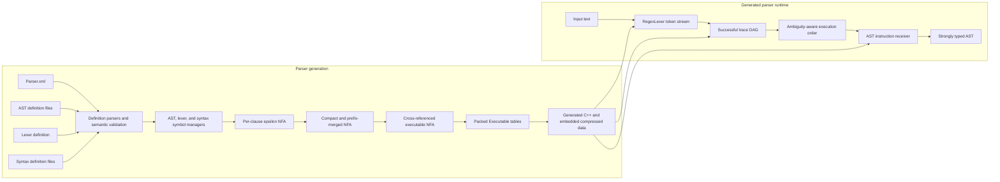

# VlppParser2 design guide

VlppParser2 is a code-generating GLR parser system. It compiles strongly typed AST, lexer, and syntax definitions into C++ types plus a serialized pushdown automaton, then uses a generic runtime to recognize every surviving parse, preserve local ambiguity, and assemble the selected paths into a typed AST.

This documentation explains the design of the code under [`Source`](../Source), with emphasis on layer boundaries, data organization, algorithm choices, and the problems those choices solve. It does not document test source code. The ordered test projects are discussed only as a bootstrap and regeneration workflow because generated code from one project is input to later projects.

The shortest useful mental model is:

> Parser generation turns rich grammar descriptions into stable integer-indexed tables. Runtime parsing turns tokens into a trace graph without creating AST objects. Only after the successful graph and its ambiguity regions are known does the runtime replay AST instructions.

## End-to-end view

The generation and runtime halves meet at three generated contracts:

- Lexer data maps text to stable token IDs.
- `vl::glr::automaton::Executable` stores the token-indexed PDA and AST instruction slices.
- A generated `vl::glr::AstInsReceiverBase` subclass maps integer class and field IDs back to concrete C++ operations.

That separation is deliberate. The core parser and ambiguity algorithms never need to know a generated C++ class, while generated code never needs to implement GLR graph traversal.

## Reading paths

For a first architectural pass, read:

1. [Architecture](Architecture.md)
2. [Grammar compilation](GrammarCompilation.md)
3. [Automaton construction](AutomatonConstruction.md)
4. [Runtime parsing](RuntimeParsing.md)
5. [Ambiguity and AST execution](AmbiguityAndAstExecution.md)

For work on the parser generator front end, read:

1. [Grammar compilation](GrammarCompilation.md)
2. [Syntax validation and rewriting](SyntaxValidation.md)
3. [Automaton construction](AutomatonConstruction.md)
4. [Code generation](CodeGeneration.md)

For work on recognition, performance, or ambiguity, read:

1. [Automaton construction](AutomatonConstruction.md)
2. [Runtime parsing](RuntimeParsing.md)
3. [Ambiguity and AST execution](AmbiguityAndAstExecution.md)

For regeneration or self-hosting work, read:

1. [Code generation](CodeGeneration.md)
2. [Bootstrapping and verification](Bootstrapping.md)
3. [Source map](SourceMap.md)

## Document map

- [Architecture](Architecture.md) defines the layers, their contracts, the central data transformations, and the design rules that keep those layers independent.
- [Grammar compilation](GrammarCompilation.md) covers AST and lexer definitions, symbol ownership, stable IDs, self-hosted definition parsers, and the hand-written lexer-definition reader.
- [Syntax validation and rewriting](SyntaxValidation.md) follows syntax definitions through name resolution, type inference, partial-rule checks, switch specialization, and structural validation.
- [Automaton construction](AutomatonConstruction.md) follows clauses from epsilon NFA fragments through epsilon removal, direct-left-recursion elimination, exact-input merging, same-rule factoring, automatic cross-rule prefix merging, cross-referencing, and packed executable tables.
- [Runtime parsing](RuntimeParsing.md) explains token dispatch, persistent return stacks, left-recursion and reduction transitions, priority competitions, trace merging, memory pools, and recognition success.
- [Ambiguity and AST execution](AmbiguityAndAstExecution.md) explains the trace post-processing pipeline, symbolic partial execution, local ambiguity boundaries, execution-step construction, the `StackBegin` instruction model, and final AST assembly.
- [Code generation](CodeGeneration.md) describes every generated artifact family, the generic/generated boundary, deterministic naming, serialization, compression, and built-in JSON/XML integration.
- [Bootstrapping and verification](Bootstrapping.md) explains how the parser generator generates its own definition parsers and why the projects in [`Project.md`](../Project.md) must run in order.
- [Source map](SourceMap.md) maps the files and directories under [`Source`](../Source) to their responsibilities and highlights implementation details that are easy to misread.

The existing language-reference pages remain the quickest syntax lookup:

- [AST definition reference](../.github/KnowledgeBase/manual/vlppparser2/ast.md)
- [Lexer definition reference](../.github/KnowledgeBase/manual/vlppparser2/lexer.md)
- [Syntax definition reference](../.github/KnowledgeBase/manual/vlppparser2/syntax.md)
- [Generated API reference](../.github/KnowledgeBase/manual/vlppparser2/apis.md)

This design guide follows current source behavior when it differs from those older reference pages.

## Why the architecture looks this way

### Recognition is separated from semantic execution

An aggressively merged PDA can share work across many grammar paths, but arbitrary branch and merge shapes make it unsafe to mutate an AST while recognition is still speculative. VlppParser2 records transitions as a trace graph first. Dead branches are ignored by walking backward from successful endings, and AST instructions are scheduled only after the surviving graph is understood.

This solves two problems at once:

- Complex local ambiguity no longer requires cloning a partially built AST on every branch.
- The recognizer can merge equivalent configurations for performance without pretending their semantic histories are already identical.

### AST instructions describe slots before types and fields

The older design exposed the eventual AST class and field near the beginning of a clause. Two syntactically identical prefixes could therefore carry different instructions and could not be shared safely. The current instruction set stores tokens, enum values, and completed child objects in numbered slots. `CreateObject` and `Field` occur near the clause end, after the parser knows which clause completed.

The result is the core `StackBegin` invariant: equal grammar prefixes normally produce equal instruction prefixes. This is what makes automatic prefix merging and direct-left-recursion rewriting composable instead of a collection of special cases.

### Local ambiguity is represented in the type system

An `@ambiguous` AST class gains a generated `ToResolve` subtype whose `candidates` field stores alternatives for one source range. The parser therefore returns one AST containing local ambiguity nodes, not a Cartesian product of whole trees. The generated parser also provides the runtime with a common-base-class table so the generic trace processor can select the correct ambiguity wrapper.

### Mutable graphs become packed arrays at the deployment boundary

Generation algorithms benefit from pointer-linked rules, states, edges, and symbols. Runtime execution benefits from dense arrays, 32-bit indices, and range descriptors. `vl::glr::parsergen::SyntaxSymbolManager` therefore owns a mutable graph during compilation, while `vl::glr::automaton::Executable` is a compact serialization-oriented form.

The runtime follows the same principle for transient data: append-only block pools provide stable 32-bit handles for return stacks, traces, symbolic stack records, ambiguity records, and execution steps. This avoids a heap allocation for every small graph node and keeps recently created nodes close in memory.

### Generated code contains data and type-specific adapters

The generated parser does not duplicate the GLR algorithm. It contains:

- serialized lexer and parser tables;
- enums and lookup helpers for stable IDs;
- strongly typed AST classes and optional visitor/builder utilities;
- a small assembler adapter that implements object creation, field assignment, and ambiguity wrapping;
- thin `ParseRuleName` methods for rules marked `@parser`.

This keeps the runtime reusable while preserving compile-time type checking in client code.

## Terminology used throughout

- **Definition AST**: the generated `GlrAstFile` or `GlrSyntaxFile` tree produced while reading a parser definition. It is not the AST produced by the parser being generated.
- **Symbol manager**: a semantic model that owns resolved names, stable order, validation errors, and, for syntax, the mutable automaton graph.
- **Rule edge**: a transition that calls another grammar rule before cross-referencing.
- **Return edge/descriptor**: an ordered logical rule-call continuation attached to an active token or `LeftRec` edge. Packing turns the referenced rule edge into a `ReturnDesc`.
- **Ending transition**: an epsilon-like reduction of the current rule. It may pop a saved continuation.
- **Left-recursion transition**: an epsilon-like transition that re-enters a continuation after a completed prefix; it also represents continuations introduced by prefix merging.
- **Trace**: one recorded automaton move plus its parser configuration and predecessor relationship.
- **Trace DAG**: the surviving partial order of successful trace paths, including branch and merge nodes.
- **Competition**: the runtime mechanism implementing `+[]` and `-[]` preference without changing grammar acceptance.
- **AST instruction**: a grammar-independent operation such as `StackSlot`, `CreateObject`, or `Field`.
- **Execution step**: a range of trace instructions, or a synthetic begin/branch/end operation used to construct a local ambiguity node.

## Scope and maintenance rule

The documents describe code under [`Source`](../Source) and the non-test generator entry point that orders those APIs. Generated directories are described as outputs and bootstrap artifacts, not as places to edit. Test projects are named only to explain generation dependencies; their implementation is intentionally out of scope.

When changing the system, update the document that owns the changed invariant rather than adding an isolated note to this index. The most important cross-check is that the generation-time instruction ordering in [Automaton construction](AutomatonConstruction.md) still agrees with the runtime assumptions in [Ambiguity and AST execution](AmbiguityAndAstExecution.md).
