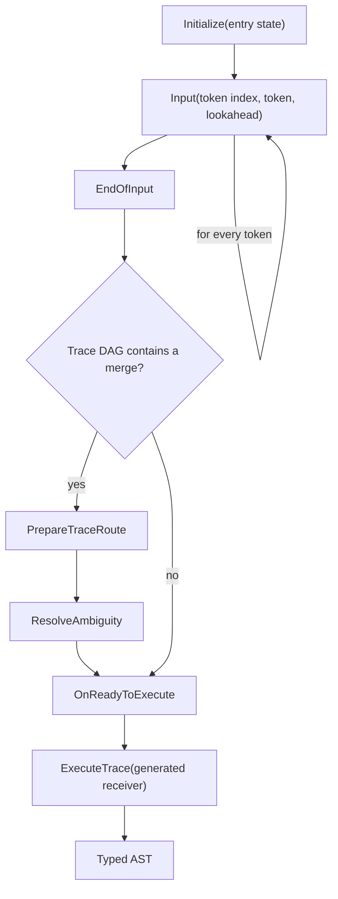
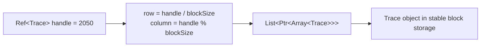
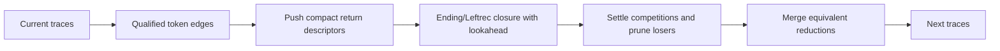
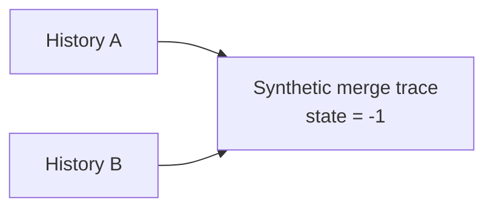
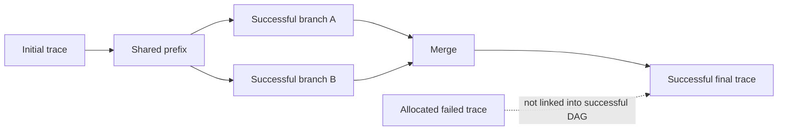

# Runtime parsing

Runtime parsing begins with the generated lexer and packed automaton and ends with a bidirectional graph containing every successful parse history. It deliberately does not allocate or mutate generated AST objects. Semantic execution starts only after the graph is complete, as described in [Ambiguity and AST execution](AmbiguityAndAstExecution.md).

This chapter covers the runtime-facing code in:

- [`SyntaxBase.h`](../Source/SyntaxBase.h) and [`SyntaxBase.cpp`](../Source/SyntaxBase.cpp);
- [`Executable.h`](../Source/Executable.h) and [`Executable.cpp`](../Source/Executable.cpp);
- [`TraceManager.h`](../Source/TraceManager/TraceManager.h), [`TraceManager.cpp`](../Source/TraceManager/TraceManager.cpp), and the `TmInput_*` implementation files under [`Source/TraceManager`](../Source/TraceManager).

Read [Architecture](Architecture.md) first for the generator/runtime boundary. Read [Automaton construction](AutomatonConstruction.md) when the origin of an edge, return descriptor, competition, or AST instruction matters.

## The recognition contract

The generated parser and generic runtime meet at three objects:

- `vl::regex::RegexLexer` converts source text into lexer token IDs.
- `vl::glr::automaton::Executable` supplies a state-and-input dispatch table, persistent-return descriptions, priority annotations, and AST instruction slices.
- `vl::glr::automaton::IExecutor` accepts tokens and later replays the successful semantic history.

The generated parser class inherits `vl::glr::ParserBase<TTokens, TStates, TReceiver>`. It supplies:

- the generated token enum;
- the generated entry-state enum;
- a generated `vl::glr::AstInsReceiverBase` subclass;
- callbacks that write embedded lexer and parser data into a stream;
- a token deleter for whitespace, comments, and other discarded tokens;
- an `IExecutor::ITypeCallback` implementation used only if local ambiguity must be typed.

The runtime therefore knows integer token, state, rule, class, and field IDs, but it never depends on a generated AST class declaration.

## `ParserBase` orchestration

### Loading generated data

The `vl::glr::ParserBase` constructor invokes the two generated data callbacks. Each callback writes its serialized image to a `vl::stream::MemoryStream`; the constructor rewinds the stream and creates either `vl::regex::RegexLexer` or `vl::glr::automaton::Executable`.

Generated data can be emitted as raw blocks or compressed blocks. `vl::glr::DecompressSerializedData` in [`AstBase.cpp`](../Source/AstBase.cpp) reconstructs the byte stream and optionally passes it through `vl::stream::DecompressStream`. From the parser facade onward, raw and compressed generated parsers behave identically.

The parser owns both loaded objects. A newly created executor borrows the executable and the generated type callback for one parse.

### Tokenization

`ParserBase::Tokenize` calls the combined lexer and processes each `vl::regex::RegexToken`:

1. A token with `token == -1` or `completeToken == false` is reported as `vl::glr::ErrorType::UnrecognizedToken`.
2. A recognized token is passed to the generated deleter.
3. Non-discarded tokens are appended to the parser token list in source order.

Malformed lexical fragments are not appended. The default flow for lexical errors is non-throwing, so a caller that installs an error collector can receive a lexical diagnostic and still see whether the remaining tokens form a parse. A handler may set `ErrorArgs::throwError` to stop instead.

`vl::regex::RegexToken::reading` points into source storage. `ParseWithString` keeps its `WString` argument alive throughout tokenization and parsing. Code calling a token-list overload directly must keep every token's backing character buffer alive until `ExecuteTrace` has copied token fields into the AST.

### Parse lifecycle

`ParserBase::ParseInternal` owns the executor call order:



The state machine enforced by `vl::glr::automaton::TraceManagerState` is:

1. `Uninitialized`;
2. `WaitingForInput` after `Initialize`;
3. `Finished` after a successful or failed `EndOfInput`;
4. `PreparedTraceRoute` after ambiguity preparation;
5. `ResolvedAmbiguity` before semantic replay.

If there is no trace merge, `EndOfInput` moves directly to `ResolvedAmbiguity` and creates one instruction-range execution step. The expensive post-processing data structures are not allocated.

### Events and errors

`vl::glr::ParserBase` exposes three events:

| Event | Timing | Purpose |
| --- | --- | --- |
| `OnTraceProcessing` | After end-of-input graph construction and, when needed, after each trace post-processing phase | Observe or log the runtime graph without changing its algorithm. |
| `OnReadyToExecute` | After a replay schedule exists and before AST instructions run | Inspect the final executor state. |
| `OnError` | Lexical, recognition, completion, or result-type failure | Collect a diagnostic or request an exception. |

`vl::glr::TraceProcessingPhase` distinguishes `EndOfInput`, `PrepareTraceRoute`, and `ResolveAmbiguity`. The latter two are emitted only when ambiguity was involved.

`vl::glr::ErrorType` separates four public failures:

- `UnrecognizedToken`: the lexer could not recognize a complete token;
- `InvalidToken`: all live parser configurations failed while consuming one token;
- `InputIncomplete`: tokens ended before a root-rule ending configuration was reached;
- `UnexpectedAstType`: semantic replay succeeded, but the root object was not the generated entry rule's expected type.

`vl::glr::InstallDefaultErrorMessageGenerator` converts these to `vl::glr::ParsingError` objects and requests non-throwing behavior.

`ErrorArgs` is a tagged-union-like structure implemented with reference members. A factory supplies meaningful references only for fields valid for its `error` value. Event handlers must branch on `error` before reading `token`, `tokens`, `executable`, `executor`, or `ast`.

## The packed executable

`vl::glr::automaton::Executable` is the immutable runtime image produced after grammar graph transformations. Mutable generator objects have been replaced by dense arrays and 32-bit indices.

### Slice descriptors

The following structures are all `{start,count}` views into a global buffer:

- `InstructionArray` into `Executable::astInstructions`;
- `StringLiteral` into `Executable::stringLiteralBuffer`;
- `CompetitionArray` into `Executable::competitions`;
- `ReturnIndexArray` into `Executable::returnIndices`;
- `EdgeArray` into `Executable::edges`.

An empty slice normally has `start == -1` and `count == 0`. No per-edge vector or pointer allocation is required after deserialization.

### State/input dispatch

`Executable::transitions` is indexed by:

```text
state * (Executable::TokenBegin + tokenCount) + input
```

The final automaton has three indexed input families:

| Input | Value | Runtime meaning |
| --- | ---: | --- |
| `Executable::EndingInput` | `0` | Reduce or finish the current rule without consuming another token. |
| `Executable::LeftrecInput` | `1` | Enter a zero-token continuation introduced by direct left recursion, same-rule factoring, or automatic cross-rule prefix merging. |
| `Executable::TokenBegin + tokenId` | `2 + tokenId` | Consume a lexer token. |

`Executable::EndOfInputInput == -1` is a reserved constant, not a transition-table column. `TraceManager::EndOfInput` validates the live configurations explicitly.

`StateDesc` records the owning rule and whether the state is an ending state. `ruleStartStates` maps each rule ID to its packed entry state. Partial rules are compile-time macros whose bodies are inlined; their mapped value is `-1` rather than a usable runtime entry.

### Edge descriptions

`vl::glr::automaton::EdgeDesc` stores:

- `fromState` and `toState`;
- an optional exact-literal condition;
- priority competitions attached to the edge;
- AST instructions executed after the input;
- an ordered slice of return indices representing leading rule calls before the active edge.

Return indices are ordered from the outermost caller toward the innermost call. `WalkAlongSingleEdge` pushes them in that order, leaving the innermost continuation on top of the persistent return stack. Prefix-generated `LeftrecInput` edges can carry this slice just as token edges can; `EndingInput` edges are required to have an empty return slice.

Token dispatch first selects by lexer token ID. `TraceManager::IsQualifiedTokenForCondition` then checks an optional spelling by comparing token length and `wchar_t` contents with a slice in `stringLiteralBuffer`. This lets keywords and punctuation share a broad lexer token while grammar edges still require an exact spelling.

### Return descriptions

A rule edge does not survive as an input category in the packed executable. Cross-referencing attaches calls traversed before a token edge, while prefix merging attaches simulated continuation call paths to `LeftrecInput` edges. Both use the ordered `EdgeDesc::returnIndices` slice.

Each `vl::glr::automaton::ReturnDesc` stores:

- `consumedRule`: rule entered by the call;
- `returnState`: caller continuation after that rule reduces;
- competitions attached to the call;
- `ReturnRuleType`;
- AST instructions executed after the reduced rule value becomes available.

The semantic effect of `ReturnRuleType` has already been lowered into `insAfterInput`:

- `Field` stores the child object in the occurrence's numbered slot;
- `Discard` removes the child object by storing it in an otherwise unused slot;
- `Reuse` leaves the child object available as the enclosing clause's current object;
- `Partial` is reserved in the packed schema; current partial rules are inlined and do not normally produce a `ReturnDesc`.

At runtime, `ruleType` also controls persistent-stack sharing: `Reuse` call records are deliberately not reused by `PushReturnStack`; other call kinds may reuse an identical record created from the same base during the same token step.

### Serialization boundary

[`Executable.cpp`](../Source/Executable.cpp) defines context-free serialization for every descriptor and array. `vl::glr::automaton::Metadata`, containing rule names and state labels, is diagnostic data and is not serialized as part of `Executable`.

There is no explicit executable-format version in these structures. Generated parser blobs and the runtime's field and enum layout must therefore be regenerated together when the schema changes. [Code generation](CodeGeneration.md) describes how the byte image is embedded in C++.

## Append-only runtime storage

Recognition creates many small, short-lived objects. `vl::glr::automaton::AllocateOnly<T>` in [`TraceManager.h`](../Source/TraceManager/TraceManager.h) replaces individual heap allocations with fixed-size blocks.

Every pooled type inherits `Allocatable<T>` and receives a stable `allocatedIndex`. A typed `Ref<T>` stores that index as a `vint32_t`; handle `-1` is `nullref`.



Separate pools own:

- `ReturnStack`;
- `Trace`;
- `Competition` and `AttendingCompetitions`;
- the symbolic and ambiguity structures described in [Ambiguity and AST execution](AmbiguityAndAstExecution.md).

The executor's configurable block size is normally 1024. `Initialize` clears all pools and invalidates every prior `Ref<T>`. Within one parse, append-only allocation ensures that a handle remains stable while lists and graphs grow.

`WithMagicCounter::mergeCounter` plus `TraceManager::MergeStack_MagicCounter` provides epoch-based temporary marking. Algorithms can deduplicate or intersect pooled linked sets without allocating a dictionary for every traversal.

## A live parser configuration

Recognition state is spread across a `Trace`, a persistent return stack, and competition routing. This is intentional: control-equivalent paths can merge while their semantic histories remain represented by predecessor traces.

### Persistent return stacks

`vl::glr::automaton::ReturnStack` contains:

- `previous`: the persistent tail;
- `returnIndex`: the `ReturnDesc` at this level;
- `fromTrace`: the trace whose compact edge introduced it;
- `cache`: children created from this tail at recent token indices.

`TraceManager::PushReturnStack` performs hash-consing by a short linear scan of children created from the same base at the same token index. A matching `(returnIndex, fromTrace)` reuses the existing node. Sharing the immutable tail makes branching rule calls inexpensive and lets return-stack identity participate directly in trace equivalence.

`ReturnStackCache` retains both `successors` and `lastSuccessors`. `GetCurrentSuccessorInReturnStack` can therefore retrieve the current or immediately previous cached token index; any request that is neither cached nor newer than the current generation is rejected as corrupted traversal order.

When `EndingInput` reduces a called rule, the top node is popped. The new trace retains it separately as `Trace::executedReturnStack`; otherwise the `ReturnDesc::insAfterInput` slice would be lost after the current return-stack head changes.

### Traces

`vl::glr::automaton::Trace` records one automaton move:

- current state;
- current and just-executed return-stack references;
- edge and logical input that created the move;
- token index associated with the move;
- competition routing;
- predecessor links;
- successor links and counts filled only after recognition succeeds.

A trace with `state == -1` is a synthetic merge node. Its predecessors have equivalent control configurations. `TraceManager::EnsureTraceWithValidStates` obtains the actual state-bearing predecessor when recognition continues through that merge.

`vl::glr::automaton::WalkingTrace` therefore carries two pointers:

- `currentTrace`: the graph node that must become the next trace's predecessor;
- `stateTrace`: the ordinary trace whose state, return stack, and competition routing drive the next transition.

This distinction preserves the merge in semantic history without adding a fake automaton move.

### Compact predecessor/successor collections

`TraceCollection` embeds both the owned collection endpoints and the owned trace's links when it belongs to another collection:

```text
owner.collection.first/last
element.collection.siblingPrev/siblingNext
```

This avoids a separate graph-edge pool, but one `Trace` cannot be an element of two multi-element sibling lists. The surviving graph may split or merge, but it must not contain a general many-to-many junction.

`TraceManager::AddTraceToCollection` handles one legal predecessor-side collision by copying an ordinary trace that has a single predecessor. A trace that already merges several predecessors cannot be copied this way, because doing so merely moves the many-to-many conflict one level backward.

### Survivor buffers

`TraceManager` reuses `traces1` and `traces2` as current and next survivor arrays. `BeginSwap` resets a logical count, `AddTrace` overwrites reusable entries before extending the list, and `EndSwap` exchanges the pointers. Unused entries are nulled after the swap so prior-round trace pointers do not appear live.

## Consuming one token

`TraceManager::Input` in [`TmInput.cpp`](../Source/TraceManager/TmInput.cpp) processes one token in four stages:



The runtime maps the lexer token to `Executable::TokenBegin + token.token`, performs one direct table lookup for each live state, and passes the resulting `EdgeArray` to `TraceManager::WalkAlongTokenEdges`.

For every token edge whose literal condition matches, `WalkAlongTokenEdges` calls `TraceManager::WalkAlongSingleEdge`. That common helper is also used for qualified `EndingInput` and `LeftrecInput` edges, and performs these operations:

1. inherits the existing return stack and competition lists;
2. for each return descriptor in outer-to-inner order, attends that descriptor's competitions against the current stack and then pushes the descriptor;
3. attends the active edge's competitions after all of its return descriptors have been pushed;
4. handles a reduction pop if the logical input is `EndingInput`;
5. allocates a new trace and records the edge, logical input, token index, stacks, competitions, and predecessor;
6. immediately attempts reduction-trace merging when applicable.

The edge's AST instructions are not executed. The trace's `byEdge` and `executedReturnStack` are enough to recover them later.

## Ending and left-recursion transitions

Both synthetic inputs consume no new token, but they serve different purposes.

### `EndingInput`

An ending transition finishes a path through the current rule.

- It is not allowed to push new return descriptors.
- If a return stack exists, it pops exactly one entry and resumes at that entry's `returnState`.
- If the return stack is empty, it remains within the root-rule automaton and can eventually reach the root ending state.
- It can close a high-priority competition for the current rule invocation.

One trace represents one reduction. A chain of nested reductions therefore remains visible as a chain of traces, which is necessary to replay every rule-return instruction in order.

### `LeftrecInput`

A left-recursion transition is a zero-token continuation produced by direct-left-recursion elimination, same-rule factoring, or automatic prefix merging. It does not pop a return record. A prefix-generated `LeftrecInput` edge may push its own ordered return descriptors before continuing, allowing the runtime to simulate the rule path into which the shared prefix is injected.

`TraceManager::TestLeftrecEdgeQualification` follows such an edge only if the target state can either:

- accept the next token with a matching literal condition; or
- continue through an ending transition.

This condition prevents speculative synthetic continuations that cannot contribute to the next input or to a successful reduction.

### Lookahead-guided epsilon pruning

Naively following every possible reduction before discovering that the caller cannot accept the lookahead would allocate many doomed traces. `TraceManager::WalkAlongEpsilonEdges` avoids that cost in two passes.

The first pass walks the deterministic ending chain without allocating traces. At each level it asks whether:

- a qualified left-recursion continuation exists;
- the current state can consume the lookahead;
- an ending edge branches;
- no lookahead remains and the root can finish.

From those answers it calculates how many ending transitions must actually be materialized. The second pass:

- emits qualified left-recursion alternatives at each retained level;
- follows the necessary ending transitions;
- recurses only when multiple ending edges create genuine branches.

With no lookahead, the walk continues far enough to decide root completion. With lookahead, it stops once further reductions cannot improve viability.

## Priority competitions

Competitions implement preferences such as the opt-in branch of `+[syntax]`. Preference cannot be resolved statically because a favored branch may fail later.

### Data structures

`vl::glr::automaton::Competition` is identified within its owner trace by:

- rule ID;
- generated competition ID.

It stores `Holding`, `HighPriorityWin`, or `LowPriorityWin`, plus temporary high/low survivor counters.

`vl::glr::automaton::AttendingCompetitions` records:

- the competition;
- whether this route bets high or low;
- the return-stack object identifying the relevant rule invocation;
- active and carried linked-list membership;
- whether the attendance has been closed.

The return-stack object, not just the rule ID, distinguishes recursive or nested invocations of the same rule.

Competition attendance follows the packed call order. A competition attached to a `ReturnDesc` captures the stack before that descriptor is pushed; a competition attached to the active edge sees the stack after all of the edge's return descriptors have been pushed. This preserved invocation identity is what lets a later ending transition settle the correct nested competition.

### Settlement algorithm

`TraceManager::CheckBackupTracesBeforeSwapping` in [`TmInput_Competition.cpp`](../Source/TraceManager/TmInput_Competition.cpp) runs after the new traces for a token are known:

1. Reset counters on every active competition.
2. Count each surviving route's active high and low bets.
3. If only high routes survive, high wins.
4. If only low routes survive, low wins only after crossing the required token boundary.
5. Remove every trace that loses any attended competition.
6. Remove settled or abandoned competitions from active lists.
7. Remove closed attendance nodes from surviving routes.

The delay before a low win matters when the low choice is an epsilon transition but the high choice consumes the next token. Closing immediately would choose low before the high route had a chance to exist.

`TraceManager::CheckAttendingCompetitionsOnEndingEdge` can declare high victory earlier when a high route completes the intended rule invocation. It requires both the rule ID and saved return-stack identity to match.

Once attendance-list heads change, previously distinct reductions may become equivalent. The caller then invokes `TryMergeSurvivingTraces`.

## Recognition-time trace merging

Trace merging shares future work without discarding semantic history. It occurs at reduction boundaries, where two configurations can have converged after different grammar paths.

`TraceManager::AreTwoEndingInputTraceEqual` requires:

- the same state;
- the same just-executed return-stack node;
- the same remaining return-stack head;
- the same active attendance-list head;
- an ending input on the state-bearing candidate.

Pointer/handle equality is sufficient because return stacks and active competition lists are persistent and shared.

`TraceManager::MergeTwoEndingInputTrace` creates this topology:



If the selected survivor is still an ordinary trace, the function copies its former contents to a fresh allocation, clears the original allocation into a merge node, and links the former and new histories as predecessors. Existing survivor pointers continue to point at the same allocation, now representing the merge.

`TraceManager::TryMergeSurvivingTraces` handles larger sets after priority pruning. It groups ending or existing merge traces by actual state, propagates removal when an ending trace's sole predecessor no longer survives, joins compatible predecessor lists, and compacts the survivor vector.

The merge node retains all incoming histories. It does not assert that their AST instructions are interchangeable; [Ambiguity and AST execution](AmbiguityAndAstExecution.md) later determines the local semantic region that must be executed once per branch.

## End of input and the successful DAG

`TraceManager::EndOfInput` accepts only state-bearing configurations with:

- an empty return stack;
- `StateDesc::endingState == true`.

This means every nested rule call has returned and the selected root rule has completed exactly at the token boundary.

If several final configurations survive, `FillSuccessorsAfterEndOfInput` first combines them under one synthetic merge. It then walks backward from the final node or nodes and fills forward links:

- `Trace::predecessorCount`;
- `Trace::successors`;
- `Trace::successorCount`.

Only nodes reachable backward from a successful ending are visited. Failed traces remain in append-only pools but are not part of the successful graph.



Any trace with more than one predecessor sets `ambiguityInvolved`. A graph without such a trace has one successful path and degenerates to a doubly navigable chain.

When token consumption fails or end of input is incomplete, the manager can build successor links from the preceding survivor set instead. This makes the partial successful prefix available to diagnostics even though no AST will be executed.

## Fast path for an unambiguous parse

When `FillSuccessorsAfterEndOfInput` finds no merge, `EndOfInput`:

1. changes the executor state directly to `ResolvedAmbiguity`;
2. allocates one `vl::glr::automaton::ExecutionStep` of type `Instruction`;
3. sets its range from the initial trace to the sole final trace.

No `TraceExec`, symbolic stack, ambiguity record, or nested execution tree is needed. Final replay reconstructs each trace's edge and return instruction slices on demand.

The fast path uses the same per-trace instruction contract as ambiguity processing: edge instructions execute first, and an `EndingInput` trace then executes the instruction slice of the one return descriptor it popped. Return descriptors merely pushed by an earlier token or `LeftrecInput` edge do not execute at push time.

## Runtime invariants

- `Initialize`, all `Input` calls, `EndOfInput`, optional preparation/resolution, and `ExecuteTrace` must occur in order. `ParserBase` is the normal owner of this sequence.
- A token ID must be within the executable's generated token range.
- Exact-literal conditions are compared only after token-class dispatch.
- Only `EndingInput` pops a return record; the popped record must remain on the resulting trace for semantic replay.
- Return-stack caches assume monotonically advancing input token indices.
- A synthetic merge trace's predecessors must have the same control configuration used by `EnsureTraceWithValidStates`.
- Trace sibling links can encode a split collection or a merge collection, not a general many-to-many graph.
- Priority routes are pruned before equivalent reductions are merged.
- `Ref<T>` values are executor-local and become invalid after `Initialize` clears the pools.
- A materialized root AST normally requires at least one non-discarded token, because replay associates every instruction with a trace token index.

## Why this design scales

The runtime combines several forms of sharing:

- dense transition lookup shares all generation-time graph work;
- persistent return stacks share call prefixes among GLR configurations;
- trace merges share future recognition while retaining distinct histories;
- append-only pools avoid one heap allocation per tiny node;
- lookahead pruning avoids constructing doomed epsilon chains;
- priority competitions discard losing histories as soon as the input proves the preference;
- concrete AST allocation is delayed until one successful replay schedule exists.

The result is not simply a nondeterministic automaton. It is a compact recognizer that preserves exactly the semantic history required for local ambiguity and no concrete AST state for failed paths.

## Current implementation cautions

This section records verified behavior in the current source. It is separate from the intended contracts above.

### Incomplete-input range conversion

In [`SyntaxBase.cpp`](../Source/SyntaxBase.cpp), `vl::glr::ErrorArgs::ToParsingError` appears to invert the `InputIncomplete` token-count branches. The `tokens.Count() == 0` branch indexes `tokens[tokens.Count() - 1]`, while the nonempty branch returns a fixed zero range. Code documenting or fixing diagnostics should not treat that branch as the intended source-range policy.

### Superseded comments

Two comments reflect earlier runtime designs:

- `TraceManager::AreTwoEndingInputTraceEqual` mentions comparing `switchValues`. Runtime traces no longer contain switch state; syntax switches are specialized away during grammar compilation.
- The comment on `Executable::astInstructions` mentions `insBeforeInput`. The current packed format and trace replay use only edge and return `insAfterInput` slices.

The ambiguity-boundary comparison caution is documented with the affected algorithm in [Ambiguity and AST execution](AmbiguityAndAstExecution.md#current-implementation-cautions).

## Continue reading

- [Ambiguity and AST execution](AmbiguityAndAstExecution.md) starts from the successful trace DAG and explains semantic scheduling and concrete AST construction.
- [Automaton construction](AutomatonConstruction.md) explains how rule calls, left recursion, priorities, and instructions become the packed tables consumed here.
- [Code generation](CodeGeneration.md) explains the generated lexer data, executable byte arrays, parser facade, and assembler adapter.
- [Source map](SourceMap.md) provides a file-by-file guide to the entire `Source` tree.
