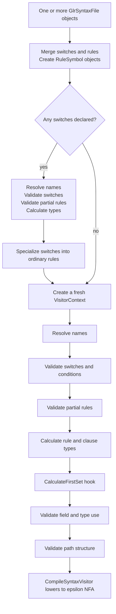

# Syntax validation and rewriting

Syntax compilation is the semantic front end between a parsed `GlrSyntaxFile` and the mutable automaton graph. Its job is to remove compile-time features, prove that AST construction is well-defined on every grammar path, and attach resolved symbols and types to the syntax before any states or edges are created.

This document follows current source behavior in [`Source/ParserGen`](../Source/ParserGen). For the surrounding layers, start with the [documentation index](Index.md), [architecture](Architecture.md), and [grammar compilation](GrammarCompilation.md). The output of this pipeline is lowered in [automaton construction](AutomatonConstruction.md); the consequences of its priority and AST decisions are covered in [runtime parsing](RuntimeParsing.md) and [ambiguity and AST execution](AmbiguityAndAstExecution.md).

## The semantic boundary

The syntax-definition parser has already produced a definition AST containing `GlrSyntaxFile`, `GlrRule`, `GlrClause`, and `GlrSyntax` nodes. At that point names are still strings, switches are still expressions, and clause types may be implicit. The compiler must turn those loose descriptions into facts that later passes can rely on:

- every token, rule, type, field, enum item, and switch reference is known;
- cross-file visibility has been enforced;
- switches have been specialized away;
- every rule and clause has one deterministic AST class type;
- partial rules can be inlined finitely and safely;
- every reuse clause has exactly one reused object on every path;
- loops, optionals, field assignments, and priority annotations satisfy the AST instruction model.

The central working types are declared in [`Compiler.h`](../Source/ParserGen/Compiler.h):

- `vl::glr::parsergen::compile_syntax::VisitorContext` connects definition-AST nodes to `RuleSymbol`, token IDs, clause types, and dependency graphs.
- `vl::glr::parsergen::compile_syntax::VisitorSwitchContext` stores declared switch defaults plus the switches that affect each clause and rule.
- `vl::glr::parsergen::SyntaxSymbolManager` owns resolved rules and the shared error sink. Its graph is still empty throughout validation.
- `vl::glr::parsergen::AstSymbolManager` and `LexerSymbolManager` are read-only semantic inputs.

The maps in `VisitorContext` are deliberately keyed by AST-node or symbol identity rather than repeating information in generated AST classes. The definition AST stays a syntax tree; semantic facts live in the compilation context.

## Pass order

The orchestration is in [`CompileSyntax.cpp`](../Source/ParserGen/CompileSyntax.cpp).

After every named stage, `CompileSyntax` checks `ParserSymbolManager::Errors()`. Later passes are not asked to operate on an invalid semantic model.

Switch-enabled grammars intentionally run the early passes twice. The first run supplies the types and dependency information needed to specialize rules. Specialization creates new AST nodes and `RuleSymbol` objects, so none of the pointer-keyed maps from the first `VisitorContext` can be reused. A fresh context resolves and validates the rewritten, switch-free grammar again.

The multi-file overload returns the rewritten `GlrSyntaxFile` when switch specialization occurred and returns `nullptr` otherwise. This return value is useful for displaying the compiler-created grammar; automaton generation itself proceeds through `SyntaxSymbolManager`.

## Creating rule symbols before validation

`vl::glr::parsergen::CreateSyntaxSymbols` creates one `RuleSymbol` for each source rule before resolving clause contents. The symbol records:

- the source file index;
- `@public` and `@parser` attributes;
- the stable rule name and insertion order.

Creating the complete name table first allows forward references. File indices let name resolution distinguish a legal same-file reference from a cross-file reference that requires `@public`.

A rule name may not collide with a lexer token name. Duplicate rules and token conflicts are reported immediately, before a context tries to index the rule map.

## Name resolution

[`CompileSyntax_ResolveName.cpp`](../Source/ParserGen/CompileSyntax_ResolveName.cpp) implements `vl::glr::parsergen::ResolveNameVisitor` and `ResolveName`.

### Rule and token references

An identifier in `GlrRefSyntax` may name either a token or a rule. The earlier name-conflict check makes that choice unambiguous. A missing name produces `TokenOrRuleNotExistsInRule`.

When the target is a rule in a different syntax file, the target must be `@public`. This check is performed for both ordinary references and `GlrUseSyntax` (`!Rule`). Visibility is a definition-file concern; after validation, the automaton does not need to carry access metadata.

### AST class names

Rule type annotations and create/partial clause types are looked up in `AstSymbolManager` and must resolve to exactly one class symbol. An enum or ambiguous name lookup is rejected.

If the class participates in the generated ambiguity-class transformation, resolution uses `AstClassSymbol::derivedClass_Common`. This makes later type inference operate on the concrete common representation expected by the generated assembler rather than on the source declaration placeholder. The runtime side of that relationship is explained in [ambiguity and AST execution](AmbiguityAndAstExecution.md).

Resolved create and partial clause types are saved in `VisitorContext::clauseTypes`. Reuse-clause types are not known yet; they are inferred from their `!Rule` dependencies.

### Literal tokens

The two literal forms have different contracts:

- A double-quoted literal must equal the display text of one non-discarded lexer token. The resolved token index is cached in `VisitorContext::literalTokens`.
- A single-quoted conditional literal is lexed using the cached grammar lexer. It must form exactly one complete, non-discarded token, and that token must not already have display text. The token ID selects the transition; the unescaped literal becomes a runtime lexeme condition on that transition.

The cached lexer is built lazily by `VisitorContext::GetCachedLexer` from `LexerSymbolManager::TokenOrder()`. This keeps conditional-literal validation consistent with the actual generated lexer.

### Reuse dependencies

Every valid `GlrUseSyntax` contributes two possible dependency records:

- `ruleReuseDependencies`: from the containing rule to the reused rule;
- `clauseReuseDependencies`: from the current reuse clause to the reused rule.

The first graph drives rule-type propagation. The second determines the type of each individual reuse clause. Keeping both avoids confusing “this rule can return these types” with “this particular clause reopens one of these types.”

### Switch names

`ResolveName` builds the global switch map, rejects duplicates and missing references, and reports switches that are never accessed. When switches are present, source rule names containing `_SWITCH` or `SWITCH_` are rejected because those fragments belong to generated specialization names.

`IsLegalNameBeforeWithPrefixMerge` still recognizes historical `LRI`/`LRIP` generated-name fragments, but it is not called by the current pipeline. Prefix merge is now an automatic automaton transformation, not syntax rewriting.

## Discovering switch dependence

[`CompileSyntax_ValidateSwitchesAndConditions.cpp`](../Source/ParserGen/CompileSyntax_ValidateSwitchesAndConditions.cpp) treats switches as compile-time parameters propagated through the rule-call graph.

### Direct dependence

`CollectRuleAffectedSwitchesFirstPassVisitor` walks conditions and records a switch against the current clause and rule. A switch overridden by an enclosing `GlrPushConditionSyntax` is not an external dependency of that region: the pushed value supplies it locally.

### Transitive dependence

`CollectRuleAffectedSwitchesSecondPassVisitor` repeatedly propagates the affected-switch sets of referenced rules into their callers. Propagation skips a switch when the caller overrides it around that reference. The pass runs to a fixed point because dependence can cross an arbitrary number of rules.

The result has two granularities:

- `VisitorSwitchContext::ruleAffectedSwitches` tells specialization which values distinguish complete rule variants.
- `VisitorSwitchContext::clauseAffectedSwitches` tells rewriting when a clause depends on only a subset and can be shared through a combined helper rule.

### Verifying pushed values

`VerifySwitchesAndConditionsVisitor` checks each pushed switch against the syntax below it. A value is useful if the body tests it directly or reaches a rule whose affected set contains it. Pushing a value that can never be observed is reported as `PushedSwitchIsNotTested`, which catches misspelled intent even though name resolution alone would accept the switch.

At least one rule must be unaffected by switches. These unaffected rules are the concrete roots from which reachable specializations are discovered. A grammar in which every rule still requires an external switch environment has no unspecialized entry point and is rejected with `SwitchUnaffectedRuleNotExist`.

## Rewriting switches into ordinary rules

[`CompileSyntax_RewriteSyntax_Switch.cpp`](../Source/ParserGen/CompileSyntax_RewriteSyntax_Switch.cpp) removes every switch construct before automaton lowering.

The key design decision is specialization rather than runtime flags. A rule affected by `A` and `B` becomes separate ordinary rules for the reachable value combinations, with names such as `_SWITCH_1A_0B`. The runtime then sees only normal alternatives and calls; token transitions do not need switch-state dimensions.

### Discover reachable variants

`rewritesyntax_switch::ExpandSwitchSyntaxVisitor` starts from switch-unaffected rules and follows references.

For an affected target rule it:

1. takes only the switches in that rule's affected set;
2. uses the current pushed value when present, otherwise the declaration default;
3. deduplicates the `(rule, value map)` combination;
4. recursively inspects the rule under that environment.

This reachability-driven approach avoids generating the full Cartesian product of all global switches.

### Copy and evaluate clauses

`rewritesyntax_switch::ExpandClauseVisitor` is a copying visitor with a current switch-value dictionary.

- References to affected rules are renamed to the appropriate specialization.
- A push construct creates a scoped copy of the dictionary and applies its overrides.
- A test construct evaluates its conditions and copies the viable syntax branches.
- No push or test node is allowed to survive the copy.

An internal `EmptySyntax` sentinel and `CancelBranch` exception represent the two different results of condition evaluation:

- a branch can contribute an empty alternative;
- or the entire enclosing branch can be unavailable.

`DeductEmptySyntaxVisitor` then simplifies the temporary tree. Empty sequence members disappear, one empty side of an alternative becomes an ordinary optional, and empty loop/optional bodies collapse. If the complete clause is empty or unavailable, the generated rule omits it.

### Current all-satisfied-branches behavior

The current implementation iterates every `GlrTestConditionBranch` and keeps every branch whose condition evaluates to true. If several survive, `BuildAlt` produces a `GlrAlternativeSyntax` containing all of them. It does not stop after the first true condition.

This differs from the older syntax reference, which describes first-satisfied-branch selection. The design documentation follows the current source: overlapping true conditions can therefore introduce an ordinary grammar alternative after specialization.

### Sharing clauses affected by fewer switches

Suppose a rule depends on switches `A`, `B`, and `C`, but one clause depends only on `A`. Copying that clause into every `(A,B,C)` variant would inflate both the rewritten grammar and the automaton.

The rewriter instead creates `_SWITCH_COMBINED...` rules keyed by the clause's smaller switch-value set:

- ordinary rules refer to the helper through a reuse clause;
- partial rules refer to it through a generated partial clause;
- helpers do not inherit public/parser entry attributes;
- first-level specialized rules retain the original attributes.

Valid and invalid `(combined rule name, source clause)` results are cached so the same partial evaluation is not repeated for each full variant.

After generated symbols are added, original affected `RuleSymbol` objects are removed. The caller then creates a new semantic context and validates the generated grammar exactly like source grammar.

## Partial rules

Partial rules are typed compile-time grammar macros. They do not create an independently callable runtime rule body; their clauses are copied into each reference during lowering.

`vl::glr::parsergen::ValidatePartialRules` in [`CompileSyntax_CalculateTypes.cpp`](../Source/ParserGen/CompileSyntax_CalculateTypes.cpp) enforces two early invariants:

- a rule cannot mix partial and non-partial clauses;
- every partial clause in one rule must declare the same AST class.

Later passes add the constraints needed for safe inlining:

- a partial rule cannot be used with `!Rule`;
- it cannot be assigned directly to a field because it produces no standalone object;
- the caller's clause class must derive from, or equal, the partial rule's class;
- partial-rule references must form an acyclic graph;
- a partial rule that assigns a non-array field cannot be expanded inside a loop.

The last rule is transitive in effect. `ValidateTypesVisitor::FindField` marks `RuleSymbol::assignedNonArrayField`, and structural validation checks that mark when a loop references a partial rule.

## Rule and clause type inference

`vl::glr::parsergen::CalculateRuleAndClauseTypes` is also in [`CompileSyntax_CalculateTypes.cpp`](../Source/ParserGen/CompileSyntax_CalculateTypes.cpp).

The type of a rule is the most detailed common AST base class that can represent every clause result.

### Known clause types

Create and partial clauses already have a class from name resolution. These are folded into the containing rule with `FindCommonBaseClass`.

- For an explicitly typed rule, the declared type is a constraint. If folding a clause would move to a different common base, the declaration is incompatible.
- For an inferred rule, the common base becomes the rule type. Incompatible known clause types report `RuleCannotResolveToDeterministicType`.

### Types through reuse

Reuse clauses derive their value from `!Rule`, so type information flows along `ruleReuseDependencies`.

`PartialOrderingProcessor` decomposes the dependency graph. Edges internal to multi-rule strongly connected components are temporarily removed so acyclic information can propagate. The compiler repeatedly:

1. folds known dependency types into non-cyclic rules;
2. finds one common type for every cyclic component;
3. updates component members;
4. repeats while any rule type changes.

A reuse cycle is legal when the component is anchored by a compatible known type. A component whose known types have no common base is reported for every member. Any rule still untyped after convergence is also an error.

Finally, each `GlrReuseClause` independently folds the types of its `clauseReuseDependencies`. A clause with no `!Rule`, or with incompatible reused rule types, cannot determine which object it edits and is rejected.

## Field and reference type validation

[`CompileSyntax_ValidateTypes.cpp`](../Source/ParserGen/CompileSyntax_ValidateTypes.cpp) validates operations against the resolved clause class.

`vl::glr::parsergen::ValidateTypesVisitor` enforces:

- a named field exists, including inherited fields;
- a token is assigned only to an `AstPropType::Token` field;
- a called rule's class is convertible to the destination class field;
- a partial rule is only expanded into a compatible clause class and never assigned to a field;
- `GlrUseSyntax` targets a non-partial rule and occurs only in a reuse clause;
- additional assignments target enum fields and name an item from that enum.

`ConvertibleTo` walks base classes from the produced type toward the required type. The direction matters: assigning a derived result to a base-typed field is legal; assigning a base result to a derived-only field is not.

Strong and weak enum assignments share the same static checks. Their runtime difference is only the emitted instruction: `Field` versus `FieldIfUnassigned`.

## Path-structure validation

[`CompileSyntax_ValidateStructure.cpp`](../Source/ParserGen/CompileSyntax_ValidateStructure.cpp) proves properties over every path without enumerating paths explicitly.

### Counting visitor

`ValidateStructureCountingVisitor` computes three summaries for each syntax subtree:

- minimum consumed length;
- minimum number of `!Rule` uses;
- maximum number of `!Rule` uses.

Sequence adds summaries. Alternative takes the minimum or maximum as appropriate. Optional and loop set minimum length/use count to zero. Loop maximum-use counts are deliberately inflated beyond one; only the distinction between zero, one, and more than one is needed.

The summaries enforce these invariants:

| Invariant | Why it is required |
| --- | --- |
| A clause cannot expand to empty | A rule reduction must make progress and provide a meaningful recognition path. |
| A loop or optional body cannot itself expand to empty | Otherwise epsilon closure or repetition can cycle without consuming input. |
| Every reuse-clause path has exactly one `!Rule` | The clause must have one and only one object to reopen. |
| `!Rule` cannot occur in a loop or optional | Repetition or skipping would violate the exactly-one-object contract. |
| Loop assignments target arrays | Repeated values must have a collection destination. |
| At most one preferred optional appears in a clause | This is a syntax-language restriction: one written priority site becomes one take/skip competition, although the runtime can carry competition IDs inherited from multiple nested calls. |
| A prefer-skip optional cannot end the clause | At clause end, the high-priority skip path could finish the rule immediately, before the take path has input with which to prove itself. |

When visiting a sequence, the validator examines the second subtree first. This lets it determine whether a prefer-skip optional in the first subtree is effectively at the end because everything after it can also be empty.

These restrictions concern priorities written in one source clause, not the number of active runtime competitions. Cross-referenced calls can make one trace attend several independently generated competitions. [Automaton construction](AutomatonConstruction.md#priority-optionals) explains how a priority optional becomes edge annotations, and [runtime parsing](RuntimeParsing.md#priority-competitions) explains when high and low routes settle.

### Relationship visitor

`ValidateStructureRelationshipVisitor` tracks the maximum number of writes to each field along any path.

- Sequence accumulates writes.
- Alternative evaluates each side from the same incoming counters and merges with per-field maximum, not sum.
- A non-array field with a maximum above one is rejected.

The same visitor records direct partial-rule references. A second `PartialOrderingProcessor` pass reports self-recursive and mutually recursive partial components. This graph concerns macro expansion, not ordinary runtime recursion.

## The current `CalculateFirstSet` hook

[`CompileSyntax_CalculateFirstSet.cpp`](../Source/ParserGen/CompileSyntax_CalculateFirstSet.cpp) is still called between type calculation and the final validators, but in the current source it does not publish a first set or report a semantic error.

`DirectFirstSetVisitor` updates only its private `couldBeEmpty` flag. `TryGetRuleSymbol`, `currentClause`, and `CalculateFirstSet_MoveFromDirectClauses` do not contribute to an output structure. The function is therefore an inert compatibility/refactoring hook, not the start-set implementation used by automaton optimization.

The effective token and rule start sets are calculated later from compact-NFA start edges by `vl::glr::parsergen::SyntaxSymbolManager::CreatePrefixMergeCache`. That algorithm and its indirect-left-recursion check are documented in [automaton construction](AutomatonConstruction.md#automatic-prefix-merge).

## Error reporting versus internal invariants

User-authored grammar problems are accumulated as `ParserError` values through `SyntaxSymbolManager::AddError`. The complete error enum is declared in [`ParserSymbol.h`](../Source/ParserGen_Global/ParserSymbol.h). Each error carries a syntax-file name and `ParsingTextRange`, so validation can continue far enough to report multiple independent problems.

`CHECK_ERROR` and `CHECK_FAIL` are reserved for compiler invariants, including:

- a switch node surviving specialization;
- an impossible empty builder element list after validation;
- a missing field/rule that an earlier pass promised was resolved;
- calling graph-building operations in the wrong `SyntaxPhase`.

This separation is important when extending the grammar compiler. A malformed definition should produce a located `ParserError`; a state that can only result from a broken pass contract should fail immediately rather than being silently tolerated.

## Output contract for automaton lowering

When `CompileSyntaxVisitor` begins, it may assume all of the following:

- the grammar contains no switch syntax;
- rule and literal references resolve deterministically;
- every clause and rule has a class type;
- partial references are finite and compatible with their callers;
- a reuse clause has exactly one `!Rule` per path;
- no loop or optional introduces a zero-consumption cycle;
- field operations are type-correct and have valid multiplicity;
- priority syntax satisfies its structural restrictions.

Those assumptions keep [`CompileSyntax_CompileSyntax.cpp`](../Source/ParserGen/CompileSyntax_CompileSyntax.cpp) mechanical: it selects the appropriate `AutomatonBuilder` operation instead of repeating semantic checks. Continue with [automaton construction](AutomatonConstruction.md) for that lowering and every graph transformation that follows.
